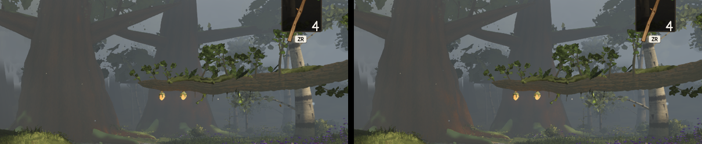

# Round 51 — the white-barks' mid LOD stops casting shadows (fable-4; a W38 give-back)

fable-2's triangle map (`.agents/reviews/fable-2-triangle-budget-110453d4.md`): the shadow pass is a
third of every frame and the trees' casters are 1.3 M of it whichever way the camera looks — "a lower
LOD for the shadow pass alone would keep the shadows and lose most of it". The white-bark family's
near and mid LOD meshes both cast (`trees/index.ts` familyMeshes); the mid meshes stand 20–44 m from
the camera, their dapple on ground under the haze. Now only the near LOD casts (the far never did).

## Six views vs the head 073f5ff2 (same build path, same settle)

| view | SSIM Δ | pixels > 6 levels | draws | triangles (main + shadow, as W38 counts) |
|---|---|---|---|---|
| A | 0.0000 | 0 | 450 → 444 | 8.74 → 8.68 M |
| B | 0.0000 | 1 | 430 → 425 | 7.88 → 7.80 M |
| C | −0.0006 | 0.74 % | 345 → 335 | 6.93 → 6.69 M |
| D | −0.0002 | 0.15 % | 393 → 386 | 8.06 → 7.96 M |
| E | 0.0000 | 1 | 430 → 425 | 7.88 → 7.80 M |
| F | 0.0000 | 57 | 406 → 399 | 7.99 → 7.86 M |

C's 0.74 %: the hazed bank behind the lantern limb where the grove's mid stems shaded the ground,
+7.6 levels where the dapple was.

 C's right half, left head / right the branch.

## Measured and NOT shipped: the columns' mid LOD too

`familyMeshes` also builds the seated columns; with both families' mid meshes not casting the saving
doubles (A 8.61 M, C 6.66 M, F 7.77 M, draws −12) but **E −0.0032, A −0.0019, D −0.0019, B +0.0006**:
the columns' mid shadows lie on the paths the fixed views frame. The columns keep casting; a
per-seat choice (only the seats whose shade misses the paths) is the columns lane's call.
