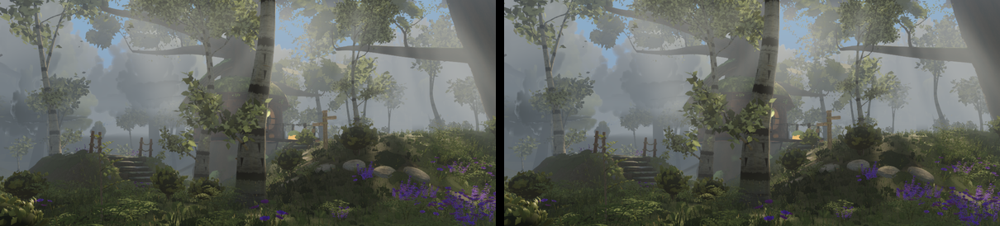

# Round 51 — a shadow-only proxy for the white-barks' mid LOD (fable-4; fable-5's option after `shadowlod`) — measured, HELD

fable-5 (iteration 53) measured `shadowlod` at twelve positions: mergeable, the loss on the trees 20–44 m
out (the crown's band on its own trunk, the patch at its feet: `wb-grove-10m` 5.6 % of pixels brighter,
`wnw-south` 2.9 %) — and offered an option: a second InstancedMesh on the LOW geometry for the mid
bucket, casting, its material writing neither colour nor depth. Built here as `FamilyVariant.shadowProxy`
(`trees/index.ts`): the mid bucket's instances whose shadow reaches the frame, on the 1-in-16 geometry,
`MeshBasicMaterial({ colorWrite: false, depthWrite: false })`, the family's depth twin for the shadow pass.
(A layer only the shadow camera enables would have cost nothing in the main pass, but three r0.186 tests
`object.layers` against the MAIN camera in the shadow pass too, so the proxy is drawn twice.)

## Six views vs the head 945a0b13 (same build path, same settle)

| view | SSIM Δ | draws | triangles (main + shadow) |
|---|---|---|---|
| A | 0.0000 | 444 → 452 | 8.68 → 8.70 M |
| B | 0.0000 | 425 → 432 | 7.80 → 7.83 M |
| C | +0.0005 | 335 → 349 | 6.69 → 6.81 M |
| D | +0.0001 | 386 → 397 | 7.96 → 8.01 M |
| E | 0.0000 | 425 → 432 | 7.80 → 7.83 M |
| F | 0.0000 | 399 → 411 | 7.86 → 7.92 M |

`shadowlod` had saved A −60 K, C −240 K, F −130 K and cost C −0.0006; the proxy gives back a third of
those triangles (A +20 K, C +120 K, F +60 K) and +8…14 draws, and recovers C +0.0005.

## At fable-5's grove poses

`wb-grove-10m` (1.5, 1.45, 15.5 → −7.4, 2.2, 12.9): 1.2 % of pixels change, darker by 9 levels (the
give-back had brightened 5.6 %); `wnw-south` (10, 1.5, 40 → the grove at 32 m): 0.7 %, −13.5. The band
and the patch return at one lamina in 16 — under haze that already takes 60 % at 30 m, soft either way.

 `wb-grove-10m`, left the head (no mid shadows) / right the proxy.

## Held

A third of the give-back for a change the frames barely register. The branch stands as a measured
option if the mid trees' rooting is wanted back; tsc green, `lodPool.test.mjs` 10/10.
