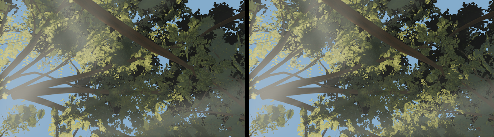
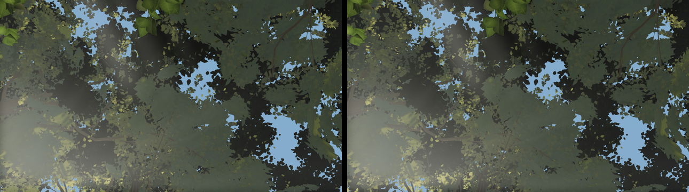

# Round 51 — `NEAR_CANOPY_SLOTS` 40 → 64 (fable-4, lod-1's dial; fable-cursor's "next dial")

Round 51's 30 / 34 m lobe step measured 0.00–0.01 % at seven plaza poses: more than 40 lobes are
active inside the 26 / 30 m band there, so the 40-slot cap — not the swap radius — decided which
crowns showed their near part. This raises the cap to 64 (`materials.ts`, one constant: the
`uNearCanopy` uniform array and the per-vertex collapse loop size follow it).

## Where it shows (large tier, head 54196e0b vs 64 slots, 1280×720)

| pose | changed pixels (Δ > 6) |
|---|---|
| w10-spine-u (1.7, 1.4, −14.3) look-up | 11.96 % |
| w05-spine-u (0, 1.45, 0.56) look-up | 4.29 % |
| w22-stairs-u (3.6, 1.44, −0.4) | 1.00 % |
| f4-lobe-28m (−5.2, 1.4, −9.6) | 0.97 % |

 w10-spine-u: left 40 slots, right 64 — shaped, lit laminae where the flat far foliage was (upper right, centre left)

 w05-spine-u

## Cost

- Six fixed views: pixel-identical (the hero pass culls near parts to the frusta). A 440 draws /
  8.61 M · B 420 / 7.79 M · C 338 / 7.01 M · D 390 / 8.08 M · E 420 / 7.79 M · F 405 / 8.00 M.
- Walk trace (perftrace, 2400 frames, 240 rendered, same walk): triangles median 8.96 → 8.97 M,
  p95 11.26 → 11.26 M, max 11.47 → 11.49 M; mean per-frame delta +0.01 M, worst frame +0.05 M
  (the stairs, k = 880); draws median 419 → 420, max 480 → 484; step p50 3.2 / p95 10.2 → 9.6 ms;
  pinned canopy 25.1 → 37.8 MB at load, all resident, 0 builds / 0 evictions (the 256 MB pool).
