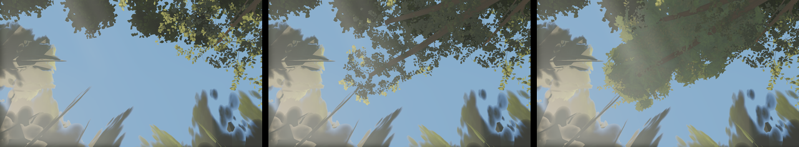

# Round 51 — the north spine's open sky (fable-4): measured, NOT shipped — a near-canopy question first

`w19-spine-u` — straight up from the north spine at (4.7, 5.3, −44), the walk to the arch — has
**52.5 % blue sky** on the head c11f0ff4 (the other look-ups after slots64 + the plateau roof:
`sn-lantern-limb` 4.5 %, `w02-spine-u` 6.2 %, `w10-spine-u` 14.0 %). The north-east giant's crown is
11 m east, the north-west's 15 m west; nothing over the spine.

## What was tried (all rendered at the pose, blue-sky share = pixels with b > r + 20 and b > g + 10)

| variant | lobes | blue |
|---|---|---|
| head | — | 52.5 % |
| v1: one north-east bough at 24 m, three lobes, density 1 (≈ 280 laminae each) | near-eligible | 46.3 % |
| v1 + `corridors: false` | near-eligible | 46.3 % (no change — the corridors do not reach 24 m) |
| v2: two boughs, six lobes, density 3 (814–856 laminae each, audit) | near-eligible | 43.3 % |
| v2 with settle 90 frames (a build-budget test) | near-eligible | 43.3 % |
| v2 with the large tier's canopy pool 256 → 512 MB (a pool-pressure test) | near-eligible | 43.2 % |
| **v2 with `tone: 0.99` (fails the `lobeTone === 1` eligibility, so the far laminae always draw)** | far only | **33.4 %** |

 left the head; middle v2 near-eligible — one cluster at the bough's
tip, the lobe over the zenith missing; right the same six lobes as far laminae — dense masses, the
sky a third closed.

## The finding

Six lobes are BUILT (the audit's `giantLobeLeaves/north-east` [856, 852, 814, 856, 856, 856]) and
visible as dense foliage from 11 m south of them (`f4-spine-lobes-near`), but from directly below,
inside the 26 / 30 m swap radius, only the tip cluster draws: the far laminae fold for the shown
near parts and the near parts of the zenith lobes do not appear. Not the corridors, not the build
budget (settle 12 → 90 identical), not the hero pass (it only touches parts within 30.5 m of a hero
camera; these are 41 m from D), not the pool cap (512 MB identical). Open: why a near part built
for a lobe at 22 m local (under `NEAR_CANOPY_MAX_Y` 25) is not drawn from below. Whoever holds the
near-canopy kit (lod-1's `nearCanopy.ts`) will know faster than another tick of my elimination.

## Frames

Any roof here sits inside D's and B's top edges: lobe undersides at 24 m project 0.02–0.06 of the
frame inside their tops (a 26 m roof would clear them, and no giant here is that tall). Not yet
measured on the six views — the render question comes first.

Nothing is on the branch; `trees/index.ts` is as on the head.
