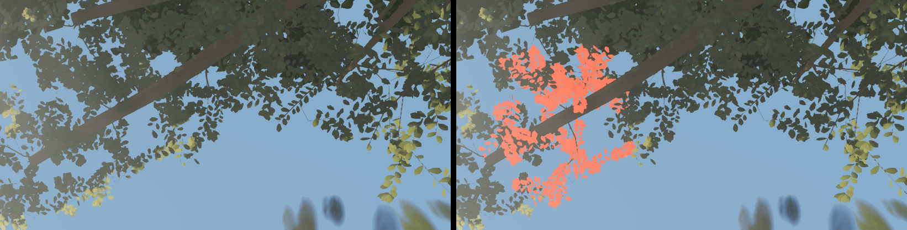

# Round 51 — the north spine's open sky (fable-4): measured, NOT shipped — a near-canopy question first

`w19-spine-u` — straight up from the north spine at (4.7, 5.3, −44), the walk to the arch — has
**52.5 % blue sky** on the head c11f0ff4 (the other look-ups after slots64 + the plateau roof:
`sn-lantern-limb` 4.5 %, `w02-spine-u` 6.2 %, `w10-spine-u` 14.0 %). The north-east giant's crown is
11 m east, the north-west's 15 m west; nothing over the spine.

## What was tried (all rendered at the pose, blue-sky share = pixels with b > r + 20 and b > g + 10)

| variant | lobes | blue |
|---|---|---|
| head | — | 52.5 % |
| v1: one north-east bough at 24 m, three lobes, density 1 (≈ 280 laminae each) | near-eligible | 46.3 % |
| v1 + `corridors: false` | near-eligible | 46.3 % (no change — the corridors do not reach 24 m) |
| v2: two boughs, six lobes, density 3 (814–856 laminae each, audit) | near-eligible | 43.3 % |
| v2 with settle 90 frames (a build-budget test) | near-eligible | 43.3 % |
| v2 with settle 400 frames (the pool builds 6 ms per frame; 400 frames is 2.4 s of build work) | near-eligible | 43.2 % |
| v2 with the large tier's canopy pool 256 → 512 MB (a pool-pressure test) | near-eligible | 43.2 % |
| **v2 with `tone: 0.99` (fails the `lobeTone === 1` eligibility, so the far laminae always draw)** | far only | **33.4 %** |

 left the head; middle v2 near-eligible — one cluster at the bough's
tip, the lobe over the zenith missing; right the same six lobes as far laminae — dense masses, the
sky a third closed.

## The finding (resolved 2026-09-22 with a runtime probe — not a bug)

Probed in the page at the pose (`__ZR__` + the scene hooks): the six near parts are built (8.5–9.2 K
vertices, 8.7 K non-degenerate triangles each, world positions in the right box), in the shown
slots, drawn every frame (`onBeforeRender`), and — painted in a fog-free emissive material — they
cover **2.5 % of the frame each** at 17 m. In the normal frame their laminae are there, pale
grey-green (RGB 105/112/102 against the sky's 137/171/199), along the bough. Nothing hides them.
What the far lobe has and the near part lacks is the **cluster cards**: the swap folds the far
laminae *and cards* away and draws a laminae-only part, which from directly below at 17 m is a
see-through cloud. Six of them take the sky 52.5 → 43 %; the same six as far lobes, cards kept,
33 %. (My earlier read of "the zenith lobe missing" took the bounding-sphere centre for the leaf
cloud; the laminae sit along the twigs toward the bough.)

 left the frame as built, right lobe-26's near part in an emissive
marker material: the same cluster of pale laminae — present, sparse.

So a roof 17 m overhead is a design choice for the near canopy, not a fix: keep such lobes far-only
(cards + laminae; an explicit `near: false` on the CanopyLobe rather than `tone: 0.99`), or give the
near kit cards / a higher laminae cap for high lobes (lod-1's `NEAR_CANOPY_LEAVES`). Either way the
plateau roof worked because its lobes hang 10 m over the walker, not 17.

## Frames

Any roof here sits inside D's and B's top edges: lobe undersides at 24 m project 0.02–0.06 of the
frame inside their tops (a 26 m roof would clear them, and no giant here is that tall). Not yet
measured on the six views — the render question comes first.

Nothing is on the branch; `trees/index.ts` is as on the head.
