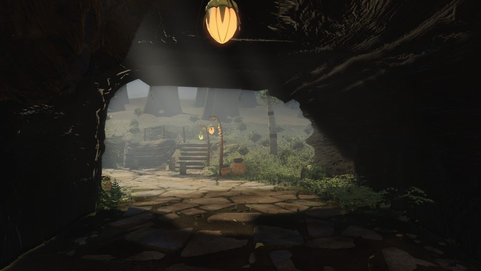
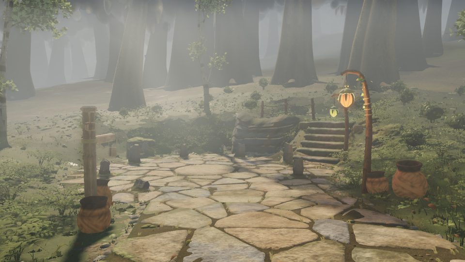
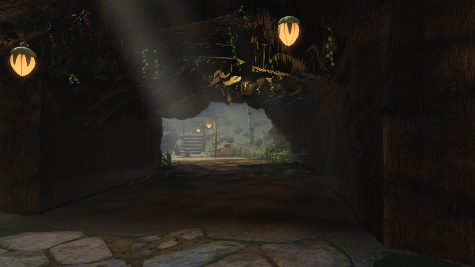

# Round 51 — V2 / opus #01 ("no world beyond the arch") on the head f6890f4a: a status measurement (fable-4)

The opus-walk poses `x-arch-approach`, `x-arch-tunnel-n`, `x-northpath-n` (eye seated 1.45 m above the
terrain), rendered on the head. Luminance is CIE L* (0–1) of the sRGB frame; fable-5's figures in
`reference/ANALYSIS_VIDEO2.md` §6.6 are quoted for the same boxes.

## The tunnel's tonal half (V19) is at the reference

| region (`x-arch-tunnel-n`) | ours now | reference `d_121` | fable-5 at filing |
|---|---|---|---|
| frame mean | 0.142 | 0.131 | 0.430 |
| window 0.28–0.62 × 0.20–0.60 | 0.374 | 0.39 | 0.52 |
| belly 0–1 × 0–0.20 | 0.089 | 0.08 | 0.15 |
| left wall 0–0.2 × 0.3–0.8 | 0.040 | 0.05–0.07 | 0.17 |
| right wall 0.8–1 × 0.3–0.8 | 0.035 | (near-black) | no wall |
| floor 0.3–0.7 × 0.8–1 | 0.071 | 0.15 | 0.46 |
| window : wall | 9.5 : 1 | 6–8 : 1 | 3 : 1 |

The tunnel is a tunnel: both walls, the belly's pod, the floor darker than the frame's.

## The structural half is half-closed

Through the opening (`x-arch-tunnel-n`, `x-northpath-n`): rows of tall hazed trunks with crowns
(the depth bands at z −55…−61 and −84…−98, the columns), the ledge flight with its lantern post, the
white-barks, pots and a rail — not the cone forest on a plane of opus #01. Still open against the
frame's "trunks and lights with no floor": the ground plane is visible (the pale plain in the haze at
the window's centre), the stand is sparse (band spacing 5 / 7 m; the frame's is dense), and there are
no hanging vines or glowing points beyond the arch.

Nothing changed in this measurement; the frames are the head's.
