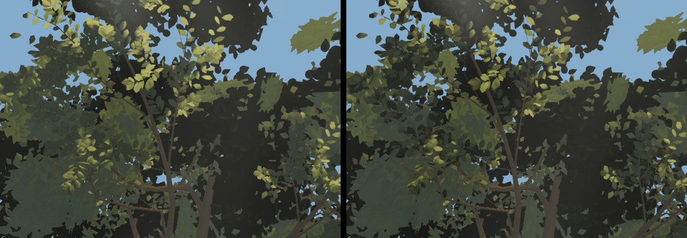

# Round 51 — W10's visual half, measured and NOT shipped (fable-4)

fable-5 (r48 walk, carried since): F's lobes "flat single-tone with a grey field"; at
`w27-plateau-u` the crowns one tone. The offer (INBOX 12:20 UTC): port the white-barks' layered
per-leaf draw (whitebark.ts leafSpray — occluded / backlit laminae by `leafShade` and albedo) to the
giants' lobes, geometry only. Four variants were built and rendered on the head d292437a; none
layers the lobes. The finding is where the flatness comes from.

## Where the lobes are drawn from

Inside 26 / 30 m every lobe in F and the look-ups is its NEAR part (nearCanopy.ts), the far laminae
folded. A per-leaf shade on the far laminae (giant.ts leafSpray, variant 0: `leafShade` 1 → 1 −
interior × 0.3 / 0.6, 75 % of the lobe laminae carrying 0.4–0.99) changed 0.00 % of F and 0.0 % of
the look-ups — the geometry moved (verified in the built asset) but nothing that shows.

## The near parts (nearCanopy.ts nearSpray / nearRosette), foliage luminance in a 600 × 420 crop of `w27-plateau-u`

| variant | what was written per lamina | mean | sd | p10 | p90 | pixels changed |
|---|---|---|---|---|---|---|
| head | one `leafShade` (1), the colour rule's interior / underside darkening | 65.1 | 26.7 | 37 | 99 | — |
| v1 fill cut | `leafShade` 1 − interior × (0.3 / 0.6) | 64.0 | 25.3 | 37 | 96 | 13.1 % |
| v2 white-bark recipe | structured shell / top tone and shade; 45 % occluded (tone × 0.4, shade × 0.35), 20 % backlit (× 1.08, shade 1) | 61.3 | 23.1 | 36 | 89 | 17.5 % |
| v3 split only | 45 % occluded (0.4 / 0.35), 20 % backlit (1.08), the rest untouched | 62.5 | 24.5 | 37 | 91 | 11.5 % |
| v4 lit end | 25 % occluded (0.55 / 0.5), 25 % backlit tone × 1.3 | 64.1 | 25.8 | 37 | 96 | ~10 % |

`w10-spine-u`, whole frame: head sd 40.7 (p10 44, p90 153); v3 39.3 (38, 145); v4 40.0 (41, 150).

Every variant LOWERS the spread. The dark end never moves (p10 37 in all five rows): the leaf shade
floor (materials.ts, the TREE_LEAF_FLOOR family) lifts every shaded lamina to the same level, so a
lamina written darker — by albedo or by its fill share — lands on the floor with its neighbours.
The lit end does not rise either: × 1.3 albedo on a quarter of the laminae left p90 at 96 — the
sunlit laminae are set by the sun term and the tone curve, not the albedo. Between a floor and a
saturated top, a per-leaf draw can only compress the range, which is what the numbers show. The
white-barks' draw worked (round 49, `f4-crown-up`, sd 19.5 → 22.2) because their lobe was seen from
7 m against the sky with the white-bark material's own `leafNear` handling — the giants' canopy
material does not give the geometry that room.

 `w27-plateau-u` 1:1: left head, right v2 — darker, not layered.

## What would layer them (Astra's file)

The floor is the flatness: a leaf floor that keeps more of the lamina's own value (texture share up,
lift down for the canopy leaves), or that reads `vLeafShade` as an occlusion the floor respects
(mix toward the floor by it rather than lifting to it), would let the existing interior / underside
darkening and any per-leaf draw show. Six-view cost unknown until tried; F is the frame that pays.

## Six views

Variant 0 on the fixed views: A −0.0002, B −0.0001, C 0, D −0.0003, E −0.0001, F 0 (nothing
visible changed — the far laminae are folded inside the swap radius). Variants 1–4 were measured at
the poses only; nothing shipped, `giant.ts` and `nearCanopy.ts` are as on the head.
