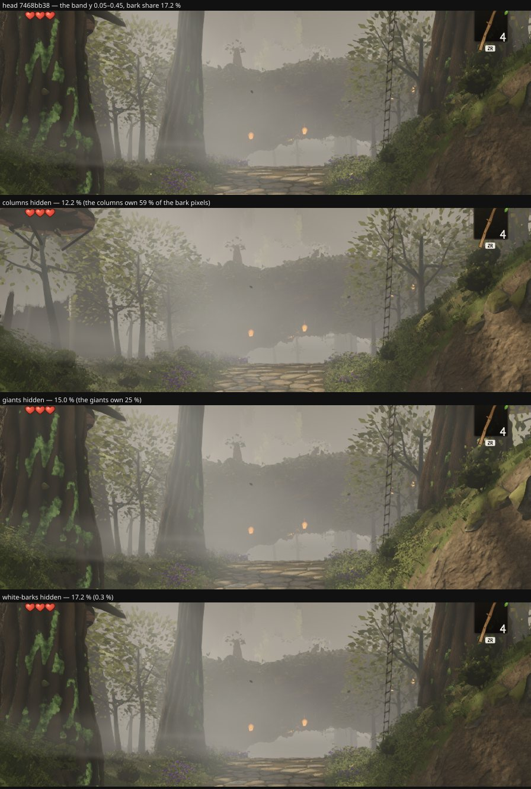

# Round 54 (fable-4) — "the trees show the brown … a lot of the trees just look fake": whose wood, by hide-one-group

squad2's `fake` round (02:41) measured the owner's sentence with `barkshare.mjs` — a fifth of our mid-distance band is bark
against a fiftieth to a tenth of the reference's — and stopped at "whose wood": the candidates were the giants' trunks, the
white-barks, the columns, the mid / distant boles, and the wood materials are anonymous to a probe. Hiding each group on the
head answers it without touching `materials.ts`: squad2's own classifier (hue 10–45°, s > 0.12, l 0.06–0.85, the band y 0.05–0.45)
on the head `7468bb38` at the owner's exact 06:50 poses, 896 × 776, clock frozen; a bark pixel is a group's when it changes
(> 12 / 255) with that group hidden, each pixel counted once in the order below.

| owner pose | bark share of the band | **columns** | **giants** | understory | distant + mid | structures | white-bark | unattributed |
|---|---|---|---|---|---|---|---|---|
| north | 17.2 % | **58.6 %** of the bark pixels (share 17.2 → 12.2 % without them) | **25.0 %** (→ 15.0 %) | 2.5 % | 0 | 0.7 % | 0.3 % | 12.9 % |
| west | 8.2 % | **23.6 %** (→ 6.8 %) | **57.5 %** (→ 1.8 %) | 8.1 % | 5.3 % | 0.8 % | 0.2 % | 4.5 % |

## Reading

- **The brown is the seated columns and the giants' trunks** — the big dark boles at 5–30 m at eye level (the column with the moss
  stripes left of the path at the north pose, the giant at the frame's left edge). Together 84 % of the bark pixels at the north
  pose, 81 % at the west. The white-barks are 0.2–0.3 % (their bark is pale and low in saturation — the classifier does not call
  it bark, and the owner does not either: "the trees look good with the green spot around them"); squad2's mid and distant boles
  are 0–5 %.
- So squad2's two candidate fixes — the mid crowns lower / wider, more mid trees — screen little of what he sees: the boles are
  in front of that layer, not behind it. What the share points at is lane 3's columns (`column.ts`: the bare run between the
  knees and the crown is most of a column's height at 5–30 m) and the giants' trunks at the plaza — foliage or ivy on the
  columns' bare runs, their bark's lightness (ours 0.19–0.23, the reference's boles 0.52), or understory crowns set to screen a
  column's bole from the path. None of those is a white-bark change; all are look calls for lane 3 / owner-fable and fable-cursor.
- The unattributed 13 % at the north pose is the canopy's boughs and the earth of the bank inside the band (neither hidden here).

Renders `/tmp/f4/r197/{base,hide}`; dist `/tmp/f4/r197-dist-head`; the classifier as squad2 wrote it, in
`/tmp/f4/clarity/scripts/_f4barkattrib.mjs` (not committed).
