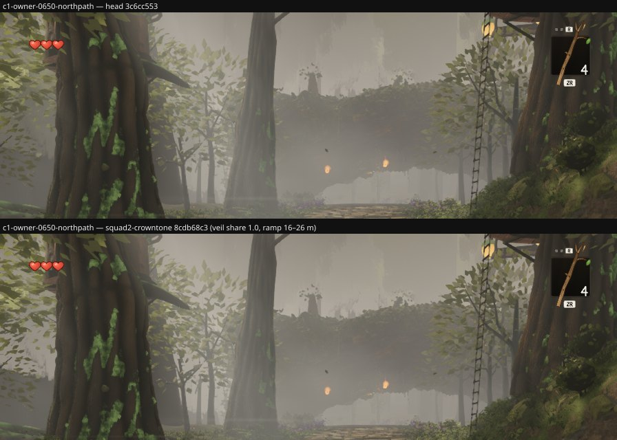
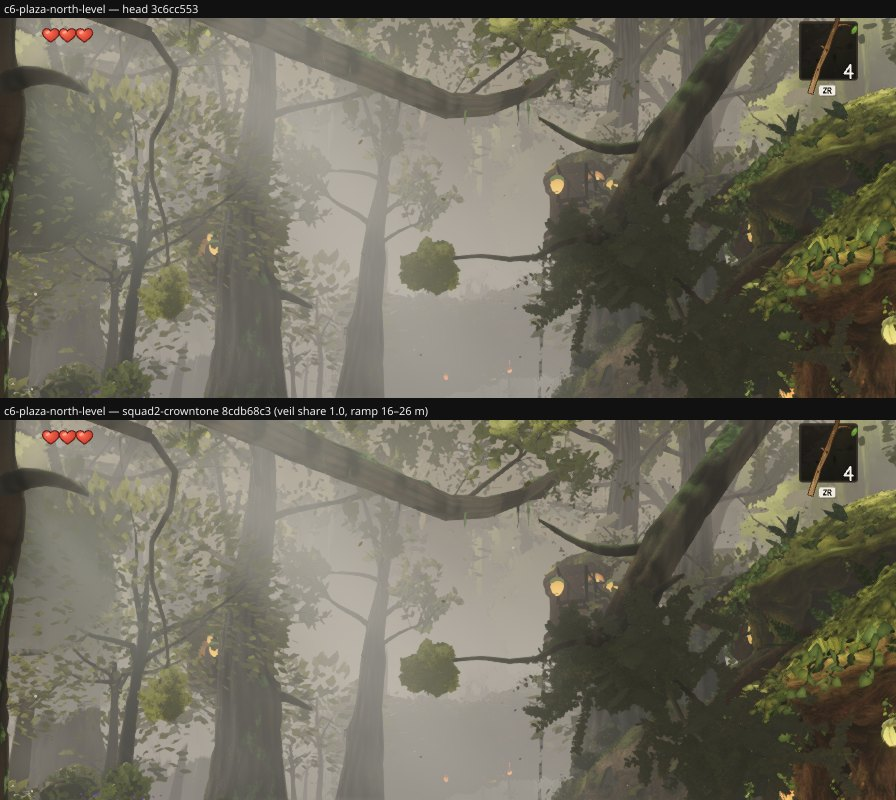

# Round 54 (fable-4) — `agent/squad2-crowntone` @ `8cdb68c3` read where squad2's cards stand behind my understory (non-author review)

squad2 takes `CROWN_VEIL` to share 1.0 on a 16–26 m ramp with the lift capped at the reference's foliage-to-air relation
(`distant.ts`; four tests in `crownVeil.test.mjs`). The veil is on the distant layer's crown cards only, so the question for
lane 2/3's corridor is the relation: my understory crowns (4.5–9 m trees at 3–11 m off the path, 5–15 m from the walker) are
not veiled, the cards 16–40 m behind them now are — does the boundary read as depth or as a seam?

Head `3c6cc553` vs the branch's tip, each built in a worktree; 896 × 776, quality high, clock frozen; the six poses below.
Pixels moved at 8 / 255. For c1–c3 the understory's and the distant layer's pixels were found by hiding each group (24 / 255)
on each build, the HUD excluded; luminance is Rec. 601 on the sRGB frame, 0–255.

| pose | draws / tris (same on both) | pixels moved | where |
|---|---|---|---|
| c1 owner 06:50 north path (1.5, 3.2, −10.5) → (1.5, 1.6, −26) | 501 / 8.02 M | 1.26 % | the canopy band, y < 260 |
| c2 fable-5 northpath-r020 (0.8, 3, −4.5) → (1.2, 1.6, −20) | 515 / 7.79 M | 1.19 % | y < 266 |
| c3 fable-5 northpath-r026 (1.8, 3, −17.5) → (2.5, 1.4, −33) | 476 / 7.20 M | 2.05 % | y < 252 |
| c4 k3 west meadow, up at the hut host (−41, 1.75, 14) → (−41, 12, 35.7) | 227 / 1.65 M | 0 | — |
| c5 k4 west meadow (−24, 1.9, 30) → the same | 221 / 2.61 M | 32 px | — |
| c6 plaza → north at eye level (3, 1.7, 2) → (3, 4.7, −30) | 552 / 7.73 M | 2.14 % | y 35–405 |

## The relation, measured on the corridor poses

| pose | understory share of frame | understory mean L head → branch | cards share | cards' ΔL within the head's card pixels | step cards − understory, head → branch |
|---|---|---|---|---|---|
| c1 | 9.9 % | 95.9 → 96.5 (+0.13 on the same pixels) | 2.3 % | **+9.2** | 9.7 → 11.5 |
| c2 | 8.1 % | 96.4 → 96.5 (+0.10) | 1.4 % | **+8.8** | 21.6 → 21.1 |
| c3 | 7.2 % | 96.9 → 98.0 (+0.20) | 5.0 % | **+7.2** | 9.9 → 10.5 |

Of the pixels that move, 50–54 % are inside the card pixels, 3–5 % inside the understory's (its edges against the cards),
the rest the cards' own edges and the far bands the hide test does not attribute. The cards lift **7–9 levels** toward
their air at 16–40 m; the understory in front of them stays where it was (≤ 0.2 of a level). The step between a near
understory crown and the card behind it grows by 0.6–1.8 levels on a step that was already 10–22: **depth order, not a
seam** — the near layer stays the dark, saturated one, the cards recede. Nothing at eye level moves (squad2's own reading of
the owner's middle third, 71.7 → 71.7, holds here: the moved pixels' boxes stop at y 252–266 on c1–c3). The two look-ups
(k3 / k4) are untouched — the crown gate above 26° is shut whatever the share.

## Verdict, from lane 2/3's side

Safe for the corridor: the understory is not touched and the relation to the cards behind it moves the right way by a small
amount. squad2's own flag — the leaf-to-sky step in hero A's crown box 6.6 → 8.0 % — is the six-view gate's to weigh
(fable-cursor's full check); at my poses the near-to-far step is +0.6–1.8 levels. One reading for squad2: on all three
corridor poses the hide test finds **fewer** card pixels on the branch (16.2 K → 13.0 K at c1, 34.9 K → 30.0 K at c3), which is
the veil doing what it says — a card 25 m out now sits within 24 levels of its air more often — and also the number to
watch if the cap ever loosens: past that, the middle distance stops reading as trees.

Renders `/tmp/f4/r187/{H,C}`, `/tmp/f4/r187/hide-{head,crowntone}`; dists `/tmp/f4/r187-dist-{head,crowntone}`.
