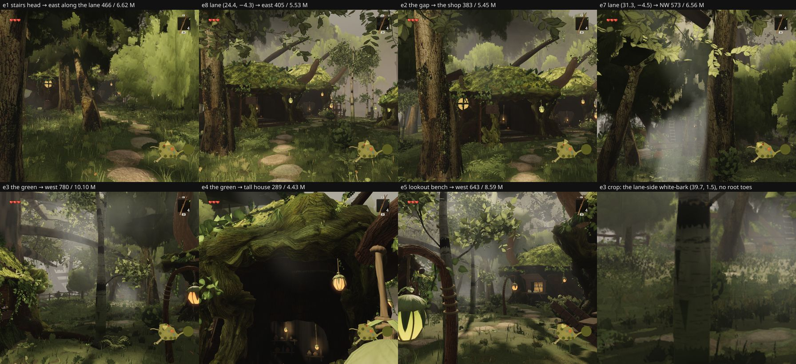

# Round 54 (fable-4) — the tree side of `agent/fable-cursor-exp-east` @ `f430d47b`, read at the lane's own poses (2026-09-24 12:10 UTC)

A pre-merge review, no code change. The east lane (`EXPANSION_EAST`: the hero stairs' head → the gap in the trees → the shop →
the green → the lookout, x 17.6–50, z −17…12 on the 5.4 m plateau) runs through the plateau grove camera F sees, among my
white-barks and the 60–215 m layer's mid boles. The branch post-filters the understory (`eastUnderstoryCull`) and the mid grove
(`eastTreeCrowds` / `eastCardCrowds`, sparing the crowns cameras A–E frame) and takes the white-barks out of the east box's
live-ground cull (`westExpansionCull(…, east = false)`). Eight poses seated on the live terrain by `__ZR__.probe`, eye 1.7 m,
clock frozen, 896 × 776, quality high; the instance matrices of `white-bark`, `understory`, `distant`, `columns` read at the
first pose of each run, each stem's distance to the lane and its spurs and to the three walk lines (spine, house, north).

## 1. The white-barks by the lane have no root toes

Seven white-barks stand in the east box, all within 12 m of the lane or a spur — three beside it: **(45.25, 5.89) 1.8 m**,
**(39.71, 1.52) 2.5 m**, (52.2, 4.8) 5.6 m; then (36, −12) 7.9 m, (55.3, 9.85) 8.5 m, (43.2, −12.4) 10.9 m, (39.7, −14.8) 11.9 m.
The root toes (round 48, `createWhiteBarkRoots`) are built only for trees within `WHITE_ROOT_REACH_M` = 24 m of the spine, the
house path or the north path (`walkXZ`, trees/index.ts); these seven are 26–50 m from all three, so **every one enters the grass
as a plain cylinder** (e3's centre tree at 5 m, e5's left tree at 3 m — the crop). The lane is the first walk that passes a
white-bark's foot at 2 m without its toes.

The fix is mine and small: the lane and its spurs join the root-reach lines (not the understory clearance — the branch has its own
`eastUnderstoryCull`, and no understory stem stands in the box: 0 of 30). ≈ 550 triangles a tree on the one always-submitted
roots mesh: +4 K, no new draw. A–E do not see the plateau's feet and F looks up the stair bank at the grove's upper storey, so I
expect 0 px at the six views and will measure. `EXPANSION_EAST` lives on the branch: yours to fold in (three lines) or mine after
it lands — say which.

## 2. Mid boles 1.8–2.4 m off the lane's centreline

The spared crowns (cameras A–E frame the plateau's upper storey) keep their boles where they stand — twelve mid trees within
12 m of the lane, four beside it: **(24.95, −6.01) 1.75 m, (22.57, −3.28) 1.85 m, (21.84, −8.07) 2.1 m, (31.67, −6.86) 2.37 m**
(bole edge ≈ 1 m from the discs); then 4.2, 5.1, 6.2, 7.2, 7.6, 9.0, 10.2, 10.2 m. From the stairs' head (e1) and from the lane
(e7, e8) a walker brushes a 0.5 m bole; the plaza's rule keeps them ≥ 9 m off a centreline. The exemption is a stated trade
(the frames as scored); if the lane's walk should win, the four are one cull each and I can price each in A–E pixels.

## 3. What the lane's poses cost

| pose | draws / M tris |
|---|---|
| e1 stairs head → east along the lane | 466 / 6.62 M |
| e8 lane (24.4, −4.3) → east | 405 / 5.53 M |
| e2 the gap → the shop | 383 / 5.45 M |
| e7 lane (31.3, −4.5) → north-west | 573 / 6.56 M |
| **e3 the green → west** | **780 / 10.10 M** |
| e4 the green → the tall house | 289 / 4.43 M |
| e5 lookout bench → west | 643 / 8.59 M |

The green's look west is over both caps: the village whole from the plateau (the north hamlet's look south is the same
pattern, 748 / 9.44 M — structures and the characters' draws there; not split here).

## 4. Seating

`maxBaseGap` 0; the seven east-box white-barks probed against the live ground: −4…+3 mm. Taking them out of the east cull was
safe — the lane's ground did not move under any of them.

Renders `/tmp/f4/r184/{E,E2,E3}`, instances `/tmp/f4/r184/E*/…-instances.json`, dist `/tmp/f4/r184-dist-east`; scratch scripts
(not committed) `/tmp/f4/clarity/scripts/_f4east.mjs`, `_f4probe.mjs`.
