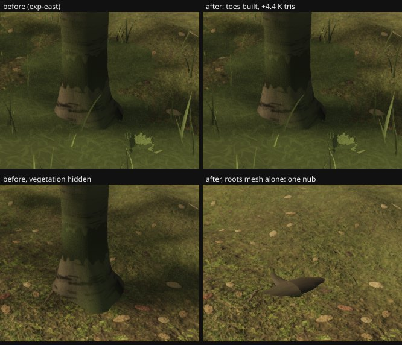

# Round 54 (fable-4) — the east lane's white-barks' root toes: built, measured, WITHDRAWN (`agent/fable-4-eastroots` `ea78545a`, off `agent/fable-cursor-exp-east` @ `f430d47b`)

**Outcome: a FAIL, reported, not landed.** The seven toes are built (+4,448 scene triangles, the roots mesh's one draw) and nothing
shows: 0 px at the two lane poses e3 / e5, 6 px at a foot 2 m away, and with the vegetation hidden and the roots mesh drawn alone
one 0.5 m nub is all that reads at the (45.25, 5.89) stem. The plateau's white-barks are young / mature variants at scale 0.91
(toe height = 0.42–0.66 × trunk radius ≈ 6–13 cm, length 0.6–1.2 m) in a 30 cm turf on ground that rises 4–6 cm within a
metre of the stem, so the toes sit inside the turf and the ground's own relief. The "plain cylinder" the review saw is the
trunk above the turf line, which toes do not change. Bedding the toes on the live lattice instead of the legacy heights
(tried, `EAST_BOX` → `liveTerrain`) rendered the same. Do not merge; the branch stays for the numbers.

The round54-east-review found the seven white-barks in the east box — three at 1.8 / 2.5 / 5.6 m from the lane — standing on
plain cylinders: the round-48 root toes (`createWhiteBarkRoots`) are built only for trees within `WHITE_ROOT_REACH_M` = 24 m of
the spine, the house path and the north path, and these stems are 26–50 m from all three. One change in `trees/index.ts`:
the east lane and its spurs (`EXPANSION_EAST.lane` / `.spurs`) join the root-reach lines. The lane's trees are appended AFTER
the three paths' trees with `toeStream`s past theirs, so every toe already built keeps its shape (the toe-shape stream is the
tree's index in the rooted list; a re-roll at the plaza would move the six views' pixels). The toes bed on the same ground the
stems were seated on (the seven stems probed −4…+3 mm against the live ground).

Harness for the six views: `capture.mjs --settle 12 --no-checks`, 1280 × 720, quality high, the branch's tip as the base and
the same build plus this commit as the after; pixel diff at 8 / 255.

## Six views — base (exp-east `f430d47b`) → after (`ea78545a`)

| view | base draws / tris | after draws / tris | pixels changed |
|---|---|---|---|
| A_stairs | 639 / 8.84 M | 639 / 8.85 M | 0 |
| B_house | 628 / 8.27 M | 628 / 8.28 M | 0 |
| C_lookback | 571 / 7.93 M | 571 / 7.94 M | 0 |
| D_log | 562 / 8.63 M | 562 / 8.64 M | 1 px |
| E_ground | 628 / 8.27 M | 628 / 8.28 M | 0 |
| F_canopy | 643 / 9.09 M | 643 / 9.10 M | 0 |

The roots mesh is one always-submitted draw; the seven trees' toes are the +4,448 scene triangles (≈ +9 K with the shadow
pass) every view pays and none shows. (Note for the branch, not this change: F is 9.09 M on exp-east against 8.01 M on the head — the plateau's upper
storey over the lip.)

## The lane's poses — before / after (896 × 776, clock frozen)

| pose | before draws / tris | after draws / tris | pixels changed (16 / 255) |
|---|---|---|---|
| e3 green, look west (44.5, 3.5) → (22.3, −5.7) | 780 / 10.099 M | 780 / 10.108 M | 0 |
| e5 lookout bench, look west (48.3, 7.55) → (38, −2) | 643 / 8.589 M | 643 / 8.598 M | 0 |
| e9 the (45.25, 5.89) foot from 2.3 m | 299 / 3.973 M | 299 / 3.982 M | 6 |

If the owner wants readable feet on the plateau it is not this: it is the turf's clearance ring round the trunks (lane 4's
`slimTrunks` avoidance is the trunk radius, the toes reach a metre past it) or taller toes for the young variants — both look
changes to ask for, neither a tree-side default.

Renders `/tmp/f4/r185-cap-{base,roots}`, `/tmp/f4/r185/{B,R}`; dists `/tmp/f4/r184-dist-east`, `/tmp/f4/r185-dist-eastroots`.
`npm run typecheck` green, `vite build` green, `node --test` trees 21 / 21.
