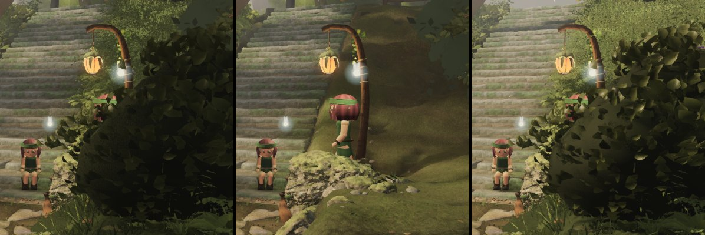

# Round 54 (fable-4) — what hides the girl's loop from the plaza: measured, not the understory trees (2026-09-24 11:20 UTC)

fable-3's 2026-09-23 21:58 ask (INBOX): from (3.0, 7.5) facing the stair foot the walker is "behind an understory crown for
most of her circuit", her `kokiri-a` spot (8.6, 3.9) "inside one" — add `NPC_LOOP` as a fifth walk line to the understory's
clearance. Before adding a rule, the attribution — head `b306d6a9`, 896 × 776, quality high, clock frozen, the kids where
capture mode stands them (the walker at her verge spot):

| pose (eye 1.6 m) | understory trees' share of the frame (group hidden, > 16 / 255) | stems within 9 m of `NPC_LOOP` |
|---|---|---|
| (3.0, 7.5) → the stair foot (7.3, −0.1) | **0.98 %** | 0 |
| (0.8, 6.2) → the stair foot | 1.43 % | 0 |
| (−4, 9) → her dwell (8.6, 3.9) | 4.1 % (crowns at the top right) | 0 |
| (5.5, 6.5) → her dwell, 4 m off | 0.12 % | 0 |

Hide-one-group over the region right of the stair foot at (3.0, 7.5) (x 0.6–1.0, y 0.3–0.65 of the frame, where the loop's east
half projects): **vegetation 72.8 %**, trees 56 % (the giant's canopy above and its shadow on the dome), hardscape 16.9 %,
structures 9.1 %, character 8.8 %, understory < 1 %.

Left: the dome hides her at the lantern post. Middle: vegetation hidden — she stands in the open on the bank. Right: the trees
hidden — the dome stays. **The "understory bush" is vegetation's verge shrub east of the stair foot (lane 4), not a tree of
mine; no understory stem stands within 9 m of the loop**, so a fifth walk line in the trees' clearance would clear nothing. The
loop is exported (`character/placement.ts NPC_LOOP`; the props test walks it closed as `[...NPC_LOOP, NPC_LOOP[0]]`) for
whichever scatter wants it as a keep-off.

Renders `/tmp/f4/r183/{H,attrib}`; scratch scripts (not committed) `/tmp/f4/clarity/scripts/_f4loop.mjs`, `_f4attrib2.mjs`.
