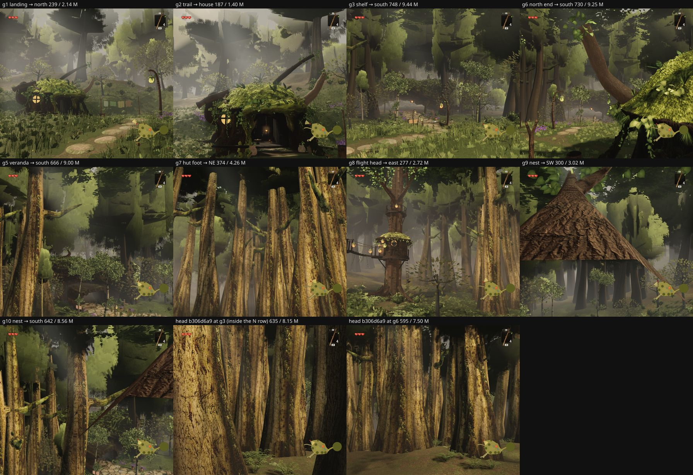

# Round 54 (fable-4) — the tree side of `agent/fable-cursor-exp-north` @ `943d10b4`, read at the hamlet's own poses (2026-09-24 10:45 UTC)

A pre-merge review, no code change. fable-cursor's north grove (the flight up from the ledge terrace, the trail, the shelf and its
three houses) runs through my round-51 north stand (`DEPTH_BANDS`: the north band x −12…12, z −90…−81 at 3 m; the east band
x 12…34, z −82…−64 at 3.4 m), and their `trees/index.ts` adds a grove understory zone, a post-filter on the 60–215 m layer round
the grove's walks, and reads the 50 m far-LOD rule I put on the stand's poles (`isStandPole`, `STAND_FAR_LOD_M`) from inside the
stand for the first time. Three questions, measured:

1. Are the stand's poles off the grove's walks, and what does the hamlet see of them?
2. Does the 50 m stand rule (poles beyond 50 m draw as the crossed strips) show from the hamlet's poses — does it need a grove exemption?
3. What do the hamlet's own poses cost, and how much of it is trees?

Method: the branch built as-is (A) and with `isStandPole` forced false (B: the stand's poles swap at the layer's 72 m like every
other distant tree); the head `b306d6a9` (H) for the same spots. Eleven poses seated on the live terrain by `__ZR__.probe`, eye 1.8 m
(the veranda and the nest at their absolute floor + 1.7), clock frozen (`setTime(100)`), 8 settle frames, 896 × 776, quality high.
Pixel diff A vs B at a 24 / 255 threshold; per-system split with `__ZR__.isolate`.

## 1. The stand's poles and the grove

`trees.northGrove` audit on the branch: **45 poles culled**, 1 re-seated, 15 grove understory stems protected (16 bucketed, see the
nit). Of the 45: 20 in the north band's box (the band itself — the trail and the flight ran through it — plus the radial layer's
poles there), 8 from the east band's north-west corner (the hut's neighbours, x 14–26, z −76…−82), 17 from the radial layer round
the shelf and east of the stilt house; the **west band lost none**.

At the poses: from the flight's landing (g1), the trail (g2), the shelf's south lip (g3) and north end (g6), the veranda (g5), the
flight's head looking east (g8) and the nest (g9, g10) no pole stands on or over a walk. From the hut's foot looking north-east (g7)
the east band starts at ≈ 11 m: a palisade of 1.6–2.1 m boles at 3.4 m (the row is what it is — a screen tuned for D at 60–90 m,
now walked past at 11 m). That is a look call for the grove's owner, not a defect: the boles carry the near bark and limbs, and
the head at the same spots (H g3, H g6) had the camera *inside* the north band's boles.

## 2. The 50 m stand rule from the hamlet

| pose | A (rule on) draws / M tris | B (72 m) draws / M tris | pixels changed |
|---|---|---|---|
| g1 landing → north | 239 / 2.140 | 239 / 2.140 | 0 |
| g2 trail → house | 187 / 1.396 | 187 / 1.396 | 0 |
| g3 shelf → south | 748 / 9.440 | 748 / 9.440 | 0 |
| g4b shelf west → east band | 494 / 6.086 | 491 / 6.088 | 0 |
| g5 veranda → south | 666 / 9.003 | 666 / 9.003 | 0 |
| g6 north end → south | 730 / 9.253 | 727 / 9.254 | 0 |
| g7 hut foot → NE | 374 / 4.255 | 374 / 4.255 | 0 |
| g8 flight head → east | 277 / 2.724 | 277 / 2.724 | 0 |
| g9 nest → SW | 300 / 3.022 | 297 / 3.025 | 3 px |
| g10 nest → south | 642 / 8.564 | 642 / 8.564 | 0 |

**Pixel-identical at ten poses, 3 px at the eleventh** (a sliver between two west-band boles from the nest). From the shelf the
bands' poles in view are all under 50 m; the ones in the 50–72 m band (the east band's far corner, the west band's westernmost
column) are outside the horizontal field looking south or hidden behind the nearer boles of their own row. **No grove exemption is
needed; the rule stays as it is.**

## 3. What the hamlet's poses cost

| pose | draws / M tris | trees | vegetation | structures | terrain | hardscape | rocks | character | props |
|---|---|---|---|---|---|---|---|---|---|
| g3 shelf → south | **748 / 9.44 M** | 168 / 2.36 M | 148 / 2.52 M | **190 / 2.93 M** | 50 / 0.80 M | 24 / 0.36 M | 51 / 0.37 M | **100** / 0.14 M | 8 / 0.02 M |
| g6 north end → south | **730 / 9.25 M** | 167 / 2.17 M | 136 / 2.61 M | **191 / 2.89 M** | 49 / 0.77 M | 18 / 0.34 M | 47 / 0.35 M | **100** / 0.14 M | 8 / 0.02 M |

The other poses: veranda → south 666 / 9.00 M, nest → south 642 / 8.56 M, shelf west → east band 494 / 6.09 M, hut foot → NE
374 / 4.26 M, nest → SW 300 / 3.02 M, flight head → east 277 / 2.72 M, landing → north 239 / 2.14 M, trail → house 187 / 1.40 M.

The two looks south from the shelf are over the six views' caps (700 / 9.0 M): they see the whole village from 60–100 m over the
cleared north band (the head at those spots, inside the band, drew 635 / 8.15 M and 595 / 7.50 M looking at bark). The trees are
2.2–2.4 M / 168 draws of it — under their camera-A share (2.85 M / 217, fable-2 09:35). What is over is **structures at 2.9 M / 190
draws** (the village's houses whole plus the grove's three) and the **characters' 100 draws** for 0.14 M. Nothing on the tree side
to change for these poses; if the grove's south look is to come under the caps, that is where the triangles and draws are.

## Nit for the branch

`groveUnderstory` (the stems the 60–215 m boles must not crowd) is filtered by `inExpansionNorth`, but the grove zone's box
(x −14…23, z −111…−80) overhangs `EXPANSION_NORTH_BOX` by up to 0.8 m: the audit shows 15 protected against 16 bucketed. Filter by
`p.grove` and the sixteenth stem is protected too.

## Observations (no action)

- The understory crowns frame the trail without closing over it (g1) and stay clear of the veranda's camera (g5) — the 2.2 / 4.5 m rules read.
- The mid layer's card crowns 11 m+ off the walks still read as flat planes where a look up the trail meets them (g2, top left; g9 at crown level from the nest) — the mid grove's known compromise (`MID_WALK_MIN_M`), nothing new here.

Renders `/tmp/f4/r182/{A,B,H,A2,B2,A3}`, diffs `/tmp/f4/r182/diff`, dists `/tmp/f4/r182-dist-{north,north-nostand,head}`;
scratch scripts (not committed) `/tmp/f4/clarity/scripts/_f4poses2.mjs`, `_f4diff.mjs`.
