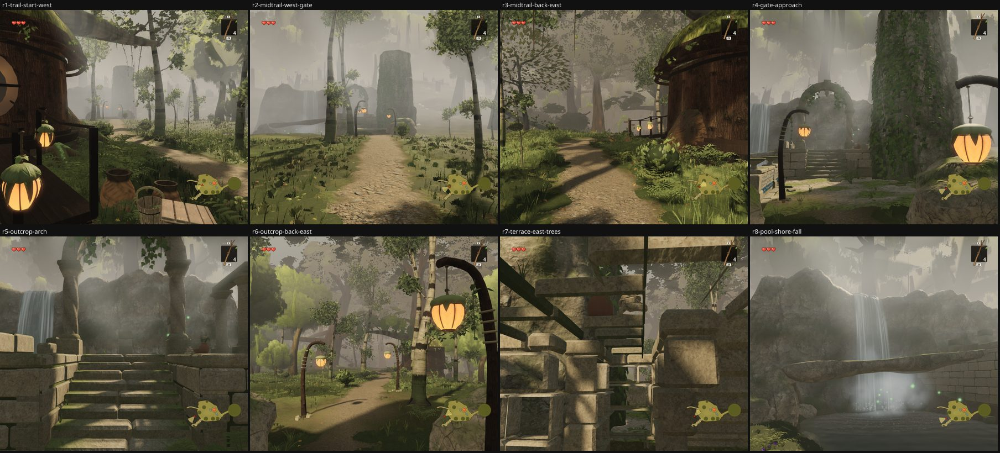
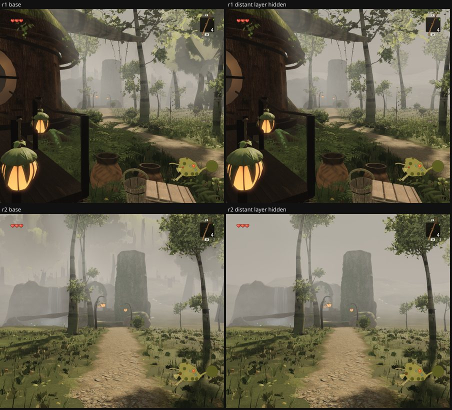

# Round 54 (fable-4) — the tree side of `agent/fable-cursor-exp-ruins` @ `7c4fb16f`, read at eight of the ruins trail's poses before it lands

Non-author review, trees only (the ruins themselves are fable-cursor's). Build of the branch's tip in a worktree, 896 × 776,
quality high, clock frozen, eye 1.6 m, fov 50; the white-bark and understory instance matrices read from the scene after the
first pose's submit; the distant layer hidden for the hide-one-group test; the audit's `whiteBarkCulled`, `ruinsCardCull`,
`maxBaseGap`, `understoryInstances`.

| pose | where | draws / tris |
|---|---|---|
| r1 | the trail's start beside the west house's flight foot (−13.75, 6.6) → west along the ledge | 397 / 3.55 M |
| r2 | mid-trail (−30, 1.5) → the gate boulders (−53, −4.2) | 232 / 2.10 M |
| r3 | mid-trail (−30, 1.5) → back east to the house (−13.7, 6.5) | **736 / 8.96 M** |
| r4 | the gate's approach (−48, −3.4) → the outcrop and the ivy rock | 137 / 0.92 M |
| r5 | the outcrop (−57.5, −4.3) → up the stair to the arch | 113 / 0.58 M |
| r6 | the outcrop → back east along the trail (−40, −1.5) | **730 / 8.91 M** |
| r7 | inside the terrace's colonnade (−66, −6) → east (a bad pose of mine: masonry fills it) | 666 / 8.54 M |
| r8 | the pool's south shore (−59, 9.5) → the fall | 107 / 0.36 M |

## What the trees do on the trail

- **White-barks frame the walk.** 17 drawn; 11 within 12 m of the trail's line, five boles at 2.38 / 2.83 / 2.88 / 2.99 / 3.9 m
  from the centreline — 0.8–2.3 m beyond the packed earth's verge (half width 0.85 + verge 0.7), none on the earth; the
  branch's `ruinsTrunkCull` ring (trunk radius + 0.9 m) does what it says. `maxBaseGap` 0: the stems sit on the ledge's
  2.2–2.8 m grade (`y` 2.23–2.82 read from the matrices).
- **Six white-barks the ruins drop**, none the six fixed frames see: (−46.71, −4.86), (−36.18, 0.29) on the trail's line;
  (−13.8, 4.88) at its first bend beside the west house — 60° off camera C's axis against a 37° half-width, and out of A / B /
  D / E / F by 99–171°; (−52.92, 6.06), (−54.09, 2.2), (−57.72, 11.67) in the pool's basin and on its shore. The cull lists
  before / after are otherwise identical (10 → 16).
- **The card layers stand back.** `ruinsCardCull` drops 57 mid-grove cards and 2 distant boles (11 m off the trail's line west
  of x −1, 10 m off the site's box). With the distant layer hidden at r1 and r2 (sheet below) every trunk left standing near
  the trail is a white-bark; the crowns that vanish are 15–40 m out, left and right of the walk — the trail's depth is the mid
  grove's, and no card pile or smeared bole stands in fable-5's 3–11 m band.
- **Understory**: one stem in the trail's box, (−10.58, −0.47), 5.8 m off the line at the very start; the understory's zones
  do not reach the ledge. The trail reads as the reference's forest path without it (white-barks near, the mid grove behind),
  so I am not proposing a zone there.
- **No root toes on the trail's white-barks** (9 of the 11 are beyond the 24 m root reach). After today's measurement on the
  east lane (`round54-eastroots`: toes built, nothing shows in turf) I am not adding them here either; the ledge's ground
  cover is the same grass.

## Notes for the branch, not trees

- The two looks back east from the trail are over the caps — r3 736 / 8.96 M, r6 730 / 8.91 M — the same shape as the north
  hamlet's and the east green's looks back at the village (structures and the characters' draws; the trees at these poses are
  the plaza's white-barks and the mid grove behind, the same as from the plaza).
- From r1 and r2 (30–45 m, in the haze) the ivy rock reads as a smooth pale cylinder — the stacked courses do not carry that far.
  The owner circled a smooth pale cylinder once (a column trunk); this one is a rock, but it reads the same way from the trail's
  first half.

Renders `/tmp/f4/r186/R`, `/tmp/f4/r186/Rnd`; dist `/tmp/f4/r186-dist-ruins` (worktree `/tmp/f4/wt-ruins` @ `7c4fb16f`).
