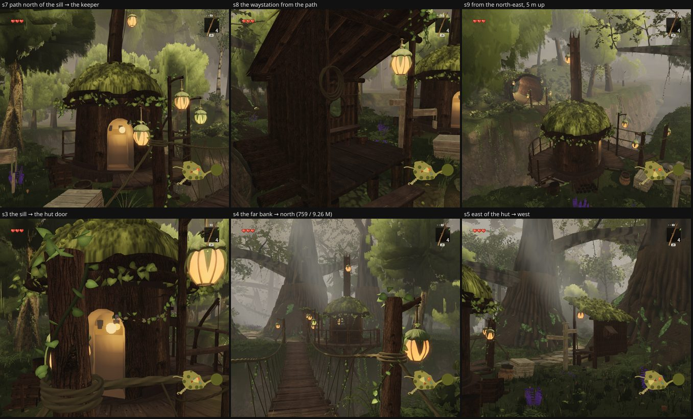

# Round 54 (fable-4) — the tree side of `agent/fable-cursor-exp-south2` @ `066144ad` at the south dwellings (non-author review)

The keeper's hut on the ravine's lip (7.1, 31.9) and the waystation by the path (5.12, 25.95) are new structures set among
trees the layout's streams placed before them; `trees/index.ts` is untouched on the branch, so the question is whether a
white-bark, an understory stem or a crown stands in or over them. Build of the tip in a worktree, 896 × 776, quality high,
clock frozen, eye 1.6 m; the white-bark and understory instance matrices read from the scene after the first pose's submit.

| pose | where | draws / tris |
|---|---|---|
| s7 | the path north of the sill (3, 27.5) → the keeper's hut | 388 / 4.47 M |
| s8 | the path (2.5, 24.5) → the waystation | 430 / 4.85 M |
| s9 | north-east of the hut, 5 m up (12, 24) → the hut | 402 / 4.23 M |
| s3 | the north sill (3.7, 29.9) → the hut's door | 392 / 4.26 M |
| s4 | the far bank (4, 46) → north over the bridge to the hut | **759 / 9.26 M** |
| s5 | east of the hut (13, 30.5) → west past the waystation | 566 / 5.68 M |

(Three more poses from the path at z 21–27 looked straight into `plaza-south`'s trunk, which is the wedge the dwellings were
set in; dropped.)

## Findings

- **No stem in or near either dwelling.** Of the white-barks drawn from these poses, the nearest to the hut is (21.14, 32.0),
  14.0 m east; the nearest to the waystation is the same tree at 17 m, and (−7.39, 12.87) 13 m north-west of it. Understory:
  the nearest is (−5.49, 48.37) on the far bank, 21 m off. No crown reaches the hut's cap (2.9 m), its mast (5.6 m) or the
  beacon pod; the white-barks behind the hut at s7 / s9 frame it from 14–21 m, which is the reference's relation of hut to
  trees at the plaza. `maxBaseGap` 0.
- **Nothing tree-side to change**: the branch's `expansionCull` gained `inSouthDwelling`, which the legacy streams honour;
  the tree streams did not need it here because nothing stood there.
- **For the branch**: s4, the far bank's look north over the bridge, is 759 / 9.26 M — the same pose family fable-cursor's
  full check has at 818 on the head (the village seen whole from outside). The trees at s4 are the plaza's giants and
  white-barks, unchanged.

Renders `/tmp/f4/r188/{S,S2}`; dist `/tmp/f4/r188-dist-south2` (worktree `/tmp/f4/wt-south2` @ `066144ad`).
