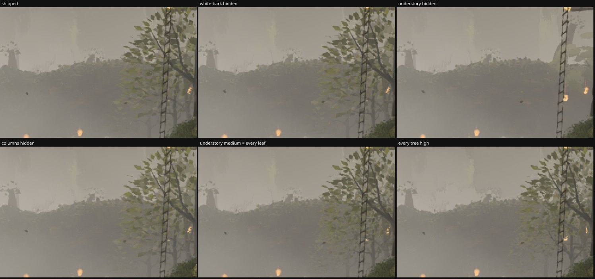
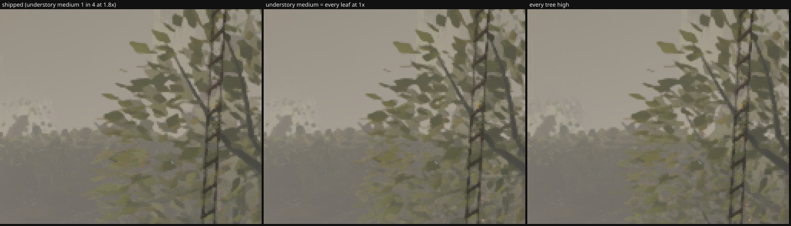

# Round 54 (fable-4) — the residual "trees only get detailed up close" at the owner's poses: whose LOD it is, and the cheap fix

squad2's lodcheck (`ba5662a5`) measured the owner's complaint as shipped rungs vs every tree forced high (`?treelod=10`): 2.06 % of
the north frame, and by elimination the high→medium rung at 28 m owns it; moving the rung to 40.6 m costs camera A +296 K it does
not have, so squad2 landed 32 m paid by the distant gate (45 m) for a tenth of it. The rung moves three families at once. This is
the same measurement asked *whose pixels* those are, on the head `b31042a2`, 896 × 776, quality high, clock frozen, the owner's
exact 06:50 poses (`owner-2026-09-23/pass3/owner-0650-poses.json`).

## Shipped vs every tree high, by family (hide each family on the shipped build; masks at 8 / 24 levels)

| pose | shipped vs every-high (> 8) | understory | white-bark | columns | other |
|---|---|---|---|---|---|
| owner-0650-north | 3.34 % of the frame | **64–74 %** of those pixels | 4–7 % (the white-barks are 0.4 % of the frame) | 2–4 % | 15–30 % |
| owner-0650-west | 3.08 % | **48 %** | 4 % | 1 % | 47 % |

The near rung × 1.45 (40.6 m) alone: 0.27 % / 0.46 % left — squad2's finding reproduced — at +163 K (north) and **+495 K** (west).

## What the swap changes, seen: an understory crown by the corridor's ladder, 30–40 m out

The crown vanishes when the understory is hidden and fills out under every-tree-high. Its medium LOD is the writer's default —
one leaf in 4 at 1.8 × — so at the 28 m rung the leaves quadruple and shrink: that is the pop.

| understory medium | leaves | frame vs shipped | blurred σ 6 mean |Δ| vs every-high, whole frame | crown box mean L | tris at the north / west pose |
|---|---|---|---|---|---|
| shipped | 1 in 4 at 1.8 × | — | 0.420 | 122.9 | 8.035 M / 5.935 M |
| 1 in 2 at 1.3 × | | 1.9 % | 0.347 | | +11 K / +7 K |
| **every leaf at 1 ×** | = the high LOD's laminae | 2.5 % | 0.297 | 122.8 (high 122.7) | **+34 K / +20 K** |
| the near rung at 40.6 m (for scale) | | 3.1 % | 0.101 | 122.7 | +163 K / +495 K |

Pixel metrics against every-high cannot reach zero for a medium mesh — its leaves land elsewhere (the tubes take different
draws at 7 sides) — so read the 3× crop: with every leaf at 1 × the medium reads as the high (same leaf size, count and tone, mean
L to 0.1), and the swap at 28 m becomes the wood's sides only. The white-barks' medium (1 in 8 at 2.53 ×) is not the pop at these
poses: densifying it to 1 in 4 or 1 in 2 moves 35–49 pixels of the north frame.

## The six fixed views, 1280 × 720 (`capture.mjs --settle 12`, head `b31042a2` vs `agent/fable-4-usmed` `28f95b56`; SSIM vs `reference/frames`)

| view | head draws / tris | branch draws / tris | pixels changed (> 8) | SSIM head → branch |
|---|---|---|---|---|
| A_stairs | 637 / 8.85 M | 637 / 8.87 M | 0.41 % | 0.1952 → 0.1955 (+0.0003) |
| B_house | 628 / 8.27 M | 628 / 8.29 M | 0.52 % | 0.1769 → 0.1774 (+0.0005) |
| C_lookback | 574 / 7.92 M | 574 / 7.92 M | 0 | 0.1839 → 0.1839 (0) |
| D_log | 561 / 8.63 M | 561 / 8.66 M | 1.33 % | 0.2511 → 0.2526 (**+0.0015**) |
| E_ground | 628 / 8.27 M | 628 / 8.29 M | 0.52 % | 0.1999 → 0.2001 (+0.0002) |
| F_canopy | 601 / 7.99 M | 601 / 8.00 M | 0 | 0.2192 → 0.2192 (0) |

No view moves away from the reference; D, whose corridor crowns at 28–44 m get their finer leaves, moves toward it. A stays
130 K under the 9.0 M gate on this head (exp-north merged since; the branch merges clean — north does not touch `understory.ts`).

## The change (branch `agent/fable-4-usmed` `28f95b56`, PR #65)

`understory.ts` `leafOpts`: `mediumEvery: 1, mediumScale: 1` — the understory's medium LOD keeps every lamina at its size (the
low LOD stays 1 in 8 at 2.6 × past 44 m). +34 K at the owner's north pose, +20 K at the west; the six fixed views' counts follow.

Renders `/tmp/f4/r191/{shipped,high,rung40,med4,med2,us-med2,us-med1,hide}`; dists `/tmp/f4/r191-dist-*`.
