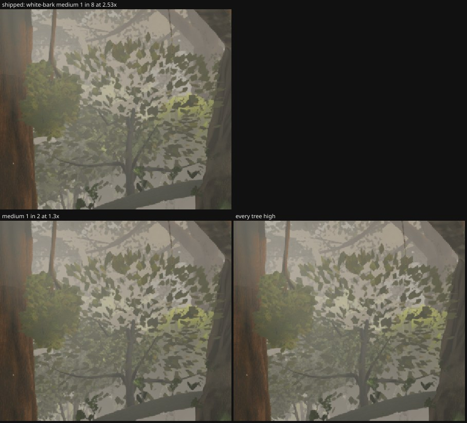

# Round 54 (fable-4) — the white-barks' medium crown, measured the way the understory's was (→ PR #74 `agent/fable-4-wbmed` `2896a08a`)

After PR #65 (the understory's medium keeps every lamina) the same question for the white-barks: their medium crown is one
lamina in 8 at 2.53 × (rounds 49 / 51's W38 give-back), the coarsest of the three families'. At the owner's own poses the
white-barks were 0.4 % of the frame, so nothing there; the swap reads on walks where a white-bark stands 28–44 m ahead.

Head `b31042a2` builds, 896 × 776, quality high, clock frozen, eye 1.7 m, fov 46. Two such poses: **w1** the plaza's west edge
(−2, 2) → the meadow's stem at (−24.1, −12.0), 29.8 m; **w2** the north path (2, −20) → the west house's stem at (−13.8, 4.9),
29.5 m. Variants: shipped; medium 1 in 4 at 1.8 × (the writer's default); 1 in 2 at 1.3 × (the low boughs' setting); every tree
high (`ZR_URL_EXTRA=treelod=10`).

| white-bark medium | w2 crown box, blurred σ 3 / σ 6 mean |Δ| vs every-high | tris at w1 / w2 | six views, head → variant (896 × 776) |
|---|---|---|---|---|
| shipped 1 in 8 at 2.53 × | 1.60 / 1.05 | 4.816 M / 8.043 M | — |
| **1 in 4 at 1.8 ×** | **1.14 / 0.72** | +61 K / +37 K | **A +16 K, B / E +20 K, C +55 K (+1 draw), D +25 K, F +39 K** |
| 1 in 2 at 1.3 × | 0.90 / 0.66 | +183 K / +109 K | A +47 K, B +60 K, C +146 K, D +75 K, E +60 K, F +115 K |
| every tree high | 0 | +2.6 M / +3.2 M | — |

The 1-in-4 medium takes the gap half-way for a third of 1-in-2's cost; what 1-in-2 adds is close to the arrangement floor
(a medium mesh's laminae land elsewhere than the high's, so no medium reaches 0). At the gate A is 8.87 M after #65; +16 K
leaves room for squad2's 32 m rung too. PR #74 ships the 1-in-4 line; the 1280 × 720 pair for SSIM is in its description.
The camera-C read is the one to watch (its white-barks at 15–44 m, two on the medium at 41–44 m).

Renders `/tmp/f4/r194/{shipped,high,med4,med2,six-med4,six-med2}`; dists `/tmp/f4/r191-dist-{head,med4,med2}`, `/tmp/f4/r194-dist-wbmed`.

## The six fixed views at 1280 × 720 (head `2f6c8ae2` vs `agent/fable-4-wbmed` `2896a08a`; merged as `32e6f5d6` in the 02:15 round)

| view | head draws / tris | branch draws / tris | pixels changed (> 8) | SSIM vs reference, head → branch |
|---|---|---|---|---|
| A_stairs | 629 / 8.94 M | 629 / 8.97 M | 0 | 0.1953 → 0.1953 |
| B_house | 616 / 8.27 M | 616 / 8.29 M | 0 | 0.1768 → 0.1768 |
| C_lookback | 562 / 7.92 M | 562 / 7.98 M | 0.03 % (one crown at 41–44 m) | 0.1855 → 0.1855 |
| D_log | 549 / 8.72 M | 549 / 8.74 M | 0 | 0.2511 → 0.2511 |
| E_ground | 616 / 8.27 M | 616 / 8.29 M | 0 | 0.1996 → 0.1996 |
| F_canopy | 585 / 8.05 M | 585 / 8.10 M | 0 | 0.2192 → 0.2192 |

Identical to four decimals at every view (fable-5's pairing read the same). **A stands at 8.97 M with this in — 30 K under the
9.0 M gate before the rest of the 02:15 round (roofcover, cliff-scale)**; the next triangle spend at A needs a give-back.
