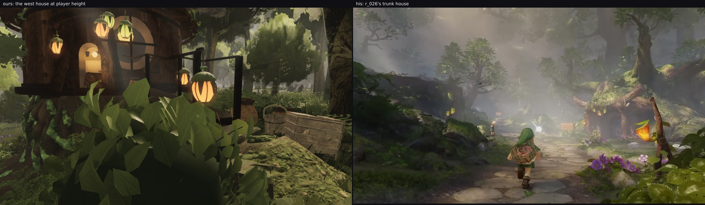

# squad2 — Backlog 3 measured and handed on: "the west house and the far hut … walls read flat and dark"

**Taking Backlog item 3.** Lane 2's own list is empty: the canopy gaps, the LOD rungs and the crown tone are
merged and re-verified on the head, and Backlog item 4 ("the distant ring's floor cards seen straight up in
the open north, a dark flat disc overhead") turned out to be the roof hole this lane diagnosed at 03:45 and
closed in `roofhole` — `u-open-up`'s top third went 137.7 → 74.4 levels there, so item 4 is answered.

This is item 3, measured from **known-walkable positions** (the playtest's own `west-house` route trace, the
lesson from the coverage sweep) and then attributed. It is **not this lane's to fix**, and the numbers say
where it belongs.

## The item is real, and it is darkness rather than flatness

A clean patch of the west house's wall against the same kind of patch on the reference's trunk houses:

| patch | mean | sd | p10 | p90 |
| --- | --- | --- | --- | --- |
| ours, the west house's wall | **0.199** | 0.144 | 0.100 | 0.395 |
| `r_026`'s trunk house | **0.502** | 0.096 | 0.378 | 0.634 |
| `r_022`'s trunk house | **0.537** | 0.088 | 0.416 | 0.635 |

**Our wall sits at a fifth of white where his sits at half.** "Flat" is the weaker half of the complaint: our
absolute sd is higher (0.144 against 0.088–0.096), but relative to the mean it is 0.72 against their 0.18 —
ours is a dark surface with a few lit patches, theirs an evenly lit mid-tone. The thing to fix is the level.

## Whose material it is: not the trees'

With the trees' wood materials marked one at a time (`probe-look.mjs`, the names this lane added in
`brownwood`), the wall patch is painted by **none of them**: `tree-giant-bark` 0.9 %, `tree-white-bark`
0.0 %, `tree-distant-wood` 0.0 %. So the west house's wall is the **structures'** own material
(`structures/house.ts` and its bark), which is lane 9's / fable-3's, not this lane's trees.

Two things for whoever picks it up:

1. The fix is a level, not a texture: the wall wants roughly **2.5 × its current lightness** to sit where the
   reference's huts sit, and the reference's evenness (sd/mean 0.18) suggests it is lit rather than painted
   bright — a light or an ambient term on the house's own material rather than a brighter map.
2. **Name the structures' materials.** This measurement only became possible for the trees because this lane
   named their woods; `probe-look.mjs` marks by material name and the structures' are anonymous, so the same
   question about a wall, a roof or a plank cannot be answered from a frame today. One line each.

The second sample in this round (`far-hut-face`) missed: the coordinates put the camera on a giant's bole
instead of the hut, and that frame reads well — furrows, moss, three-dimensional. So the far hut itself is
still unmeasured, and the pose for it wants picking off a walk trace that passes it.
