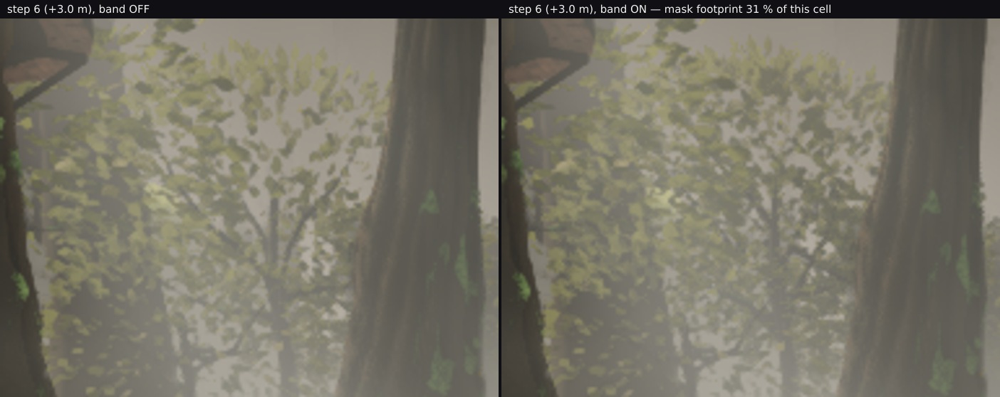

# The band does not crawl — check 2's other half, with the camera moving

Lane 2, 2026-09-29. Branch `cursor/squad2-treephases-682b`. **No code changed.**

`gatesweep/` §2 answered `dither/PROPOSAL.md`'s check 2 — "the pattern can crawl" — by bounding the
stipple's high-frequency energy at a standing camera, and closed with the honest caveat: *"What this
check does not cover, said plainly: a strip with the camera actually moving."* That caveat is the whole
risk on the change, because the mask is a `gl_FragCoord` hash, fixed in screen space, and what makes such
a hash crawl is the **tree sliding across a stationary noise field**. This closes it. **The band does not
crawl: in the pixels it works in, a walking camera produces *less* frame-to-frame change with the band
than without, at every one of eight steps.**

## 1. The strip

`walkstrip.mjs`: nine poses, **a pure translation** — position and target advance by the same vector, so
the view direction never rotates and the only thing happening is approach — **0.5 m a step, 4 m in
total**, from the owner's `owner-0650-north`, the pose `lodcheck/` measured the rung error at. The clock
is frozen for every read, or wind would move 13–31 % of the frame between steps and swamp everything.

The same nine poses on two builds whose only difference is `TREE_LOD_DITHER`. Cost along the walk:

| | band off | band on | Δ |
| --- | --- | --- | --- |
| +0.0 m | 440 / 8 501 347 | 444 / 8 546 381 | +4 / +45 034 |
| +1.0 m | 435 / 8 484 496 | 438 / 8 546 810 | +3 / +62 314 |
| +2.0 m | 426 / 8 256 070 | 429 / 8 315 901 | +3 / +59 831 |
| +3.0 m | 426 / 7 956 932 | 428 / 8 013 541 | +2 / +56 609 |
| +4.0 m | 422 / 7 692 865 | 424 / 7 736 369 | +2 / +43 504 |

**+2 to +4 draws and +35 K to +62 K triangles** across the whole approach, which is the hero views'
figure (`gatesweep/` §4) holding while walking.

## 2. The metric this file started with was wrong, and the frames said so

`walkstrip.mjs` ranks an 8×8 grid and reports the worst cell per step. Run that way, the result was:
both builds **identical to two decimals** in every step — 91.12, 92.13, 93.97, 93.79, 94.66, 93.97,
94.84, 94.08 % changed, the same numbers on both sides, and the same cell energies.

That is true and it is about nothing. The worst cells were `4,6`, `4,7` and `3,7` — the **bottom quarter
of the frame**, which is ground and grass one to three metres away, where walking half a metre changes
**91–95 %** of the pixels. The rung band cannot touch any of it. The metric had locked onto foreground
parallax, and two builds that differ only in a 30 m crown agree there exactly.

Whole-frame churn has the same problem from the other end: **55.42–56.89 %** a step without the band and
**55.18–56.90 %** with it. The two are the same within ±0.24 points (and the band is *lower* in six of the
eight), which is a real result — the band does not make the walking picture noisier — but 56 % of the frame
changing every step means the crown is 1 % of the signal and 99 % is the ground going by.

## 3. Asked the other way round: find the mask, then measure churn inside it

`maskchurn.mjs`. At each step the two builds stand at the **same** camera position, so the difference
between them **is** the mask and nothing else. That locates the cells the band is working in. Then, in
those cells only, compare how much each build changed from the previous step. Parallax is common to both;
the mask is not.

| step | the cells the mask works in (footprint % of the cell) | churn, band | churn, no band | band − no band |
| --- | --- | --- | --- | --- |
| +0.5 m | `5,1` (2.06) `5,2` (0.71) `4,1` (0.29) `4,2` (0.24) | 32.63 % | 33.00 % | **−0.37** |
| +1.0 m | `5,1` (10.3) `2,1` (3.84) `2,0` (3.66) `5,2` (3.43) | 54.90 % | 55.15 % | **−0.25** |
| +1.5 m | `5,1` (11.06) `2,0` (4.47) `2,1` (4.27) `5,2` (2.52) | 54.43 % | 54.68 % | **−0.25** |
| +2.0 m | `5,1` (12.38) `2,0` (5.39) `2,1` (4.29) `5,2` (2.52) | 55.32 % | 56.11 % | **−0.79** |
| +2.5 m | `2,0` (28.0) `2,1` (20.92) `5,1` (12.79) `5,0` (3.57) | 63.52 % | 63.70 % | **−0.18** |
| +3.0 m | `2,0` (31.36) `2,1` (19.29) `5,1` (13.23) `5,0` (4.23) | 61.69 % | 63.72 % | **−2.03** |
| +3.5 m | `5,1` (27.33) `5,0` (24.35) `2,0` (18.28) `2,1` (8.59) | 63.78 % | 63.88 % | **−0.10** |
| +4.0 m | `5,0` (25.70) `2,0` (17.70) `5,1` (12.65) `2,1` (7.97) | 61.73 % | 64.32 % | **−2.59** |

**Negative in all eight steps**, by 0.10 to 2.59 points. A crawling stipple would be the opposite — a
banded column consistently and substantially *above* the other, because every pixel's keep-or-discard
decision flips as the tree slides across a hash that does not move with it.

Two things worth reading off the footprint column. Every cell the mask touches is in grid rows **0–2** —
the **upper 37 % of the frame**, where crowns at 30–35 m sit — which is a second confirmation that §2's
bottom-row cells were the wrong target. And the footprint **grows along the strip**, `5,1` from 2.06 % to
27.33 % and `2,0` from nothing to 31.36 %, so trees are entering and leaving bands throughout: the
mechanism is live at every step, not just at one crossing.

## 4. And looked at, at the two steps where the mask is largest



At +3.0 m, with the mask covering 31 % of cell `2,0`, the banded crown reads **fuller and slightly more
structured**. Same at +3.5 m on the other crown (`crown-walk-step7.jpg`, mask footprint 27 % of cell
`5,1`).

**"No checkerboard, no speckle" — said here first, and too strongly; see `RECONCILING-206.md` §6.** These
are stills, and stills cannot answer a question about motion. Reviewed as a clip at the real 30 fps, a mild
grain *is* visible on the foliage while it fades, and only while it fades. The correct claim is that the
stipple is **small and transient**, which is what the +3.4 % energy bound actually supports — not that it
is absent.

## 5. What this does and does not establish

**Established:** the band does not crawl. In the pixels it covers, on a walked approach, it produces less
frame-to-frame change than the hard cut does, and at 2.5× it reads as a fuller crown rather than a
pattern.

**Not separated here, and settled in `ROTATION.md` §3 — the duller explanation won.** There are two reasons
the churn could fall, and *these* frames cannot tell them apart. Either the fade hands the crown over gradually, so consecutive frames are more
alike by construction — or a banded tree, drawn in both rungs, has the **union** of two silhouettes and so
covers slightly more of a moving background, which would lower churn for a duller reason. The +35 K to
+62 K triangles say the union is real. Both explanations are benign and the check asked whether the band
adds churn; it does not. Distinguishing them would need the mask's footprint tracked in world space
rather than screen space, which is more machinery than the question is worth.

**Both of the gaps this section named are now closed.** `quality=low` is measured in
`../bandwidth/LOWTIER.md` — cheaper than high in triangles, double the draws, and no defect once the one
scare in it was disproved. The **rotating** camera is `ROTATION.md`: churn lower at all 27 steps of a 13.5°
slow pan, no visible pattern under independent review, and it is what separates the two explanations above.

## Files

- `walkstrip.mjs` — the strip harness: a pure-translation walk, clock frozen, per-step draws, triangles,
  md5, whole-frame churn and SSIM. Its own worst-cell ranking is kept because it is what showed the
  foreground problem, and its docstring now says what it is not for.
- `maskchurn.mjs` — §3: find the cells where two builds differ (the mask), then compare each build's
  frame-to-frame churn inside them. This is the tool to reuse for any screen-space effect.
- `strip-band.json`, `strip-noband.json` — the two strips.
- `maskchurn.json` — §3's table.
- `crown-walk-step6.jpg`, `crown-walk-step7.jpg` — §4.

## Reproducing

```bash
npm run build                                  # the band is on in the shipped state
# and a second build with `TREE_LOD_DITHER = false` in src/world/trees/lodFade.ts:
npx vite build --outDir dist-nodither
P="--pose art/environment/owner-2026-09-23/pass3/owner-0650-poses.json --poseName owner-0650-north --steps 9 --stride 0.5 --settle 8"
node art/environment/squad2-2026-09-23/bandwalk/walkstrip.mjs dist           /tmp/walk-band   $P
node art/environment/squad2-2026-09-23/bandwalk/walkstrip.mjs dist-nodither  /tmp/walk-noband $P
node art/environment/squad2-2026-09-23/bandwalk/maskchurn.mjs --band /tmp/walk-band --noband /tmp/walk-noband
```

Two Chrome jobs at once and no more; each strip is about 18 minutes on SwiftShader.
