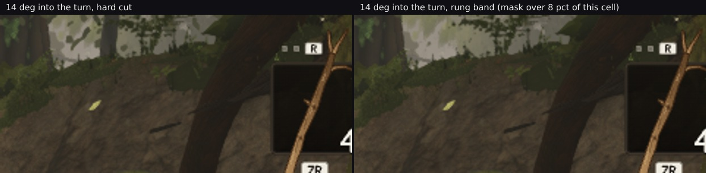

> **Read `README.md` and `RECONCILING-206.md` in this directory first.** This file closes the last
> uncovered check on the rung band and, on the way, settles a mechanism question `README.md` §5 left open.

# The camera turns instead of walking: still no crawl — and the reason the churn falls, finally separated

Lane 2, 2026-09-29. Branch `cursor/squad2-treephases-682b`. **No code changed** except a `--yaw` mode on
the strip harness.

`README.md` §5 listed one condition as uncovered: *"a strip with the camera **rotating** rather than
translating — the harshest case for a screen-space mask."* It is harsher than "different", and this is why:

**A pure rotation changes no tree's distance.** Nothing enters or leaves a band, so every banded tree keeps
a **constant** drop value while its screen position sweeps across a hash that is fixed to the screen. A
translating strip always mixes the two effects — trees crossing gates *and* trees sliding across the hash.
Rotation isolates the second one, which is the only one that can crawl.

28 poses from the owner's `owner-0650-north`, camera fixed, heading turning **0.5° a step for 13.5° in
total** — about 15°/s at 30 fps, a slow deliberate look, and slow is the worst case because a fast turn
blurs a pattern away. Clock frozen. The same 28 poses on a build with the band and one without.

## 1. No crawl, at all 27 steps

`maskchurn.mjs`: find the cells the two builds differ in (that difference **is** the mask), then compare how
much each build changed from the previous step inside those cells only.

| step | mask's biggest cell (footprint %) | churn, band | churn, no band | band − no band |
| --- | --- | --- | --- | --- |
| +0.5° | `5,1` (1.60) | 35.96 % | 36.35 % | **−0.39** |
| +2.0° | `5,1` (1.02) | 39.08 % | 39.38 % | **−0.30** |
| +3.5° | `4,1` (1.74) | 37.40 % | 37.71 % | **−0.31** |
| +5.0° | `7,0` (2.55) | 36.84 % | 37.43 % | **−0.59** |
| +6.5° | `7,0` (2.16) | 38.65 % | 39.56 % | **−0.91** |
| +8.0° | `6,0` (4.80) | 47.99 % | 49.13 % | **−1.14** |
| +9.5° | `6,0` (5.70) | 49.89 % | 51.35 % | **−1.46** |
| +11.0° | `6,0` (6.83) | 50.39 % | 51.73 % | **−1.34** |
| +12.5° | `6,0` (7.91) | 46.47 % | 47.68 % | **−1.21** |
| +13.5° | `6,0` (8.00) | 46.34 % | 47.65 % | **−1.31** |

**Negative at every one of the 27 steps**, from −0.30 to −1.47 points (`maskchurn.json` has all of them).
A crawl would be the opposite — the banded column consistently and substantially *above* the other, because
each frame re-chooses which of a sliding tree's fragments survive. It is below, throughout.

**The test is exercising what it claims to.** The mask's footprint **migrates across the grid** as the
camera turns — `5,1` → `4,1` → `7,0` → `6,0` — and **grows from 1.55 % to 8.00 %** of its cell, which is
exactly a banded tree sweeping across the screen and towards the frame's centre-right. Its magnitude stays
in the same band throughout, as it must when no distance changes.

**Cost over the turn:** +3 to +4 draws and +29 261 to +45 034 triangles, and all 28 band-on frames have
distinct md5s (the frame is genuinely moving, not a stuck render).

## 2. Looked at, under the harshest condition

The 28 frames of each build side by side at the real 30 fps, cropped to the right-hand third where the mask
ends up, looped four times (`rung-band-rotation.mp4`, also in the PR). Reviewed independently, told only
which panel was which:

> **"I do not see any crawling, fizzing, swimming, or shimmering noise on any of the tree foliage in the
> right panel. The leaves and tree crowns in the mid-distance appear solid and visually stable as they move
> across the screen."** … **"I cannot see ANY difference at all between the two panels."** … *"The motion is
> clearly a slow pan (rotation) to the right … without the depth-based parallax expansion that would occur
> if the camera were moving forward."*

The baseline matters too and was asked for: the reviewer found **no shimmer in the hard-cut panel either**,
so the absence on the banded side is not a case of both being equally noisy.

That is the third independent line on check 2, and the only one taken under the condition that can actually
produce a crawl: a **+3.4 %** Laplacian bound at a standing camera (`../gatesweep/` §2), lower churn on a
walked approach (`README.md` §3), and now lower churn and no visible pattern under a slow pan. The earlier
correction stands unchanged — a mild grain **is** visible on foliage that is mid-**handover**, which is a
different thing from a pattern that crawls, and rotation produces no handover at all.



## 3. What this settles: why the churn falls

`README.md` §5 named two explanations and said the frames could not separate them:

> *"either the fade hands the crown over gradually, so consecutive frames are more alike by construction, or
> a banded tree — drawn in both rungs — has the **union** of two silhouettes and covers slightly more of a
> moving background, which would lower churn for a duller reason."*

**Rotation separates them, because it removes the first one.** No tree changes distance, so no handover is
in progress anywhere in this strip — and the reduction is still there at every step. More than that, **it
scales with the mask's footprint**:

| the mask's biggest cell | reduction |
| --- | --- |
| 1.0–1.7 % | 0.30–0.43 |
| 2.0–3.0 % | 0.59–0.99 |
| 3.9–7.4 % | 0.92–1.47 |
| 7.8–8.0 % | 1.17–1.31 |

A gradual handover would not care how much of the cell the mask covers; more silhouette covering more moving
background would, and does. **So the union is the operative mechanism for the steady part of the reduction,
and the duller explanation is the right one.** The handover is not thereby disproved — it is where the
*large* reductions in `README.md` §3 came from, −2.03 and −2.59 points at the two steps that contained an
actual gate crossing, well above anything this rotation strip produces. The decomposition is: **a steady
~0.2 points per per-cent of footprint from the union, plus a larger one-off at a crossing from the fade.**

Which also means the "does not crawl" result should be read for what it is. It is not that the mask is
invisible; it is that **the mask's own contribution to frame-to-frame change is smaller than the pixels it
covers up**, in both motion regimes, by a mechanism that does not depend on the fade working.

## Files

- `rotation-step27.jpg` — §2, the two builds 13.5° into the turn at the mask's largest footprint.
- `rung-band-rotation.mp4` — §2's clip, the strip at 30 fps looped four times.
- `maskchurn-rotation.json` — §1's 27 rows.
- `strip-rot-band.json`, `strip-rot-noband.json` — the two strips, per step.

## Reproducing

```bash
npm run build                                   # band on
npx vite build --outDir dist-nodither           # with TREE_LOD_DITHER = false
P="--pose art/environment/owner-2026-09-23/pass3/owner-0650-poses.json --poseName owner-0650-north --steps 28 --yaw 0.5 --settle 8"
node art/environment/squad2-2026-09-23/bandwalk/walkstrip.mjs dist          /tmp/rot-on  $P
node art/environment/squad2-2026-09-23/bandwalk/walkstrip.mjs dist-nodither /tmp/rot-off $P
node art/environment/squad2-2026-09-23/bandwalk/maskchurn.mjs --band /tmp/rot-on --noband /tmp/rot-off --steps 28
```

`--yaw` overrides `--stride`: the camera holds position and only its heading turns. Two Chrome jobs at once
and no more; each 28-frame strip is about 35 minutes on SwiftShader.
