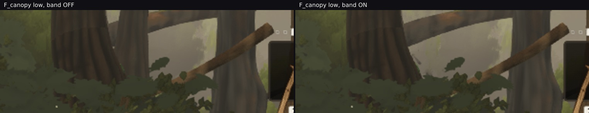

# The band at `quality=low`: cheaper than at high, apparently better against the reference — and one
# suspected defect that the metric called an improvement

Lane 2, 2026-09-29. Branch `cursor/squad2-treephases-682b`.

The rung band shipped measured only at `quality=high`; `gatesweep/` §5 and `bandwalk/` §5 both listed the
weak tier as uncovered. This closes the cost half and **opens a defect at `F_canopy`** that the aggregate
numbers scored as a small win.

## 1. Why the tier is not just "the same thing, smaller"

`quality.distance` is **0.6** at low (`world/index.ts` `qualityFor`), and the rung gates are scaled by it,
but `TREE_LOD_DITHER_BAND_M` is an absolute 2.5 m and deliberately is not (a fade should last the same
number of walking paces on every tier, because the player walks at the same speed on every tier). So the
band is a larger **fraction** of the rung range on the weaker tiers:

| tier | `distance` | gates (m) | gap | band as a share of the gap |
| --- | --- | --- | --- | --- |
| **low** | 0.6 | **19.2 / 26.4** | **7.2 m** | **34.7 %** |
| medium | 0.8 | 25.6 / 35.2 | 9.6 m | 26.0 % |
| high | 1.0 | 32 / 44 | 12 m | 20.8 % |
| ultra | 1.25 | 40 / 55 | 15 m | 16.7 % |

That table also produced a hardening worth more than this round's measurements: **low is the tier that
limits the band's width at all.** `lodSlots` returns on the first gate whose band contains `d`, so once the
band reaches the gap the two bands overlap and a tree in the overlap is claimed by the near gate — drawn
partly at rung 0, a rung more detailed than the hard cut would ever give it, while the 1→2 crossing it
belongs to never happens. The far gate still crosses over correctly, which is what makes it silent.
**Yesterday's 8 m and 12 m sweep variants, measured at high, would have been broken at low.** `bandOverlaps`
is the predicate; `trees/index.ts` resolves the band once per build and falls back to the hard cut with a
`console.error` when it does not fit, which the gauntlet's B6 check ("console clean during capture") turns
into a failed take. Two tests pin it, including the overlap's exact misbehaviour against the hard cut's
answer.

## 2. The cost, which is the good news

`frozen.mjs --quality low`, band off against band on, same view list:

| view | band off | band on | Δ | changed > 2/255 | SSIM vs band-off | SSIM vs reference | Δ ref |
| --- | --- | --- | --- | --- | --- | --- | --- |
| A_stairs | 495 / 6 441 178 | **499 / 6 474 944** | +4 draws / +33 766 | 2.14 % | 0.99447 | 0.3132 → **0.3139** | **+0.0007** |
| F_canopy | 449 / 5 493 128 | **449 / 5 493 128** | **+0 / +0** | 0.44 % | 0.99700 | 0.3553 → 0.3555 | +0.0002 |

Against high's A_stairs (+2 draws / +98 181 triangles, 0.39 % of pixels, Δ ref **−0.0004**):

- **the triangle cost is a third of high's** in absolute terms and half in relative terms (0.52 % of the
  frame against 1.14 %), because the low tier's trees are lower-poly to begin with;
- **the draw cost is double** (+4 against +2), which is the wider fraction in §1 showing up — more families
  have a banded member at any moment;
- **more pixels move** (2.14 % against 0.39 %, 5.5×), same reason;
- and the frame moves **toward** its reference at low (+0.0007) where at high it moves away (−0.0004).

That last line has a plausible reading: the weak tier starts sparser, so the band's partial high-rung
fragments add middle-distance foliage it was missing, while at high the frame is already detailed enough
that the stipple is a net departure. **It also turned out to be the wrong thing to lead with.**

## 3. The defect the metric scored as a win

At `F_canopy`, low: the trees system submits **61 draws and 2 292 225 triangles either way** — identical —
and the whole frame's counts are identical too, while **0.40 % of the pixels move by a mean of 44–48
levels**, concentrated in two adjacent cells in the upper right (x 0.63–0.88, y 0–0.13). Mean luminance in
that crop rises 66.1 → 68.9 and its top third 77.2 → 80.5: the region gets **brighter**.

Looked at, that is a **distant trunk thinning away**, with pale mist showing through where it was:



Δ ref read **+0.0002** for this frame — a hair *better*. It is not better. A metric that averages the whole
frame cannot tell "a crown gains plausible foliage" from "a trunk loses itself", and this lane has now been
caught by that twice in two days (the other being "no stipple" from a Laplacian bound that motion
contradicted).

**Why identical counts make this suspicious rather than benign.** A banded tree is supposed to be pushed
into **both** rungs' buckets, which must change the submitted triangles. A fragment `discard` does not
change them — so "identical counts, changed pixels" is consistent with the near rung drawing the tree
thinned while **the complementary rung draws nothing**. If that is what is happening, the band is not
cross-fading there at all; it is a one-sided dropout, and a tree gets thinner as the player approaches with
nothing filling in.

The mechanism I can construct for it, unverified: `fillFamily` gives every bucket mesh its own
`computeBoundingSphere()` plus `CULL_PAD_M`, so the two rungs of one banded tree are culled
**independently**. A bucket holding few instances gets a tight sphere around a different LOD's geometry, and
at the frustum edge the renderer can drop one of the pair while keeping the other.

**Verification is running** — `bucketprobe.mjs` reads `submission.byFamily`, which splits the trees by family
**and by LOD** (`whitebark-lod0/1/2`, `column-lod*`), at this pose and tier on both builds. That separates
the two possibilities cleanly: if `lod0` and `lod1` both hold the banded tree then the bucketing is right and
a mesh is being culled; if neither moves, nothing is banded and the difference is something else entirely.
The numbers land in the next commit.

**Until it is explained, this file does not claim the low tier passes.** The cost figures in §2 stand on
their own; §3 is an open defect on the tier that can least afford one, and if it is the independent-cull
story then it applies at every tier and merely shows first at low, where the gates are closest and banded
trees are largest on screen.

## Files

- `bucketprobe.mjs` — §3's probe: per-family, per-LOD submission plus the resolved `lodBand` and gates, at
  a chosen pose and quality tier.
- `lowtier-canopy-trunk.jpg` — §3, the two `F_canopy` frames at ~2.5×.
- `low.json` — §2's rows.

## Reproducing

```bash
npm run build                                   # band on
npx vite build --outDir dist-nodither           # with TREE_LOD_DITHER = false
for D in dist-nodither dist; do
  node art/environment/squad2-2026-09-23/frozen.mjs $D /tmp/lo-$D --views A_stairs,F_canopy --quality low --settle 8
done
node art/environment/squad2-2026-09-23/bandwidth/bandcost.mjs --base /tmp/lo-dist-nodither \
     --width 2.5=/tmp/lo-dist --views A_stairs,F_canopy
node art/environment/squad2-2026-09-23/bandwidth/bucketprobe.mjs dist /tmp/bp-on.json --view F_canopy --quality low
```
