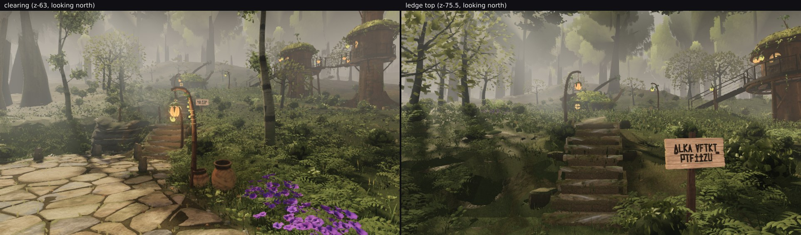

# Backlog item 2 — "the north clearing and the ledge flight: something to do there"

Taking Backlog item 2 (docs/SQUAD_2026-09-23.md §Backlog). Owner note 09-19: *"more to do after
the steps."* This is a **measurement, not a change**: the item is answered by content other lanes
have landed since 09-19, and lane 2's canopy over that route has no hole. Nothing in lane 2's files
needed editing, so this branch adds evidence only.

## What a walker now meets after the steps

Poses are two points taken off the `north-clearing-ledge` walk trace of
`gauntlet/scripts/playtest.mjs` (the route the owner's note is about), rendered at eye height with
`broll.mjs --test --settle 6`, 960×540 (`poses.json`).

| pose | what is there |
| --- | --- |
| clearing, z −63, looking north | paved apron, two clay pots, a lantern crook, a painted sign, the riser flight, the stilt houses of the grove on the right, violet flower drift |
| ledge top, z −75.5, looking north | signposted trail, four lantern crooks up the rise, a treehouse with a lit balcony and a stair, a cave mouth left, the trail winding on to the shelf hamlet |

So "after the steps" now leads somewhere: the flight is signed at the bottom and at the top, the
trail is lit, and it ends at the grove hamlet rather than at bare grass.

## Lane 2's part: is the canopy open over that route?

Pale-air share (luminance > 150) by row band, and the middle-distance band reading from `band.mjs`:

| frame | rows 0–0.18 | rows 0.18–0.35 | rows 0.35–0.5 | band y 0.1–0.45 |
| --- | --- | --- | --- | --- |
| clearing | mean 139.0, pale 41.1 % | mean 130.4, pale 32.2 % | mean 108.2, pale 10.1 % | mean 121.7, across-column sd 22.9 |
| ledge top | mean 121.4, pale **15.4 %** | mean 127.1, pale 34.4 % | mean 104.7, pale 9.6 % | — |

The ledge top, which is the pose the owner's note is about, is 84.6 % crown and trunk in its top
band; the clearing is deliberately open northward (a hill in fog behind it), and its middle band
reads as structured forest, not a flat wash: across-column sd 22.9 at mean 121.7, the same
signature the hero frames carry after the crown-veil work, not the sd < 10 of haze.

Roof coverage over the whole route is continuous in z: `ROOF_BOUNDS` z −70…40, `ROOF_STAND_BOUNDS`
z −96…−52, `ROOF_GROVE_BOUNDS` z −120…−94, `ROOF_SOUTH_BOUNDS` z 27…64. The clearing (z −55…−78)
sits inside the overlap of the first two, so there is no band to add.

## Left for other lanes

* The stilt-house wall on the right of the clearing frame is the same near-field darkness measured
  in `../farhut/README.md` (Backlog item 3): the lit balcony throws no bounce onto its own wall.
  Already handed to the structures lane; no new information here.

