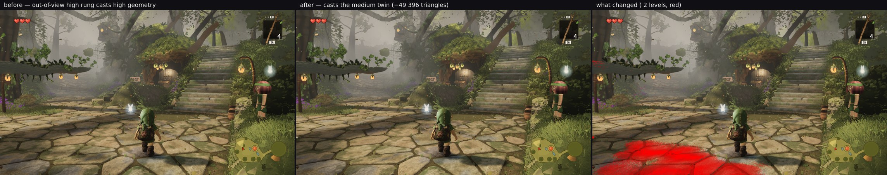

# The columns' high rung casts 69 426 depth triangles at hero A, and they are buying the dapple

*squad lane 2 — 2026-09-30 12:30 UTC — built, measured, **reverted***

Lane 2's list was empty. The first thing the newly trustworthy tally (`auditvsrenderer/`) surfaced about the
**world** rather than about the reporting was this row at hero A:

```
column-lod0    depth 230 360 triangles    colour 160 934    6 meshes / 6 instances
```

Depth 43 % above colour means out-of-view instances are casting. That is by design
(`shadowReachesGround`) — but they were casting the **full high rung**, while the white-barks have had a
medium-geometry twin for exactly that since round 53:

```ts
if (label === 'whitebark' && l === 0 && ctx.quality.shadows) {   // never widened
```

## What widening it bought

Every family at `l === 0`, hero A:

| | before | after |
| --- | --- | --- |
| frame | 561 draws / **8 724 803** | 561 / **8 675 407** |
| `column-lod0` depth | 230 360 | **160 934** (exactly its colour figure) |
| `column-shadow` depth | — | **21 549** |
| `understory-lod0` depth | 34 998 | **28 430** |
| `understory-shadow` depth | — | **5 049** |

**−49 396 triangles, draws unchanged**, 75 994 removed against 26 598 added — the frame's drop to the
triangle. `unaccounted` read ZERO, so `byFamily` claimed both new families. `stairs1-top` was
**byte-identical** either way: no out-of-view high-rung instances there.

## What it cost, which is why it is reverted

**7.65 % of the hero frame moved** at a 2-level threshold, concentrated in the bottom-left foreground — one
cell 99.6 % changed at a mean of 33 levels, its neighbours 90.3 % and 76.8 %. The sheet says what that is:
the **dappled shade on the flagstones in front of Link is gone**.



The columns' medium rung is **11 875 triangles an instance against the high rung's 26 822**. It is not
leafless — it simply has too few leaf cards to lay that dapple. So round 51's comment in `familyMeshes` was
right about more than it claimed:

> the columns' mid meshes keep casting: measured without them E −0.0032 / A, D −0.0019 (their shade is on the
> paths the fixed views frame)

Those 69 426 depth triangles are **buying the foreground dapple, not wasting it**. And the pairing is the
worst possible: the only pose with a saving is the only pose with a regression.

## What this closes, and the one option not built

The question "is the trees' 1.04 M of depth triangles at hero A partly waste?" now has an answer for its
largest suspicious row: no. That is worth more than the 49 K would have been, and it is the kind of answer
only a picture gives — the numbers alone said the change was free.

Not attempted: the proxy restricted to instances whose shade lands **far from the camera**, keeping the high
rung for the foreground. `depthfoot/` already culls shade the frame cannot see, so this would need a distance
heuristic on top of it, and the remaining prize after protecting the foreground is a fraction of 49 K. Priced
here, not built.

## Also checked, and not a bug

Before building this I went looking for a defect in the existing white-bark proxy: `fadeAttribute` attaches
`aLodDrop` to **`mesh.geometry`**, and the proxy is constructed on `w.lods[1].geometry` — the same object the
lod1 mesh uses — so the proxy's instances would read the lod1 mesh's fade values in a different order. With
`TREE_LOD_DITHER` on, that would dither the wrong instances' shade.

`materials.ts` already says it is handled, and why:

> COLOUR PASS ONLY, deliberately: the white-barks' high bucket shares its geometry with round 53's shadow
> proxy, which fills the same buffers in a different instance order, so a drop read in the depth pass would
> mask the wrong instances.

`injectLodDrop` runs only `if (extra)`, which the depth materials never pass. The hazard was anticipated by
the same branch that created it. **Read the comments in the file a proposal is aimed at** — this lane's own
standing rule, nearly broken again.

## Reproducing

```bash
node art/environment/squad2-2026-09-23/frozen.mjs dist /tmp/after --poses /tmp/shade-poses.json --settle 8
node art/environment/squad2-2026-09-23/diffmap.mjs --a /tmp/before/A_stairs.png --b /tmp/after/A_stairs.png \
  --out sheet.png --tol 2 --grid 8
```
