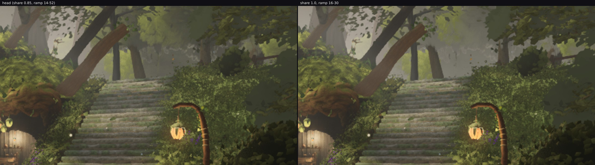
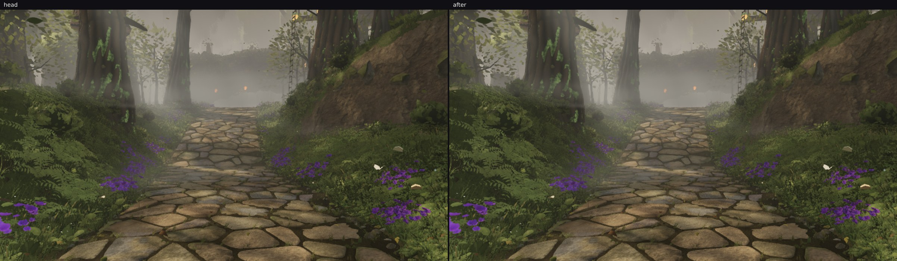

# squad2 — the level veil at full share, on a ramp that reaches the crowns

Continuing lane 2's canopy-tone thread after `agent/squad2-softedge` was merged (`cc02a9cf`, and
fable-cursor's full check on the merged head put every hero view under the cap — A 639 draws / 8.87 M).
Two things in this branch:

1. **The two commits that merge missed** — the ramp at 16–38 m and its report, cherry-picked here
   (`2c416592`, `9d888866`). The merged head still had `CROWN_VEIL.m = [14, 52]`.
2. **The colour step named at the end of the last hour**, which turned out not to need the crowns' albedo
   at all.

## The change

`CROWN_VEIL` goes to **share 1.0 on a 16–30 m ramp**. Neither can overshoot, and that is the design:
`lift = [0.55, 0.82]` stops every fragment at the reference's own relation between its foliage and its air
(`r_025`: 0.436 / 0.539 = 0.809), so the share only decides how *fast* a crown reaches that relation and
the ramp only *where*. At 0.85 on the old ramp the arithmetic put the veil 0.27–0.52 of the way on where
hero A's crowns stand, so there was room to give.

The near edge does not move: a crown 17 m off takes 0.02 of the veil. The reference's own trees at that
range are still dark and saturated, and this lane's mid canopy is what made the middle distance read as
trees at all (fable-5, 10:28: "the corridor is populated and warm now").

## What it does

| box | head (0.85, 14–52) | **now (1.0, 16–30)** | `r_025` for scale |
| --- | --- | --- | --- |
| hero A, the crown box (x 0.72–1, y 0.08–0.32) | 77.4 | **81.8** | 124.3 (its canopy band) |
| hero A, the canopy crop (x 0.55–1, y 0.02–0.45) | 80.3 | **82.3** | — |
| hero D, its canopy box | 136.4 | **137.1** | — |
| `owner-0650-north`, top third (the canopy) | 95.8 | **97.1** | — |
| `owner-0650-north`, **middle third (eye level)** | 71.7 | **71.7** | — |
| `rec-r024-plaza-fork`, top third / middle third | 87.4 / 81.3 | **88.2 / 81.3** | — |

The selectivity is the result: at both of the owner's walking poses the **eye-level band does not move at
all** while the canopy above it lifts, and the north band's within-column structure goes 18.80 → 19.55
against the reference's 22.03. Every pose moves 1.3–2.4 % of its pixels, all of it in the canopy.

The look-ups are untouched by construction — the crown gate is shut above 26°, whatever the share (measured
0.00 % on both look-up poses in the previous round).

## The one figure that moved the wrong way

In hero A's crown box the mean step across a leaf-to-sky boundary goes 6.6 % → 7.8 % (the reference's is
2.6 %). Part of that is the split moving under the metric — a veil lifts pale foliage across a fixed
luminance split, so the class that remains is darker and the step between classes grows — and part is real:
the far crowns are now paler while the near shrubs in the same box are as dark as they were, which is depth
separation, the thing the reference has. It is reported rather than explained away: if a reviewer reads it
as the cut-out failure returning at level views, the share is one constant and 0.85 is measured above.

## Cost

No geometry, no new draw, no new texture: the change is two numbers in a fragment-shader term, on the head
whose counts fable-cursor has already measured under the cap.

## Next

79.4 → 81.8 against the reference band's 124.3 is still most of the gap, and with the veil now capped by
the reference's own relation, the rest is not in this term. What is left is the crowns' albedo and the sun
on them — `MID_CROWN_LOOK`'s tints and the far cards' `cardTint` / `cardTopTint` — a colour pass whose risk
is the near band, so it wants the owner's walking poses rendered at every step, as here.
