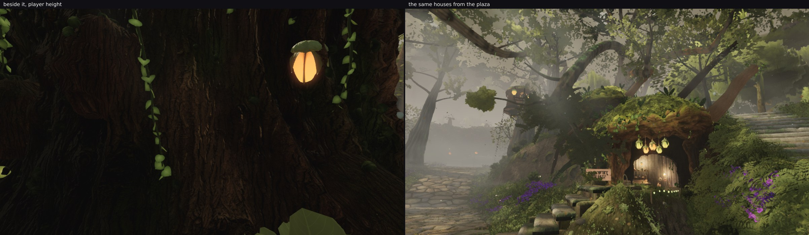

# squad2 — Backlog 3 finished: the far hut measured, and the defect is near-field light

The `backlog3` round measured the west house and reported that its second sample missed — the pose put the
camera on a giant's bole instead of the hut. This is that sample, and it is the strongest case in the item.

"The far hut" is the plateau's `upper` house (`layout.ts`, (13.5, 5.4, −17.5)); the pose stands where the
`plaza-to-upper-house` walk route ends and looks at it.

## Beside it, at player height, the wall is nearly black

| patch | mean | sd | p10 | p90 | sd / mean |
| --- | --- | --- | --- | --- | --- |
| **ours, the plateau hut's wall** | **0.075** | 0.046 | 0.045 | 0.097 | 0.61 |
| ours, the west house's wall (`backlog3`) | 0.199 | 0.144 | 0.100 | 0.395 | 0.72 |
| `r_026`'s trunk house | 0.502 | 0.096 | 0.378 | 0.634 | 0.19 |
| `r_022`'s trunk house | 0.537 | 0.088 | 0.416 | 0.635 | 0.16 |

**Seven times darker than the reference's huts, and here "flat" is literal too** — the whole patch spans
0.045 to 0.097, a twentieth of the range. The owner's two words describe this frame exactly.

## But the same houses read well from the plaza

The second frame is Saria's house and that same plateau hut seen from where a walker meets them, 20 m off:
mossy roof, lit interior, lanterns, ferns, stepping stones, the hut up in the haze. Nothing about the
material or its colour is wrong at that range.

So the defect is **near-field light on the wall, not the wall**: at 3–5 m the trunk face gets no bounce and
no spill from the lantern hanging on it, and it falls to 0.075 while the reference's equivalent sits at 0.5.
That is the same conclusion the west house's numbers pointed at (their evenness, sd/mean 0.16–0.19, is lit
rather than painted), now with a second and much sharper sample.

For whoever owns it (lane 9 / the structures lane — the tree woods paint none of these walls, measured in
`backlog3`): the target is roughly **×2.5 on the west house and ×6 on the plateau hut**, and the shape of the
fix is light — an ambient or bounce term on the house material, or the lanterns' spill reaching the trunk
they hang from — rather than a brighter bark map, which would break the distance read that already works.
