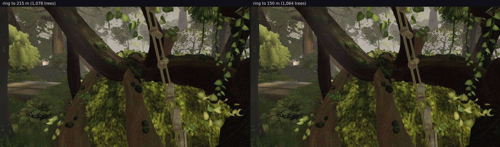

# The far ring's outer radius holds 14 trees: the density target binds, the radius does not

A second negative result on the same layer as `README.md`, and the pair of them together says something
useful about tuning the distant ring, so both levers are recorded with their numbers.

## The experiment

One constant: the outer radius `placeDistantTrees(…, 60, 215, …)` → **60, 150 m**, nothing else. Both
builds rendered the three poses that see furthest — `D_log` (the arch corridor, a fixed frame), the
plateau look-back, and a level look north from the open north at eye height — 960 × 540, settle 8, same
shots order.

## What it removed: fourteen trees

| | ring to 215 m | ring to 150 m |
| --- | --- | --- |
| `distantTrees` placed | 1,078 | **1,064** |
| `distantLod` [near, far] | [126, 952] | [117, 947] |
| hero A | 614 draws / 8.97 M | 614 / 8.97 M |

Cutting 65 m off the outer radius costs the world **14 trees**. The placer's radial distribution and its
clearance rules already keep almost everything inside 150 m, so the outer band was nearly empty — which
is also why `README.md`'s +41 % density target could raise the placed count by 276 without any of them
landing anywhere a camera could see.

## What it changed in the frames

| pose | pixels moved > 4 | mean | local detail | SSIM vs reference |
| --- | --- | --- | --- | --- |
| D_log (fixed frame) | 0.083 % | 90.6 → 90.6 | 4.14 → 4.14 | 0.4037 → **0.4038** |
| plateau look-back | 0.832 % | 58.7 → 58.7 | 4.34 → 4.35 | — |
| open north, level | 0.514 % | 100.7 → 100.6 | 1.77 → 1.77 | — |

Those differences are the **placement reshuffle**, not the fourteen trees: changing the radius changes
the placer's draws off the shared `rng`, so every distant tree moves slightly. D_log's SSIM against the
reference moves +0.0001, i.e. nothing.

## The two levers, together

| lever | does it bind? | does it show? |
| --- | --- | --- |
| density target (`distantTarget` 680 → 960) | **yes** — 1,078 → 1,354 placed | no: 0.06–0.22 % of the owner's frames (`README.md`) |
| outer radius (215 → 150 m) | no — 1,078 → 1,064 placed | no: 0.08–0.83 %, and that is the reshuffle |

So the ring is effectively a **60–150 m band of about 1,070 trees**, its population is set by the target
rather than the radius, and neither lever reaches the screen because the fog reaches its far value at
190 m and the band inside 120 m is already occupied (across-column sd 30.9 at the owner's north pose).
Nobody should spend an hour tuning either number again without changing the fog first.

## A boot-time observation, not a claim

The truncated build reported `world: ready in 79.1 s` against 83.6 s for the head, in one sample each.
Today's runs on this VM have read 79–85 s with no change at all, so that difference is inside the spread
and I am not claiming it. If the ring's build cost is ever worth attacking, it needs three samples a
side and a stopwatch on `placeDistantTrees` itself, not a frame harness.

## Reverted

The radius is back to 215 m. Nothing here is proposed for merge.

