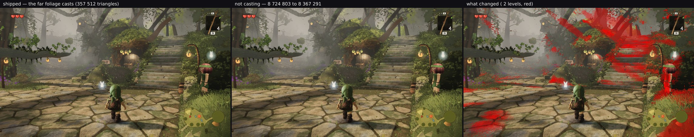
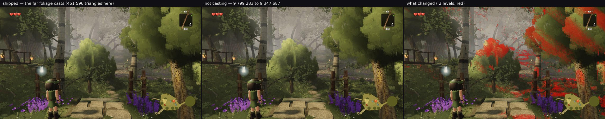

# The far foliage's shade is the trees' biggest depth cost, and it is the canopy's self-shadowing

*squad lane 2 — 2026-09-30 15:30 UTC — measured, **not shipped***

Lane 2's list was empty. `auditvsrenderer/` closed the last hour by making the tally agree with the renderer on
the depth pass, and the first thing the corrected numbers said about the **world** was this:

| family | depth triangles at hero A, as tallied before | **now** |
| --- | --- | --- |
| **`giant-far-foliage-batch`** | 124 240 | **357 512** |
| `giant-wood` | 270 625 | 270 625 |
| `column-lod0` | 230 360 | 230 360 |
| … | | |
| **depth total** | 1 043 925 | **1 277 197** |

The giants' far foliage is the **largest single depth consumer in the trees** — 28 % of their shade, 4.1 % of
the whole 8.72 M frame, and **more than the entire 275 197 of W38 headroom on the binding view**. It read
124 240 until the batch's own depth list was read, so the size of it was not knowable before this hour. That
made the question worth asking rather than assuming: does it need to cast?

## What it buys, measured both ways

`FAR_FOLIAGE_CASTS` gated the per-frame `castShadow` so both builds could be rendered from one pose list in a
single paired run (the only comparison this branch trusts for pixels — see `colshadow/`):

| | shipped | not casting | |
| --- | --- | --- | --- |
| **A_stairs** | 561 draws / **8 724 803** | 558 / **8 367 291** | **−3 draws, −357 512 triangles** |
| **`stairs1-top`** | 661 / **9 799 283** | 658 / **9 347 687** | **−3 draws, −451 596** |

The saving matches the tally **to the triangle** at hero A, which is itself a confirmation that the corrected
depth model is right. W38's headroom on the binding view would go from 275 197 to **632 709** — more than
doubled, the largest triangle prize this lane has found.

**And it is load-bearing.** 18.00 % of hero A moves at >2 levels, and 12.46 % of `stairs1-top`, at means of
4.6–14 levels across many cells rather than one:





What goes is not a dapple on the ground — it is the **canopy's self-shadowing**. Without it the crowns brighten
and flatten: the big crown on the right at `stairs1-top` reads as one green mass instead of a lit surface over
a dark interior, and at hero A the whole right-hand bank of foliage and the upper canopy lose their depth. That
is precisely the defect the white-bark laminae exist to avoid — *"the 3–10 m crowns read as flat cards without
it"* — arriving by a different route.

So the 357 512 is **not waste**, and the switch is gone rather than shipped at `false`. The measurement lives
in a comment on the `castShadow` line, in the same form round 51 used for the columns' equivalent.

## What the pair of these two rounds establishes

`colshadow/` tested the second-largest suspicious depth row (the columns' out-of-view high rung, 69 426 at hero
A) and found it laying the dapple on the flagstones. This round tested the largest (357 512) and found it
shading the canopy's interior. **Both of the trees' biggest shade costs have now been measured against pixels
and both are earning their triangles**, so the working conclusion for W38 planning is that **there is no cheap
triangle left in the trees' depth pass** — 1.28 M at hero A, 48 % of the system's total, all of it visible.

The one avenue neither round closes: a *cheaper caster* that keeps a crown's interior dark. `colshadow/` shows
a coarser rung does not (too few leaf cards to lay the pattern), so this would need geometry authored for the
purpose rather than an existing rung. Priced at up to 357 512 triangles on the binding view, and not built.

## Reproducing

```bash
# with and without, from one pose list in a paired run
node art/environment/squad2-2026-09-23/frozen.mjs dist /tmp/with --poses /tmp/farshade-poses.json --settle 8
node art/environment/squad2-2026-09-23/diffmap.mjs --a /tmp/with/A_stairs.png --b /tmp/without/A_stairs.png \
  --out sheet.png --tol 2 --grid 8
```
