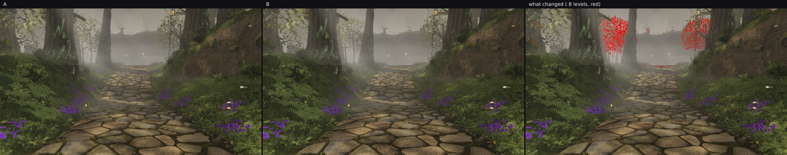
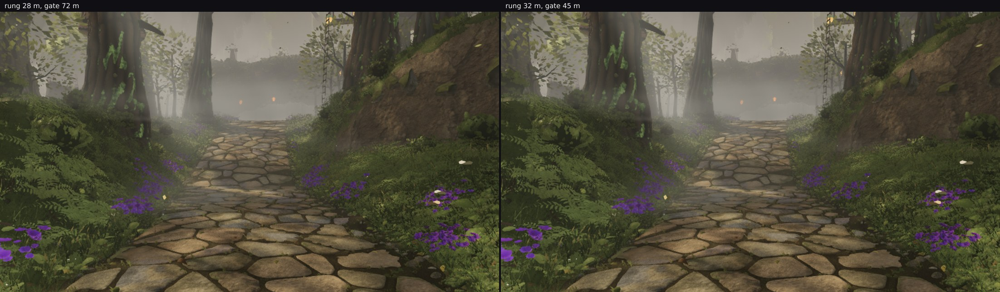

# squad2 — the LOD rungs re-measured, and where the last of the pop lives

Lane 2's other half (`trees/index.ts`, the LOD and the pools) had not been re-measured since the treepop
round at 04:00, and the head has since grown the south expansion, two vegetation passes, more props and a
third mist tier. This is the health check, and it ends with the residual attributed to one rung.

## The rungs have not regressed

The measure is the owner's own complaint made quantitative — "the trees … only get detailed when I come up
close": render a pose with the shipped rungs and again with **every tree forced to its highest LOD**
(`?treelod=10`), and diff. What changes is exactly the detail that appears only when he walks in.

| pose | shipped rungs vs every tree high |
| --- | --- |
| `owner-0650-north` | **2.06 %** of the frame |
| `owner-0650-west` | **2.24 %** |

The treepop round left 1.82 % at these rungs on a smaller world, so nothing has regressed. The diff puts
almost all of it in two columns at the corridor's mid-distance tree line (`north-close-only-detail.jpg`):
the crowns of trees at roughly 30–40 m, which fill out as he approaches.

## Which gate owns it — measured by elimination, not argued

Each gate has its own multiplier in `?treelod=<near>,<mid>,<distant>,<canopy>`, so each can be opened on
its own and the frame compared against every-tree-high:

| gate opened | `owner-0650-north` vs every tree high |
| --- | --- |
| none (shipped) | 2.06 % |
| the medium→low rung, 44 → 59 m | 2.06 % |
| the distant / mid near gate, 72 → 720 m | 2.03 % |
| **the high→medium rung, 28 → 40.6 m** | **0.10 %** |

**The whole of the residual pop is the high→medium rung at 28 m.** A tree between 28 and 41 m is on its
medium LOD and takes its detail as the walker closes to 28 m; the medium and high LODs of a tree past 44 m
read the same, which is why the rung I tried first bought nothing.

## The 59 m rung: tried, priced, backed out

Before the elimination above I moved the medium→low rung to 59 m, priced first with `pose-counts.mjs`: the
walking poses take +0.51 % and +0.75 % of their triangles (+45 k, +51 k) and the six hero views +1.4 k (A)
through +54 k (D), leaving 123 k of headroom at the tightest and rising by at most four draws
(`counts-walking-shipped.json`, `counts-hero-mid59.json`). Then the frames came back **identical to the
second decimal**, so it is out; nothing that costs 50 k triangles and moves no pixels should ship. The
constant's comment carries the measurement so the next reader does not repeat it.

## Landed: the rung at 32 m, paid for by the distant gate at 45 m

40.6 m — the value that takes the residual to 0.10 % — is **not affordable**: `pose-counts.mjs` puts camera
A at 9,171,271 triangles, **171 k over the 9 M cap**, with D left 41 k (`counts-hero-rung40.json`). So the
same trade the treepop round made when it moved this rung from 20 to 28: push the rung and pull the
distant / mid near gate in to pay for it. Priced at 34 m / 55 m A was still 38 k over; at **32 m / 45 m** it
fits with room and takes draws **down** (`counts-hero-rung32-gate45.json`):

| view | draws | triangles | vs shipped | headroom |
| --- | --- | --- | --- | --- |
| A | 620 (−19) | 8,911,398 | +36 k | +89 k |
| B / E | 613 (−15) | 8,243,388 | **−49 k** | +757 k |
| C | 554 (−18) | 7,908,814 | **−20 k** | +1,091 k |
| D | 543 (−19) | 8,686,638 | +52 k | +313 k |
| F | 579 (−20) | 8,025,810 | +14 k | +974 k |

And what it buys, on the same measure as the health check:

| pose | rung 28 m / gate 72 m | **rung 32 m / gate 45 m** |
| --- | --- | --- |
| `owner-0650-north` | 2.06 % | **1.85 %** |
| `owner-0650-west` | 2.24 % | **1.92 %** |

A tenth of the residual at the north pose and a seventh at the west one, for 15–20 fewer draws at every
hero view. The frames themselves do not move (`north-rung32-pair.jpg`: mean 80.3 → 80.2, the eye-level band
71.7 either way), so nothing is traded away for it — the swap simply happens four metres further out, and
the near-LOD wood between 45 and 72 m that pays for it was measured at 0.04 % of the frame in the treepop
round.

## What is still open, with its number

The rest of the pop — 1.85 % at the north pose — is still this rung's, and reaching it means 40 m, which A
cannot pay for while lane 4's vegetation owns its headroom (A is at 8.91 M with 89 k left after this round,
and the 40.6 m ring alone costs 296 k there). Two ways out, both outside this lane: vegetation density in
A's frame, or a cheaper medium LOD for the white-barks so the ring costs less to buy. The measurement to
aim at is in the table above.
