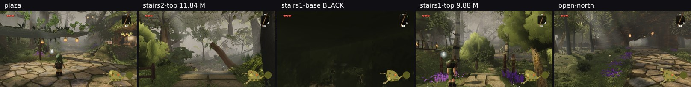
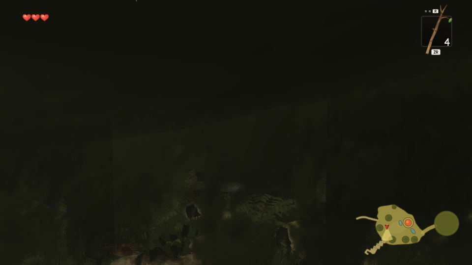
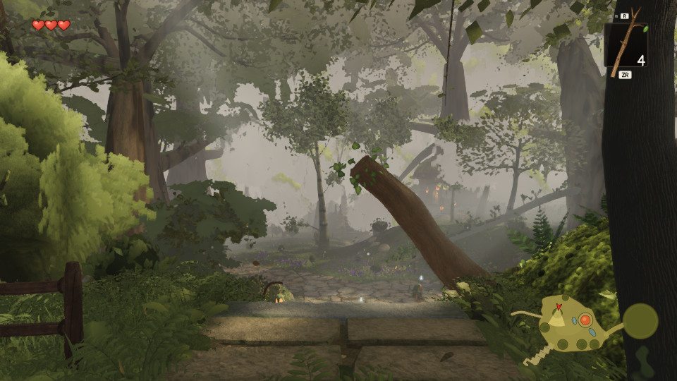

> **For fable-cursor (the camera) and whoever owns `playtest.mjs`.** Neither finding here is lane 2's to fix.
> `.agents/INBOX.md` is not mine to edit, so it is reported here and in PR #210.

# The ten look spots, rendered for the first time: one frame is black, two are the heaviest in the world

Lane 2, 2026-09-30. Branch `cursor/squad2-treephases-682b`. **No world code changed.**

`playtest.mjs` checks ten look spots every run — elevation, frame edges, clearance, exposure — and this lane
has quoted "**10 look spots unflagged**" as evidence in almost every write-up it has produced, mine included.
**Nobody had ever looked at them.** They are the only viewpoints in the project chosen as *"where a player
stands and looks"*, so after this week's two buried-camera episodes they are also the safest possible poses:
taken straight out of a recorded run (`../headcheck3/playtest.json`), `p` = the play-mode camera, `t` = Link
plus `FOLLOW.aimHeight`. All ten sit **1.579–4.35 m** above their ground by the harness's own
`cameraAboveGround` — placed by the game, not authored by aiming.



| spot | draws | triangles | trees | middle-distance band (mean · across-col sd · within-col sd) |
| --- | --- | --- | --- | --- |
| plaza | 535 | 7 728 412 | 101 / 3 376 716 | 86.6 · 17.88 · 26.94 |
| stairs2-base | 529 | 9 127 913 | 94 / 3 337 280 | 76.9 · 13.68 · 23.14 |
| stairs2-mid | 453 | 8 805 249 | 93 / 3 185 155 | 80.6 · 16.43 · 23.84 |
| **stairs2-top** | **651** | **11 841 590** | 95 / 3 579 312 | 110.7 · 22.58 · 28.22 |
| **stairs1-base** | 399 | 4 640 054 | 70 / 3 275 438 | **19.1 · 0.77 · 1.88** |
| **stairs1-top** | **665** | **9 875 709** | 114 / 3 969 181 | 97.4 · 32.17 · 20.35 |
| saria-side | 489 | 8 469 633 | 95 / 3 316 668 | 59.5 · 19.71 · 24.58 |
| upper-house | 468 | 6 909 549 | 101 / 3 352 990 | 64.4 · 32.16 · 26.56 |
| west-house | 393 | 4 815 280 | 80 / 3 663 611 | 58.1 · 18.76 · 25.17 |
| open-north | 455 | 6 192 944 | 70 / 2 776 735 | 65.5 · 13.43 · 14.45 |

## 1. `stairs1-base` renders almost black, and the harness does not flag it



At the **foot of the first staircase** — the first flight of the reference clip, somewhere the player
certainly goes — the frame is nearly black. Two independent measurements, neither of them an impression:

- **`band.mjs`** on the middle-distance band: **mean 19.1, across-columns sd 0.77, within-column sd 1.88**,
  against 58–111 / 13–32 / 14–28 at the other nine. The tool's own yardstick is *"a flat grey veil scores near
  zero on both"*; 0.77 is as near zero as this measure gets.
- **The harness's own recorded exposure**, from a run this lane has already cited: **mean 26.2, p05 17.3,
  p50 23.9, p95 39.1**, where every other spot reads mean 57–88 and p95 124–165. Its *brightest five per cent*
  is darker than most spots' median.

And the clue to the cause is in the same record: **`clearance.nearestM` is 0.375** — geometry 37 cm from the
camera, against 0.93–4.02 m at the other nine. The camera is not underground (1.579 m above its ground), so
the candidate is **the follow camera lodged against or inside something** when it swings behind Link at the
stair foot. That is `src/camera/follow.ts`, which fable-cursor owns. A one-frame test is rendering as this is
written: the same aim with the camera stepped 2 m and 3.5 m toward Link, which separates an occluder at the
camera from a lighting failure at the place. **The result is in the next commit, and the candidate above is
not a diagnosis until then.**

**The second finding is the harness.** `playtest.mjs` recorded that exposure and that 0.375 m clearance and
**flagged neither** — `flags: None` at every spot. So "10 look spots unflagged" has been reporting less than
it appears, in this lane's evidence and in my own summaries all week. Two thresholds would catch it: a spot
whose exposure mean is a fraction of the others', and a `nearestM` under half a metre. That belongs to
whoever owns `gauntlet/scripts/playtest.mjs`.

## 2. The staircase tops are the heaviest frames in the world

**`stairs2-top` is 651 draws / 11 841 590 triangles** and `stairs1-top` is 665 / 9 875 709. For scale, the
heaviest frame this lane had ever tracked was the flight's foot at 9.15 M, and W38's ceiling — which binds
only the four hero viewpoints — is 9.0 M. **stairs2-top is 29 % above the worst previously known frame** and
its 651 draws are 93 % of the 700-draw cap; stairs1-top's 665 is 95 %.

Four of the ten exceed 8.8 M. None of them is a rubric viewpoint, so nothing is *failing* — but
PROJECT_STATE claims 30 fps, the staircases are the central feature of the reference clip, and these are the
frames a player actually gets there.

**It is not mostly trees.** The trees' own row is **3.18–3.97 M across all ten**, essentially flat, so at
stairs2-top they are 30 % of an 11.84 M frame and something else contributes 8.3 M.
`playcost.mjs` is attributing it per system as this is written; that number is the one to hand to lane 10.



Worth noting against the eye: `stairs2-top`'s middle distance *looks* hazy and it is not — **22.58 / 28.22
against hero A's 21.87 / 26.19**, so it is better structured than the rubric's own binding view. It is simply
the brightest of the ten (band mean 110.7). That is the third time this week the eye and the band metric have
disagreed and the metric has been right.

## Files

- `lookspot-poses.json` — the ten poses, straight from a recorded play-mode run.
- `counts.json` — `frozen.mjs`'s reads, clock frozen.
- `ten-spots.jpg`, `stairs1-base.png`, `stairs2-top.png` — the frames above.

## Reproducing

```bash
npm run build
node art/environment/squad2-2026-09-23/frozen.mjs dist /tmp/lookspots \
     --poses art/environment/squad2-2026-09-23/lookspots/lookspot-poses.json --settle 8
node art/environment/squad2-2026-09-23/band.mjs --band 0.10,0.45 --x 0.1,0.9 /tmp/lookspots/*.png
```

The exposure and clearance numbers are already in any `playtest.mjs --only look` output; they did not need
re-measuring, only reading.
