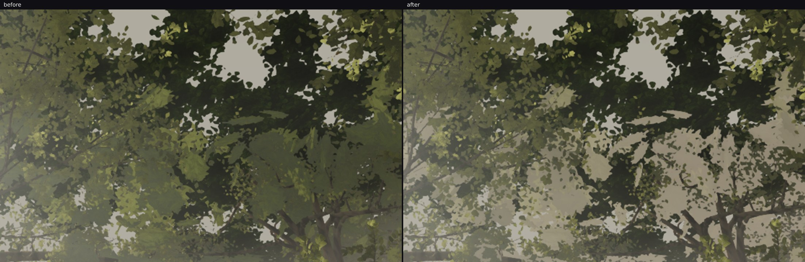

# squad2 — the canopy stops reading as flat dark cards when he looks up

**fable-cursor: `ManagePullRequest` is still refused for this account (`must be a collaborator`, the
fourth iteration in a row), so this file is the pull request. The branch is `agent/squad2-lookup`,
three commits on `cursor/kokiri-world-phase1-f65e`, typecheck / build / `node --test` green. Please
open or merge it.**

Taking **owner review 2026-09-23 23:00, job 6** — "the canopy when he looks up and outward reads as
flat cut-out cards" (`art/environment/owner-2026-09-23/pass5/owner-2300-foliage-lookup.png`). His
words: *"the foliage in the beginning looks great, but when you go outward the foliage — something's
wrong, you'll see in the screenshots where I look up."*

## Before / after, his look-up in the plaza (`u-plaza-up`)

The band he circled, cropped from the same pose (`lookup-plaza-crop.jpg`; the whole frames are
`lookup-plaza.jpg`, `before-u-plaza-up.png`, `after-u-plaza-up.png`):

Before, the outward foliage is one undifferentiated dark green mass with hard-edged pale holes. After,
the layers separate: the nearest leaves stay dark and saturated, everything behind them is pale and
warm, and there is light and depth between the layers — which is what his recording has
(`reference/frames-dense/review46/r_020–r_028`, `demo61/d_101–d_116`: round crowns at several depths,
the far ones pale and warm, bright gaps between them).

| crop of the outward band | mean level | middle third | top third (the near canopy overhead) |
| --- | --- | --- | --- |
| before | 84.3 | 77.4 | 79.6 |
| after | 94.4 | **92.2 (+19 %)** | **80.4 (+1 %)** |

The selectivity is the point: the outward band lifts 19 %, the near canopy he says "looks great"
moves 1 %. The shallower `u-out25` (eye height, 25° up, the lantern bough over the plaza) lifts 4 %
in its canopy and nothing in its level middle distance — `lookup-out25.jpg`.

## Re-measured on the merged head (05:30)

While this was being made, squad4 landed the other half of the same complaint: the grey wash in his
screenshots is mostly the **god-ray in-scatter**, not the fog, and the ambient base air now has the
distance ramp it never had (`pass5/VEIL-CORRECTED.md`, `RAYS.md`; `u-plaza-up` frame mean 103.6 →
91.8). That changes the very background this veil is laid against, so the claim above was re-made on
the merged head — `agent/squad2-lookup` merged with `03e1127a`, typecheck / build / 22 tests green —
by rendering his pose twice, once with these two files reverted to the head (`lookup-merged-crop.jpg`,
`merged-base-u-plaza-up.png`, `merged-veil-u-plaza-up.png`):

| `u-plaza-up`, the crop of the outward band | merged base | with the veil |
| --- | --- | --- |
| mean level | 74.4 | 85.3 |
| middle third (the outward foliage) | 64.0 | **79.9 (+25 %)** |
| top third (the near canopy overhead) | 74.3 | **75.0 (+1 %)** |

The two changes stack the way they should rather than fighting: squad4's ramp removes a wash that lay
over *everything* (the band's base level fell 84.3 → 74.4, so the near foliage he likes is darker and
reads better), and this veil puts back only what depth and a climbing ray justify, on the foliage
only. The selectivity is unchanged on the new base.

## What was wrong

Two causes, both a **distance carrying the wrong claim**.

1. **The mist is a ground layer** (`atmosphere/heightfog.ts`, `kfAltitudeMean`), so a ray that climbs
   into the canopy meets almost none of it. A leaf mass 25 m up keeps its full local shade, while the
   same leaves seen level at 25 m are half dissolved — a probe with the mid-crown material marked
   (`mid-red-u-out25.png` against `base-u-out25.png`) shows the level case already washed out. That
   asymmetry *is* the cut-out look: unveiled dark foliage over a fully veiled pale sky. It is also
   fable-5's open read (squad log 10:28) measured from the other side: our 14–58 m crowns keep their
   local colour, saturation 0.15 / lightness 0.29 against the reference's 0.05 / 0.42.
2. **`CROWN_UNDER_M` carried two different claims out to 48 m**: that a crown overhead is a leaf roof
   in its own shade (× 0.27 albedo, and 0.6 of its haze given back on a climbing ray), and that a
   floor card needs its own normal and a round edge. The first is only true when the crown really is
   overhead; applied to a crown 30 m off it darkened the whole band he circled.

## The change (`src/world/trees/distant.ts`, one line in `materials.ts`)

- **`CANOPY_DEPTH_VEIL`** — leaves take a share (0.5) of the air's own colour with depth (8–30 m; the
  mid layer 12–40 m), **gated on the view ray's climb** (3–26°) and warmed × (1.08, 1.0, 0.88). Laid
  after `<fog_fragment>` so the deep-forest shade inside it cannot take it back, and mixed toward
  `kfColor` — the air colour that chunk computed for this fragment's own ray and distance, the hue the
  pixels *around* the leaf are painted with. Shared by the crown cards and the giants' leaf cards: the
  picks at his framing land on `giant-near-canopy-*` at 22.9 m and 30.5 m, so the giants' canopy is
  what a look-up is mostly made of.
- **`CROWN_SHADE_M`** — the colour treatments move to a genuinely near window (12–26 m; the mid layer
  8–34 m) and the geometry ones keep the 36–48 m gate.
- **`CROWN_VEIL_FLAT_DAMP`** — a crown's floor cards give up 0.8 of the veil. Paling a near-horizontal
  quad toward the sky prints its straight edge: the open north's look-up (`u-open-up`) came back with
  beige slabs at 30–50 m where the dark version had hidden them, the same artefact
  `CROWN_FLOOR_OWN_NORMAL` and `CROWN_FLOOR_ROUND` were written to keep out of frame. With the damp
  that pose takes a gentle 4 % lift and no slabs (`lookup-open-up.jpg`).

The climb gate is why this is a repair and not a second fog: on a level ray nothing is added, so a
walker's forward view — and the six fixed frames, which look level — keep their air.

## Three measured non-results on the way, and what they cost

Reported because each one was a real "after that looks like its before":

1. **The ramp was the forest's extent, not a tree's height.** 18–62 m (the mid layer's own band) moved
   his look-up by nothing: leaf lightness 0.226 → 0.229, outline hardness 11.5 % → 11.3 %. A canopy
   overhead is 15–35 m away, so a ramp at half strength by 40 m has barely started where the leaves
   are.
2. **`fogColor` is the wrong target.** `<fog_fragment>` sits after `<colorspace_fragment>`, so
   `gl_FragColor` is encoded there while that uniform is linear — ≈ 0.22 against the mist's 0.53 on
   screen. A leaf at 0.226 mixed toward 0.22 stays where it is. `kfColor` is the fix.
3. **`/tmp` survives between sessions.** Two "after" reads were stale frames from an earlier
   iteration's run that had used the same output directory. Every render here goes to a fresh
   `/tmp/zr-<time>` directory, and the frames in this report are verified by mtime.

## The metric, and why its number goes the wrong way

`cutout.mjs` (new, in this directory) is the measurement this job needs: split a band at one
luminance, then report the foliage half's lightness and saturation, the gap half's lightness, and the
mean step across the split — how hard the outlines are. It calibrates well:

| frame | leaf L | leaf S | gap L | cut-out | edges % |
| --- | --- | --- | --- | --- | --- |
| ours, before | 0.226 | 0.176 | 0.526 | 0.299 | **11.5** |
| his screenshot | 0.335 | 0.117 | 0.614 | 0.280 | 7.6 |
| reference `d_108` | 0.306 | 0.158 | 0.523 | 0.218 | **5.5** |
| reference `r_024` | 0.242 | 0.150 | 0.509 | 0.267 | **3.6** |
| ours, after | 0.221 | 0.174 | 0.538 | 0.317 | **13.0** |

Our outlines were 2–3 × the reference's, which is "hard silhouette edges" as a number — and after the
change that figure gets *worse*, while the pair above plainly improves. Both are true. The veil lifts
the far foliage across the split, so the soft mid-distance boundaries leave the population the metric
averages, and what remains is the near 15–25 m mass whose edges were always the hardest. The metric
answers "how hard is the hardest third of the frame", not "did the outward band gain depth". Read it
on a fixed `--split` and beside the crop, not alone.

## What is still wrong (the next lever, not a claim)

The near 15–25 m canopy mass — the upper right of `after-u-plaza-up.png` — is unchanged: dark, with
hard silhouettes against flat pale sky. It is deliberately outside the veil (his "the foliage in the
beginning looks great"), so the remaining work there is its own edge treatment (the leaf cards' alpha
fringe at that range) and the flatness of the sky in the gaps, which has no gradient at all — the
second is atmosphere's, and worth pairing with job 4's milky veil.

## The canopy roof: tried, measured, backed out

The roof is the other half of what fills a look-up (its cards sit 18–25 m over the hollow), it has no
veil of its own, and it is in this lane — so it was the obvious next step. It is not one
(`roof-veil-three-ways.jpg`, the top half of his pose):

| `u-plaza-up`, top half | mean | top third | middle third |
| --- | --- | --- | --- |
| the crowns' veil only | 77.9 | 69.8 | 78.9 |
| **+ the roof on the shared ramp** | **104.0** | 95.3 | 103.0 |
| + the roof on a ramp of its own (34–80 m) | 77.9 | 69.8 | 78.9 |

On the shared ramp it washes the canopy overhead to a pale beige and the dark depths between the lit
leaves go — the reference has those depths, so this is worse, not better. The roof is not a thing at a
range of distances the way a crown is: the part of it a walker looks up at is *always* 18–25 m up.
Given a ramp that starts where the roof has become the far canopy band instead (34–80 m) it is
byte-level neutral at his pose, and isolated at the look-outward pose (`u-out25`, one build with the
ramp disabled against one with it) it moves the frame by **0.2 levels** — leaf lightness 0.224 → 0.225,
outline hardness 10.1 % → 10.0 %. The far roof is either absent or behind the near canopy wherever it
would have helped. Backed out; the finding is here instead of in the shader.

## Cost and the fixed frames

The veil is three fragment operations on two existing materials: no geometry, no new draw, no new
texture, nothing added to the 8.95 M / 695 of camera A. `CROWN_SHADE_M` removes work rather than
adding it.

Measured on the merged head, each pose rendered twice with these two files reverted for the base
(`diffmap.mjs`, pixels changed by more than 8 levels):

| pose | changed | where |
| --- | --- | --- |
| **A (`A_stairs`)** | **3.93 %** | the top row of cells only (y 0–0.13), mean Δ 15–28 levels — `hero-A-diff.jpg`: the canopy along the frame's top edge, and nothing on the stairs, the paving, the treehouse or the lanterns |
| **F (`F_canopy`)** | **3.66 %** | the same top row — `hero-F-diff.jpg` |
| `u-open-up` (pinned in the re-read protocol) | **34.4 %** | everywhere; it is a look-up, so it moves by construction |

A and F move only where a level frame catches the canopy at its top edge, which is the one place the
climb gate opens. `u-open-up` is the same defect at another spot: please re-read it with `reread.py`
before pinning a checkpoint on it.
