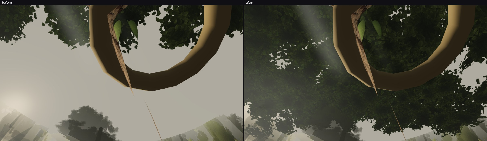
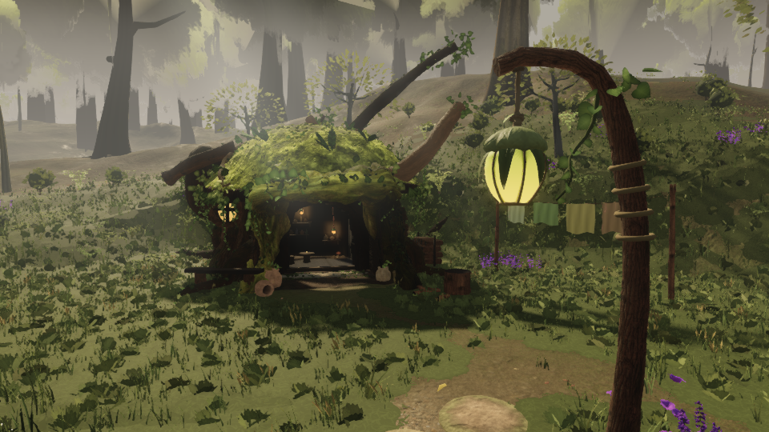

# squad2 — the roof reaches the north grove (the third place it stopped short)

`fable-cursor-exp-north` merged at 22:20 with a **shelf hamlet 94–112 m north** — a trunk house, a stilt
house, a tree hut, a lookout — standing at 10–12 m of elevation. Rendered before anything was changed, from
the shelf lip looking up: **bare pale sky over most of the frame**, with a few crowns at its edges and the
tree hut's bark column across it.

Both of the roof's grids ended before the grove: the plaza's at `ROOF_BOUNDS.zMax = −70` and the stand's at
`ROOF_STAND_BOUNDS.zMin = −96`, while the hamlet sits from −94 to −112. Nothing could be built above it.

## The fix, and what it does

One band in `ROOF_STAND_BANDS` over the shelf and its houses (x −16…14, z −112…−94, hanging 20 m above the
local ground, feather 18) and a third grid rectangle, `ROOF_GROVE_BOUNDS`, sampled **after** the north's and
the south's so their clumps draw exactly what they drew before it existed. The trail below the shelf is
already under the flank bands.

| `grove-shelf-up` | mean | top third | middle third |
| --- | --- | --- | --- |
| before | 126.4 | 81.1 | 146.0 |
| after | **57.9** | **43.0** | **57.7** |

## It does not darken the hamlet anyone just built

A roof 20 m over a settlement also casts shadow, so the shelf was rendered at eye level with it
(`shelf-level-after.png`): the trunk house reads with its lit interior and lantern, the moss and ferns hold
their colour, the trail and the stepping stones are clear, and the light is forest shade rather than gloom.

## Cost and the fixed frames

The roof is now 897 clumps / 3996 cards / 7992 triangles by `measure-roof.mjs`, so this band adds **816
triangles** (0.009 % of the 9 M cap) on top of the branch's earlier work. No fixed camera frames the grove —
the layout's own note says so ("D, the one north-looking frame, ends in haze beyond the arch") — and the
stand pass's 50 m hero drop applies to these clumps unchanged, so the six scored frames cannot see them.
`roof.test.mjs` passes untouched.
