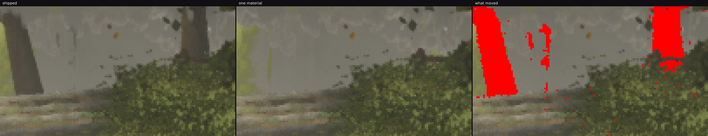
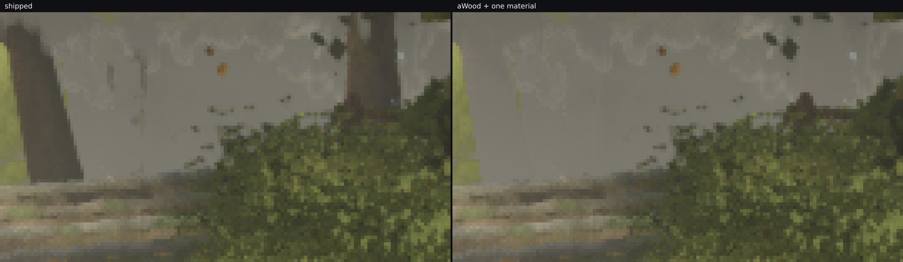

# Sixteen draws for two material groups, and the distant trunks pay for them

*squad lane 2 — 2026-09-30 18:30 UTC — measured, **not shipped***

`roofdraws/` merged seven canopy meshes into one because draws are the scarce resource where this world is
tight. The same question, asked of the thinnest remaining row in the trees: at hero A `distant-far` is **12 draws
for 5 832 triangles — 486 a draw**, thinner than the roof was, and `mid-near` and `mid-far` are 10 draws each
for ~12 000. Thirty-two draws for 29 184 triangles across the three.

Half of those draws are a **second material group**. `distant.ts` gives each near and far geometry two:

```ts
farGeometry.addGroup(0, farWood, 0);                              // the trunk
farGeometry.addGroup(farWood, far.indices.length - farWood, 1);   // the crown cards
…
new InstancedMesh(geometry, [mats.distant, mid ? midCrown : distantCrown], n)
```

and three draws one call per visible material group in every pass (`auditvsrenderer/`), so **every one of those
meshes is two draws.** The file reads as though one material would do: `solidUv` exists so that *"solid
(non-card) vertices of a geometry **sharing the cluster-card material** sample the opaque patch"*, and the crown
material's own design note says its layer already contains solid geometry — *"every vertex tagged `w ≤ 0` — the
lobe cores at 0 and the near LOD's bark at −0.45"*.

## The saving is exactly what it looks like

One material instead of the array, nothing else — the groups stay on the geometry and three ignores them when
the material is not an array:

| | shipped | one material |
| --- | --- | --- |
| **A_stairs** | **555** draws / 8 724 803 triangles | **539** / 8 724 803 |
| trees' own row | 140 / 2 656 692 | **124** / 2 656 692 |

**−16 draws, triangles identical to the digit.** At `stairs1-top`, where 45 draws are spare under W38's 700,
that would be over a third of the headroom.

## What it costs: the distant trunks

0.52 % of the frame changes at >2 levels — **an order of magnitude below the two shade experiments**
(`colshadow/` 7.65 %, `farshade/` 18.00 %) — and at 1× the two frames are indistinguishable. The change is one
cell, x 0.75–0.88 y 0.13–0.25: **14.3 % of its pixels, mean Δ 37.9 levels.** Magnified six times, with the
moved pixels in red:



**Two trunks are simply not there.** `mats.distant` is a plain `MeshStandardMaterial` over the cluster atlas;
the crown material carries the foliage treatments — the distance-keyed haze and under-shade that `CROWN_SHADE_M`
and the height-fog chunks apply — and a solid trunk drawn through them washes into the mist. The trunk row in
the middle distance is exactly what `ownerlook/` valued when it checked the owner's north pose: *"resolves at
2.5× into white-bark trunks and crowns at two or three depths"*.

Not shipped. `src/` is unchanged; `git diff` says so.

## The uncomfortable part: this lane's own metric missed it

`band.mjs` exists for one question — *"the middle distance shows trees, not haze"* — and it does not see this:

| `--band 0.05,0.30` | mean | across-columns sd | within-column sd |
| --- | --- | --- | --- |
| `x 0.70–0.95`, shipped | 83.8 | 19.55 | 23.70 |
| `x 0.70–0.95`, one material | 85.7 | **20.17** | 23.92 |
| `x 0.10–0.90`, shipped | 110.1 | 26.00 | 22.96 |
| `x 0.10–0.90`, one material | 110.6 | 25.66 | 23.05 |

Two trunks vanish and the across-columns structure in the window they stood in goes **up**, 19.55 → 20.17.
It is not that the metric is wrong; it is insensitive at this scale. A trunk is ~4 px wide, two of them are a
fraction of a 250-px window, and their tone sits close to the local mist mean, so column statistics have almost
nothing to register. The band metric was built to catch a *whole* middle distance collapsing into a veil, and it
does that.

**The rule this adds**: a small changed-share is not a small change. 0.52 % of a frame deleted two trees.
Magnify the worst diff cell and look at it before believing an aggregate, and do not let a purpose-built metric
that disagrees with the picture settle it — here the order was eye, then metric (which said no), then the
focused diff of the worst cell (which said yes, and was right).

## Round two: the mechanism, and a branch that did not fire

*2026-09-30 19:30 UTC.* The 16 draws were worth a round of their own, and it produced the mechanism and a
failure, in that order.

**Why the trunks vanish rather than darken.** `mats.distant` samples the **cluster** atlas; the crown material
samples `createFarCrownAtlas`. Bark's uv is `SOLID_UV` — the opaque **white** corner patch that
`createLeafClusterTexture` and `createLeafClusterDetail` both reserve *"so they survive the alpha test"*. And
**`createFarCrownAtlas` has no such patch.** It `clearRect`s the whole texture, its own comment says it
*"exclude[s] the solid wood patch in its corner"* from the card crops, and it never fills it. Nor can it simply
be painted: the cluster atlases map cards to `[CARD_UV0, 1]²` and never touch the corner, but the far-crown
atlas's four cells **tile the whole texture** (`cell = size / 2`, and `farCrownCellUv(2)`'s crop starts at the
margin), so white in that corner would appear inside crowns. So bark drawn by the crown material samples
transparent and `CROWN_ALPHA_TEST` of 0.3 discards it outright — which is exactly why the picture shows mist
rather than a differently-toned trunk.

Two of my own hypotheses died on the way, both by reading: `CROWN_MIP_BIAS` is **−0.5**, sharper not blurrier,
so no mip bleed; and a trunk's uv is *constant across the trunk*, so its derivative is ~0 and the finest mip is
selected regardless.

**The fix needs no atlas change**, because white times the vertex colour is the vertex colour: for bark the
faithful thing is to skip the map sample entirely, which is all `mats.distant` amounted to. So the branch —
`vCrownWood` gating the map, the crown colour block, the sphere normal, the rim, the fog cut, and the wind.

**It does not fire.** Measured: A_stairs **555 → 539** and `stairs1-top` **655 → 639**, −16 draws with triangles
identical to the digit — and **0.51 % of the frame moves against 0.52 % without the branch**, the same worst
cell at 15.7 % and 36.3 levels. The trunks are still gone:


`writer.ts` says why, and it is a tag-space problem rather than a shader one. Its `aRoot.w` decode is leaf
`≥ 0.5`, wood `≤ 0`, and the **wood codes are**: plain wood **0**, `woodMoss` **−0.45 × cover**, a moss
cushion's window **(−0.5, −0.47)**, `woodCollapsible` **−1**, and **−2**. So the −0.45 the design note mentions
is a **moss** code that only appears where cover > 0 — **plain bark is tagged 0, which is exactly what a lobe
core is tagged.** The crown shader cannot tell the distant trunk from the crown's own cores, and
`aRoot.w < -0.2` selected neither.

Reverted; `src/` is byte-identical to before the attempt.

## Round three: the attribute route, and one frame that ended the guessing

*2026-09-30 20:30 UTC.* Round two's blocker was the tag space, so this round avoided it: `markWood()` puts a
**one-float attribute** on the distant and mid geometries alone — 1 on the trunk, 0 on every card and lobe core
— rather than adding a sixth code to an encoding three tree shaders decode. Both builders write the whole trunk
before the first card, so it is a fill rather than a per-vertex test, and a geometry without the attribute feeds
the shader WebGL's default 0, which means "not wood". `createDistantCrownMaterial` is the only consumer of these
materials, so nothing else could be touched.

Measured, and the prize is the same: **A_stairs 555 → 539 draws and `stairs1-top` 655 → 639**, triangles
identical to the digit. And **0.49 % of the frame moved** against 0.51 % and 0.52 % for the two earlier
attempts — the same worst cell at 15.6 % and 36.4 levels, the same two trunks gone:



**Then one diagnostic frame settled what three rounds of reasoning could not.** Painting the wood branch magenta
— alpha 1, and three runs `<map_fragment>` before `<alphatest_fragment>`, so any rasterised wood fragment would
show — gives **zero magenta pixels in 518 400**.

So no wood fragment takes the wood path at all. The flag is not arriving as 1; the trunk is drawn down the
**crown** path, samples the far-crown atlas's cleared corner, and `CROWN_ALPHA_TEST` discards it. The alpha test
is the proximate cause and **the flag is the reason** — which is a different statement from either earlier
round, and it clears my shader gating of blame: the gates are fine, nothing reaches them.

Reverted; `src/` is byte-identical to before the attempt.

## What the next round needs, and what it does not

Not another mechanism. A **runtime check of the attribute itself**: report `markWood`'s `woodVertices` and the
uploaded attribute's sum in the trees audit, and see which of the two is wrong before touching the shader again.
Two candidates, and the check separates them in one probe rather than one render:

- `woodVertices` is wrong — `roots.length / 4` is read at the right moment in both builders, but that is an
  assumption about `GeometryWriter`'s accumulation order that nothing has verified.
- the attribute is not bound — `markWood` sets it after `finish()`, and `finishSteps` packs a fixed attribute
  list; whether a late `setAttribute` on an `InstancedMesh`'s shared geometry reaches this program is untested.

**The lesson worth more than the draws**: three rounds went on *reasoning* about which term removed the trunks —
mip bleed, the atlas corner, the aRoot.w tag, the shader gates — and one instrumented frame answered it in three
minutes. When a change does nothing visible, make the branch itself visible before theorising about what it
does.

## The path as round two left it

Give the distant and mid **trunk** wood its own code in `createDistantVariants`, inside the windows `writer.ts`
already uses, and the branch has something to read. The 16 draws follow from there with no atlas or `SOLID_UV`
change. It still wants its own round with the owner-review poses re-rendered, because the tag space is decoded
by three tree shaders and the crown material is tuned across several of those reviews — but it is now a known
edit rather than an open question.

## The path as it was priced before that round

The 16 draws are still there for whoever wants them, and the shape of the fix is narrow: the crown shader
**already tags wood as `w ≤ 0`**, so a branch that skips the foliage-specific haze and under-shade for those
vertices would let one material draw both and make the 16 draws free. That is a change inside
`createDistantCrownMaterial`'s injected fragment, not a rewrite — but it is a shader change to a material tuned
across several owner reviews (`CROWN_SHADE_M`, `CROWN_UNDER_M`, the leaf-warmth and floor terms), so it wants
its own round and its own before/after at the poses those reviews used. Alongside `batching/` §4's ~26 draws
this is the second-largest draw prize this lane has priced.

## Reproducing

```bash
# the one-line experiment: single material instead of the array in index.ts's `make`
node art/environment/squad2-2026-09-23/frozen.mjs <dist> /tmp/out --poses <poses> --settle 8
node art/environment/squad2-2026-09-23/diffmap.mjs --a … --b … --out sheet.png --tol 2 --grid 8
node art/environment/squad2-2026-09-23/band.mjs --band 0.05,0.30 --x 0.70,0.95 before.png after.png
```
