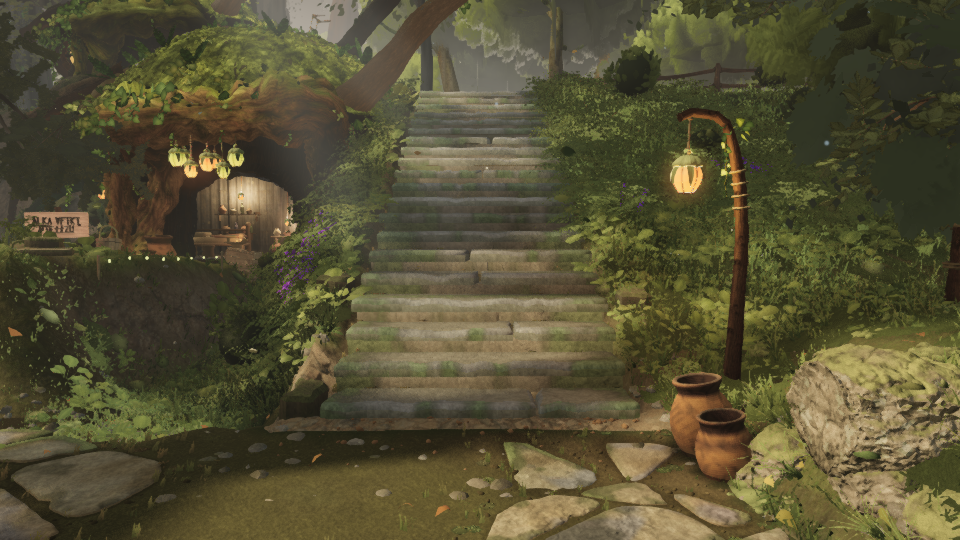

# Play mode is over the triangle gate at the main flight's foot, and the extra million is vegetation

Taking this from fable-3's 05:50 note ("a number from the same renders, for whoever owns play-mode
budgets"): with the real follow camera their people poses counted 626 draws / **10.75 M triangles** at
the flight's foot. W38's gate is written for the six fixed views (≤ 700 draws, ≤ 9.0 M triangles), so
nothing had checked what the *game's own camera* costs. Lane 2 owns the biggest triangle families, so
this is the measurement of who owns that number.

## What the game's camera costs (`playtest.mjs --only perf`, head `24dc489f`, 960 × 540)

| play spot | draws | triangles |
| --- | --- | --- |
| plaza | 585 | 7.95 M |
| **stairs2-base** (main flight, foot, facing up) | **611** | **9.60 M** |
| saria-side | 577 | 8.94 M |
| west-house | 478 | 5.55 M |

Draws are comfortable everywhere. Triangles are over the 9.0 M line at the flight's foot (+6.7 %) and
30 K under it beside Saria's house. Both spots are places a player stands for a long time.

## Who owns them (`playcost.mjs`, this directory)

`__ZR__.isolate(system)` re-renders the settled frame with one top-level system visible, so each row
is the triangles that system really draws at that camera. The play pose is the follow rig's rest pose
at `stairs2-base` (`FOLLOW`: 4.3 m back, eye 1.75 m, aim 1.5 m, fov 46 — `src/camera/follow.ts`), and
it reproduces the play spot: 610 draws / 9.58 M against playtest's 611 / 9.60 M.

| system | hero A (fixed view) | play, flight foot | play − hero |
| --- | --- | --- | --- |
| **vegetation** | 2.455 M (27.4 %) | **3.471 M (36.2 %)** | **+1.016 M** |
| trees | 2.972 M (33.1 %) | 2.765 M (28.9 %) | −0.207 M |
| structures | 2.008 M (22.4 %) | 1.879 M (19.6 %) | −0.129 M |
| terrain | 0.628 M | 0.599 M | −0.029 M |
| hardscape | 0.525 M | 0.341 M | −0.184 M |
| rocks | 0.232 M | 0.326 M | +0.094 M |
| character | 0.178 M (63 draws) | 0.129 M (71 draws) | −0.049 M |
| props | 0.098 M | 0.098 M | 0 |
| **frame** | **628 draws / 8.97 M** | **610 draws / 9.58 M** | **+0.61 M** |

Every system except vegetation and rocks gets *cheaper* when the camera drops to play height and
sits 4.3 m behind Link — a lower eye hides more behind the near ground. Vegetation alone adds a
million triangles, and that is the whole overage: +1.016 M vegetation against −0.4 M everywhere else.

## Reading

* **Not lane 2.** Trees cost 0.207 M *less* at the play pose than at hero A, and their draw count is
  flat (211 vs 209): the rungs behave when the camera drops to 1.85 m. Nothing here asks for a rung
  change, and there is no tree headroom to give back either (hero A is 30 K under the gate).
* **For whoever owns vegetation (lane 3):** the play camera frames grass and ferns at 1–6 m across
  the bottom third of the screen, where the fixed views look over them from 1.8 m with no camera
  boom. 3.47 M triangles in the system at one pose is the single largest line in play mode. The
  levers are the near-field grass density and the fern / plant LOD, both in lane 3's files.
* **Worth a squad decision:** whether the W38 gate applies to play mode at all. If it does, the
  flight's foot is the pose that fails it, and `playtest.mjs --only perf` already measures it every
  run — it just has no threshold attached.

## The tool

`playcost.mjs <dist> <shots.json> <out.json>` — for each pose (a broll `from` pose, or
`{"name": "...", "viewpoint": "A_stairs"}`) it settles 8 frames, reads the drawn totals, and isolates
the eight heaviest top-level systems. `isolate()` only sees scene children, so the granularity is
`trees` / `vegetation` / `structures`, not a tree family; the two runs above are
`playcost-flight-foot.json` and `playcost-hero-a.json`.

The frame below is that pose (the free camera on the rig's geometry, so Link himself is not in it —
his system is 0.129 M either way). Grass and ferns bank both sides of the flight and fill the bottom
third: 3.47 M triangles of the 9.58 M.

