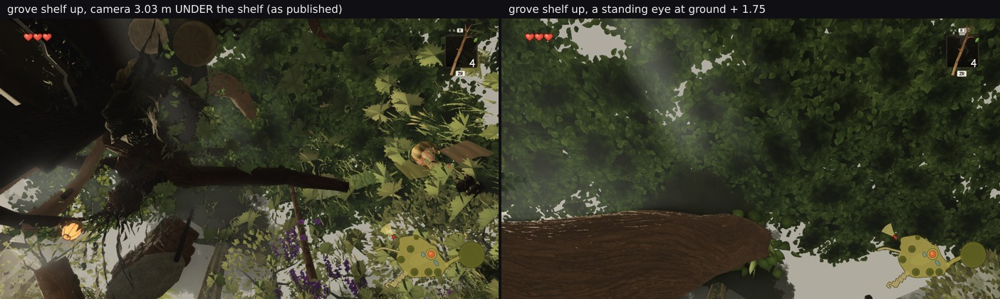
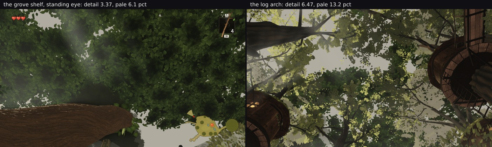

# Every pose this lane ever measured from, checked against the ground — three were inside it

Lane 2, 2026-09-30. Branch `cursor/squad2-treephases-682b`. **No world code changed.**

`../southwest/` is why. A frame that looked like a real defect turned out to be a camera **23 mm above the
ground**, because the pose had been authored by aiming at a subject and giving `y` an absolute 1.75 — a
standing eye on the flat plaza, where nearly every pose in this lane sits, and ground level anywhere the
terrain rises. The generalisation is uncomfortable and cheap to test: **a conclusion is only as good as the
pose it came from, and this lane has twenty pose files.**

`groundcheck.mjs --all` reads every camera position in all of them plus the owner's, probes the heightfield
under each with `__ZR__.probe(x, z)`, and needs **no rendering at all** — two minutes against the forty a
strip costs, which is the whole argument for running it first.

## The result: 60 poses, 57 fine, 3 in the ground

| pose | camera y | ground | above | a standing eye | verdict |
| --- | --- | --- | --- | --- | --- |
| **`look-up-poses:up-open-north`** | 1.8 | **3.251** | **−1.451** | 5.001 | **UNDERGROUND** |
| **`uplooks/poses:grove-shelf-up`** | 7 | **10.028** | **−3.028** | 11.778 | **UNDERGROUND** |
| **`upring/poses:clearing-up80`** | 4.9 | 4.206 | **0.694** | 5.956 | **too low** (mask `structure 1.00`) |
| `uplooks/poses:bridge-up` | 2.5 | −9.531 | 12.031 | — | above head height — **correct**, it is a bridge |
| the other 56 | — | — | **1.29–2.33** | — | ok |

The 56 good poses are what make the three legible: every hero view, every owner pose, every plaza and
plateau and ledge pose lands between 1.29 and 2.33 m above its ground, on `path`, `plateau` or `stairs`.

Two of the flags are worth nothing and one is worth a retraction.

## `clearing-up80` — already known, and a useful check on the tool

`../upring/README.md` says it plainly: *"the second, `clearing-up80`, lands inside a bole and is not used."*
The lane caught this one when it happened. Rediscovering it independently is the point — a tool that finds
the thing you already know is a tool you can believe about the thing you do not.

It also did **not** cry wolf on `bridge-up`, 12 m above its ground: that pose stands on a bridge over a
ravine, and the verdict says "above head height" rather than flagging it.

## `up-open-north` — one row of a table, and the table survives

It appears once, in `../depthfoot/README.md`'s depth-cull table:

> `up-open-north` | 246 / 3 683 298 | 241 / 3 519 960 | **−163 338** | −5 | identical

The claim that table makes is that the culls remove triangles **without changing the frame**, and that
property holds at any camera, underground included. The other six rows are all from valid poses, and the
headline range quoted everywhere — **79–193 K a pose** — comes from `plaza-east` (−78 725) and
`clearing-north` (−193 035), both fine. So **nothing in the depth-cull conclusion needs withdrawing.**

What does need saying: **the −163 338 on that row is not a saving any player receives**, because no player
stands 1.45 m inside the ground of the open north. It should be read as a seventh data point on the
mechanism, not as a player-facing number.

## `grove-shelf-up` — a published interpretation that rationalised the bug

This is the one that matters. `../uplooks/README.md` looks up at three places and concludes:

> | the grove shelf (0, 7, −100) | 60.4 | 5.71 | 5.7 % |
>
> All three read as layered leaf mass with sky holes … **The grove shelf is the darkest and the tightest
> (5.7 % air), which is what a closed canopy over a shelf should be.**

The grove shelf's ground is at **10.028 m** and that camera is at **7** — **three metres under the shelf**.
Of course it is the darkest and the tightest: it is looking up through soil. **And the reading explained
that away as a virtue** — "what a closed canopy over a shelf should be" — which is the same failure as
`bandwidth/LOWTIER.md` §3, where a metric scored a camera artefact as a small improvement, and the same
failure as reading "the darkest" as good news rather than as a symptom.

**Withdrawn:** the grove-shelf row of that table and the sentence interpreting it. `uplooks/`'s other two
rows (the log arch at 1.735 m above ground, the bridge at 12 m on a bridge) stand, and so does its
conclusion that there is *nothing for lane 2 to change* — that conclusion is now supported by two places
rather than three.

**What the relative uses survive.** `../northgrove/` compares this pose before and after its own change
(mean 126.4 → 57.9) and `../headcheck/` re-reads it as a regression guard (57.9 / 43.0 → 57.9 / 43.4).
Those are the *same* pose either side of a change, so they remain valid as difference measurements — a
buried camera is still a fixed camera. What they cannot be is a description of the grove shelf, and
`northgrove/`'s before/after is not one; it is a claim about a change, which still holds.

## What the grove shelf actually looks like

The same up-look at ground + 1.75, which is **11.78** rather than 7:



| | mean | top third | draws / triangles |
| --- | --- | --- | --- |
| 3.03 m under the shelf (as published) | 60.0 | **41.4** | 160 / 1 677 983 |
| a standing eye (ground + 1.75) | 56.4 | **53.0** | **85 / 939 570** |

**The top third is 28 % brighter from a standing eye** — that is the sky the published reading said was
absent at "5.7 % air", and it is the whole basis of calling the shelf "the tightest". The buried camera also
drew **nearly twice the triangles**, because it was inside the vegetation rather than under it. From where a
player stands the grove shelf reads as a canopy with real sky holes and a bough crossing it, which is
neither the darkest nor the tightest of the three up-looks.

## The replacement row, and what it says about the metric

The withdrawn row has to be replaced with one measured the same way, and nobody could do that: the three
numbers were computed ad hoc and **no script was committed**. `uplookmetrics.mjs` now defines them — mean
luminance, the mean absolute luminance difference between adjacent pixels ("local detail"), and the share
brighter than 150 — and reproduces all three published rows to within **0.4 mean and 0.1 detail**:

| image | published | `uplookmetrics.mjs` |
| --- | --- | --- |
| the log arch | 77.7 / 6.39 / 13.1 % | 78.1 / 6.47 / 13.2 % |
| the bridge | 78.7 / 6.36 / 15.6 % | 79.1 / 6.51 / 15.6 % |
| the grove shelf (buried) | 60.4 / 5.71 / 5.7 % | 60.8 / 5.73 / 5.7 % |

My own re-render of the buried pose reads **61.0 / 5.73 / 5.9 %** — the published frame reproduces, which
is what makes the replacement trustworthy. **The corrected standing pose reads 57.8 / 3.37 / 6.1 %.**

**And that 3.37 is where this round nearly went wrong a second time.** `uplooks/`'s own yardstick is *"a flat
slab reads under 2, leaves read 5–6"*, so 3.37 looks like a canopy halfway to a slab — a fresh lane-2 defect
in the charter's own territory, at a pose now verified reachable. It is not one. **Looked at**, the standing
frame is a dense layered canopy of individual leaf clusters with real sky holes, a god ray and a bough
crossing it.

My first explanation for the gap was dilution — the big smooth bough and the pale mist dragging a whole-frame
average down — and **that was wrong too**: canopy-only crops read **3.19** and **3.09**, *lower* than the
whole frame, against the arch's **6.46** on the same crop. The difference is in the canopy.



The frames say what it is. The arch's leaves sit against **bright pale sky**, so every leaf edge is a large
luminance step; the grove shelf's canopy is dark leaves against dark leaves. **"Local detail" is largely
measuring how much sky is behind the canopy**, and it tracks the column beside it almost monotonically:

| up-look | pale > 150 | local detail |
| --- | --- | --- |
| the bridge | 15.6 % | 6.51 |
| the log arch | 13.2 % | 6.47 |
| the grove shelf (standing, whole frame) | 6.1 % | 3.37 |
| the grove shelf (canopy crop only) | **0.5 %** | **3.19** |

**The refinement worth keeping:** the "leaves read 5–6" band requires sky *behind* the leaves. Dark canopy on
dark canopy reads about **3.2**, and a flat slab still reads **under 2** — so the metric does discriminate a
slab from foliage, just not at the level the README implies, and a low reading at a closed canopy is not
evidence of flatness. Any future use of this number has to hold the pale share roughly constant or say
nothing.

**So `uplooks/`'s conclusion stands** — there is nothing for lane 2 to change overhead — now on a pose a
player can occupy, supported by looking at the frame rather than by a number that mostly reports the sky.

## The rule

Every rule this branch has written down is a variant of the same one, and this is the cheapest of them:
**check that a pose is somewhere a player can stand before you believe anything it shows you.** It costs two
minutes and no rendering; the southwest episode cost an hour of renders and nearly a wasted report to two
other lanes, and this audit found two more poses that had already shipped conclusions.

Concretely: **any pose authored by aiming rather than by walking goes through `groundcheck.mjs` first**, and
that especially means anything off the plaza, because the plaza is flat at y ≈ 0 and that is exactly what
makes an absolute `y` of 1.75 feel safe everywhere else.

## Files

- `groundcheck-all.json` — the 60 rows.
- `grove-shelf-poses.json` — the buried pose and the standing one, same aim.
- `grove-fixed.jpg` — the pair.

## Reproducing

```bash
npm run build
node art/environment/squad2-2026-09-23/southwest/groundcheck.mjs dist --all
```
