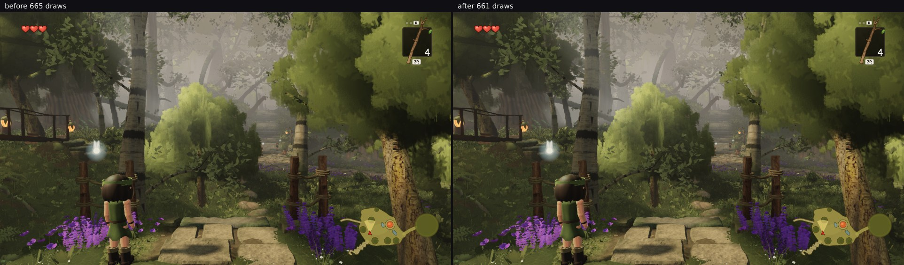

# The white-bark shadow proxies were drawing in the colour pass, writing nothing

*squad lane 2 — 2026-09-30 09:00 UTC — commits `d6fc4794`, `81e9b3b0`*

`stairs1-top` is the frame this branch found closest to W38's 700-draw line (665 in
[`../lookspots/`](../lookspots/README.md)). Reading every tree family's call count there rather
than just the two I had been trying to batch, the largest single consumer was not a tree at all:

```
whitebark-shadow    calls  12   meshes  8   instances 11   triangles 188 576
```

That family is the high bucket's **shadow proxies** — an `InstancedMesh` per white-bark variant
holding the instances the view frustum *rejected* whose shade still reaches the frame, so the
medium-rung geometry can cast for the high rung. Its material is
`MeshBasicMaterial({ colorWrite: false, depthWrite: false })`. It is not supposed to be visible.

But the proxy's aggregate bounding sphere encloses several out-of-view trees and carries
`CULL_PAD_M`, so it clips the frustum edge often, and three then submits it in the **colour pass**
too — where it draws nothing at all. Pure waste, at the tightest frame in the world.

## The two obvious fixes are both closed by three's own source

I checked `node_modules/three` instead of assuming, and both ideas I had died there:

| Idea | Why it fails |
| --- | --- |
| Put the proxy on a layer the camera does not test | `WebGLShadowMap.renderObject` tests `object.layers.test( camera.layers )` — the **main** camera's layers, not the shadow camera's. Hiding it from the camera hides it from the shadow map. |
| `shadowOnlyMaterial.visible = false` | The same function guards its single-material branch with `} else if ( material.visible ) {`. Setting it deletes the shade too. |

## What actually works

`installMainPassCount` already solves exactly this for the ordinary buckets, which draw fewer
instances in colour than in depth. A count of 0 makes `WebGLBufferRenderer.renderInstances` return
**before** it issues a draw or touches `info.render`, and the shadow pass is untouched because it
runs first and calls `onBeforeShadow`, never `onBeforeRender`. So the proxy's main-pass count is
pinned at 0 and its full count follows whatever the submission just set.

## Proof

Same pose, same **one-pose** list on both builds — so the same world time, which is the only way
md5s compare on this branch (`frozen.mjs` settles with time advancing, so a pose's pixels depend on
its index in the list).

| | draws | triangles | trees audit | trees triangles | md5 |
| --- | --- | --- | --- | --- | --- |
| before `0acee2c8` | 665 | 9 875 709 | 114 | 3 969 181 | `c2d51f15a4b0cf58bc0bb9b340efa1d9` |
| after `81e9b3b0` | **661** | **9 799 283** | **110** | **3 892 755** | `c2d51f15a4b0cf58bc0bb9b340efa1d9` |

**−4 draws, −76 426 triangles, and the frame is byte-identical.** The identical md5 is the safety
proof as well as the cosmetic one: had any shade gone missing with the draw, the pixels would have
moved. At `plaza` (index 0 of the ten-pose list, so directly comparable to
[`../lookspots/counts.json`](../lookspots/counts.json)) it is 535 → 533 draws and −55 574 triangles,
md5 also unchanged. At `stairs2-top` it is 651 → 651 and bit-identical triangles: no proxy in that
frame.



## Two things I predicted wrong, stated

**The saving is 4 draws, not the 8 I expected.** From `calls 12 / meshes 8` I assumed 8 colour plus
4 depth. The renderer says 4 colour and 8 depth — four proxies clipped the view frustum, eight sat
in the shadow frustum. The arithmetic was a guess dressed as a reading; only `info.render` settles
it.

**The audit was reporting a draw the renderer never makes.** After the first commit the frame fell
to 661 while the trees' own audit still read 114, because `add()` counts a colour call from a
frustum test and never knew about `MAIN_COUNT`. `81e9b3b0` fixes that: a main-pass count of 0 now
means no colour call and no colour triangles, which is also the honest answer for any ordinary
bucket whose whole submission happens to be shadow-only that frame. The audit and the renderer now
agree on both the 4 draws and the 76 426 triangles.

One inaccuracy is left standing rather than hidden: a bucket mixing kept and shadow-only instances
is charged its **full** count's triangles in the colour pass, where only `mainCount` of them draw.
Splitting that would rewrite every recorded family number on this branch, so it stays a known bias.

## Reproducing

```bash
node art/environment/squad2-2026-09-23/frozen.mjs dist /tmp/after \
  --poses art/environment/squad2-2026-09-23/proxydraw/one-pose.json --settle 8
```
