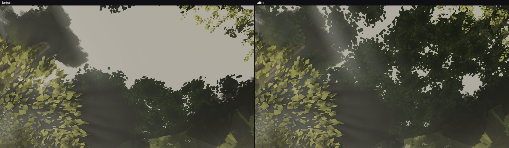
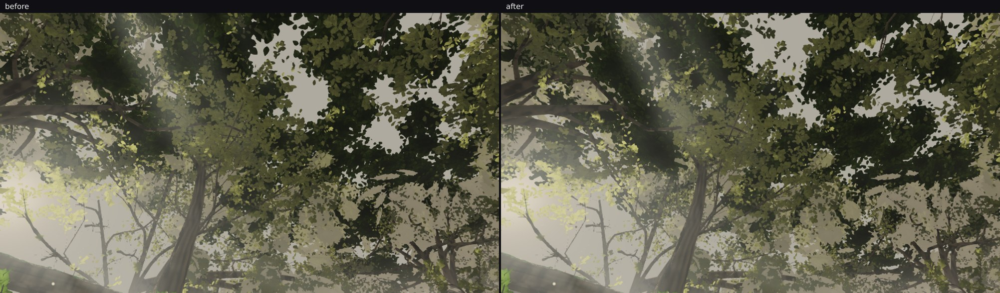
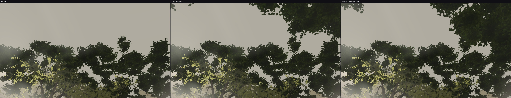

# squad2 — the canopy closes over the open north

Taking the item lane 2 diagnosed at `art/environment/squad2-2026-09-23/upring` and then left twice because
it moves the fixed frames: **looking up from the plaza's northern approach showed haze where the canopy
should close.** Branched from the head; `agent/squad2-crowntone` (PR #48) is independent of this and
touches different files.

## The pose the owner would see

`u-open-up`, the pinned look-up in fable-cursor's re-read protocol, before and after
(`open-north-pair.jpg`):



| `u-open-up` | mean | top third | middle third |
| --- | --- | --- | --- |
| before | 107.4 | 137.7 | 114.8 |
| after | **71.9** | **74.4** | **72.1** |

39.3 % of that frame changes. What was a flat pale-grey void over two thirds of the image is now layered
leaf masses with bright gaps of sky punched through them and the god rays coming down between — which is
what the reference's look-ups have (`review46/r_020–r_028`, `demo61/d_101–d_116`).

## Why the hole was there

The roof's hero-frame exclusion dropped **every** clump projecting anywhere inside one of the six fixed
frames within 120 m (`HERO_DROP_M`). A roof hangs 20–37 m up, so "anywhere inside a frame" is in practice
the frames' **top band** — and the consequence was that the airspace over the northern approach
(z ≈ −20…−52) carried no roof at all, while the stand pass that would have covered it starts at z ≤ −52
(`ROOF_STAND_BOUNDS`). The hole was not a bug in the field or the supports; it was the exclusion doing
exactly what it said.

`HERO_TOP_KEEP = 0.18`: a clump whose projected disc stays within 0.18 of a frame's height from its top
edge is kept. That band is the only part of a hero frame a 20–37 m roof can reach; our frames already carry
foliage along it (hero A's top third is foliage) and so does the reference (`r_025`, `r_026`, `d_108` all
close over the top of the image). **Below the band the exclusion is exactly as it was.**

## What it costs

`measure-roof.mjs` (new, in this directory) builds the roof headlessly through the canopy test's loader and
prints the change exactly, instead of inferring it from a rounded pose count:

```
HERO_TOP_KEEP = 0      clumps   672  cards  2944  triangles  5888  dropped by the frames   76  over the approach  121
as shipped             clumps   753  cards  3278  triangles  6556  dropped by the frames    3  over the approach  176

delta: 81 clumps, 334 cards, 668 triangles (0.0074 % of the 9 M cap), and 55 more clumps over the northern approach
```

And the hero views measured with `pose-counts.mjs` on this build (`pose-counts-after.json`) are the same
figures fable-cursor's 11:20 full check reported on the merged head — A 639 draws / 8,875,355 triangles,
B 628 / 8.29 M, C 572 / 7.93 M, D 562 / 8.63 M, E 628 / 8.29 M, F 599 / 8.01 M. Nothing approaches the
700-draw / 9 M cap.

## What it moves in the fixed frames

| frame | pixels changed > 8 levels | mean before → after |
| --- | --- | --- |
| A (`A_stairs`) | 10.58 % | 94.8 → 94.8 |
| D (`D_log`) | 9.58 % | 90.1 → 90.0 |
| F (`F_canopy`) | **0.00 %** | 84.0 → 84.0 |

The means do not move, and `hero-A-diff.jpg` shows why: the changed pixels are scattered over lit
vegetation — the treehouse's moss, the left canopy, the right-hand shrubs and grass — not a new band across
the top of the frame. That is the added roof's **shadow** re-dappling the plaza, light moved around rather
than taken away. It is a real change to the scored frames and it needs a pinned-pose re-read before any
checkpoint leans on A or D; F, the canopy view, does not move at all.

## The other look-ups, and play mode (14:20–14:50)

The open north was the pose with the hole; the three other look-up poses are the check that closing it did
not darken the places the owner already likes ("the foliage in the beginning looks great"). Each rendered
twice on this branch, once with `canopy/roof.ts` reverted to the head:

| pose | mean before → after | top third | pixels changed > 8 levels |
| --- | --- | --- | --- |
| `u-plaza-up` (his job-6 pose) | 96.2 → **95.8** | 74.2 → 76.6 | 22.4 % |
| `u-saria-up` | 57.8 → 58.6 | 81.9 → 84.4 | 4.9 % |
| `u-stairs-up` | 80.5 → 80.7 | 82.0 → 82.9 | 12.9 % |

None of them darkens — the plaza look-up holds its level to within half a level and its top third comes up
2.4 — so the −63 levels at `u-open-up` was the hole being filled and nothing else. `plaza-lookup-pair.jpg`
shows the character kept: layered leaves with sky gaps, a little more canopy over the upper-left gap.



**Play mode** (`playtest.mjs --only look,walk,perf`, `playtest.json`): no page errors, all **ten walk routes
reached with nothing stuck** (68 waypoints), south probes 41/41. A roof 20 m up cannot block a walker and
does not.

One thing to relay rather than to fix here: the perf spots report `stairs2-base` at **9.50 M triangles**
(610–614 draws), above the 9 M figure the hero views are held to, and `saria-side` at 8.86 M. That is not
this change — `measure-roof.mjs` puts its whole contribution at **668 triangles**, 0.007 % — and it matches
what fable-5 attributed to lane 4's vegetation at 13:43 and what fable-cursor flagged for the south
look-back at 11:20. Worth a pass by whoever owns the play-mode budget.

## Both of lane 2's open branches together (15:20–16:00)

This branch and `agent/squad2-crowntone` (PR #48) are both open and touch different files — the roof here,
the crown cards' veil there — so the question a reviewer would ask is whether they compound. They do not:
merged locally and rendered against each one alone (`combined-hero-A.jpg`, `combined-owner-north.jpg`):

| pose | head | the veil alone | the roof alone | **both** |
| --- | --- | --- | --- | --- |
| hero A, canopy crop (mean) | 80.3 | 82.4 | 80.4 | **82.4** |
| `owner-0650-north` (mean / top third / eye level) | 79.8 / 95.8 / 71.7 | 80.2 / 97.3 / 71.7 | — | **80.2 / 97.3 / 71.7** |
| `u-open-up` (mean / top third) | 107.4 / 137.7 | (gated off) | 71.9 / 74.4 | **71.8 / 74.3** |
| `u-plaza-up`, his job-6 pose (mean / top / eye) | 96.2 / 74.2 / 93.0 | (gated off) | 95.8 / 76.6 / 89.5 | **95.8 / 76.6 / 89.5** |

Each pose lands on whichever change owns it, to a tenth of a level: the veil is shut above 26° so it adds
nothing at `u-open-up`, and the roof's shadow adds 0.1 at hero A where the veil adds 2.1. The merge is
clean, and the merged tree's tests pass (canopy roof 1, `crownVeil` 4, LOD pool 18).

`pose-counts.mjs` on the merged tree (`pose-counts-both-prs.json`) is **identical on all six hero views** to
the roof-only build and to fable-cursor's 11:20 full check — A 639 / 8,875,355, B 628 / 8.29 M,
C 572 / 7.93 M, D 562 / 8.63 M, E 628 / 8.29 M, F 599 / 8.01 M. Both branches together cost nothing in the
scored budget.

## The same defect on the newest content: the south exit (16:20–17:00)

Rendered before changing anything, from two look-up poses authored off the layout's own bridge
coordinates: **at the log's mouth the forest's crowns end in a line with bare pale sky over them.** The
plaza grid stops at `ROOF_BOUNDS.zMax = 40` and no giant reaches the far bank — the nearest is 14 m north
of the bridge's north sill — so nothing closed over lane 5's new exit. The bridge's own look-up was already
canopied by the trees on the lips, so this is the roof's edge and not a hole in the trees.

Three bands in `ROOF_STAND_BANDS` (the far bank either side of the path, the mouth, then the top of the
ravine's airspace) and the stand pass now samples a **list** of grids, `ROOF_STAND_GRIDS`, with the north's
rectangle first so every north clump draws exactly what it drew before the south existed. Everything else
about that pass — the band support, the giant skip, the shaft and opening carves, its own 50 m hero drop —
applies unchanged.

| `s-logmouth-up` | mean | top third |
| --- | --- | --- |
| head | 119.3 | 172.2 |
| + the bank and mouth bands | 103.4 | 125.7 |
| **+ the ravine band** | **98.4** | **120.3** |



`s-bridge-up` does not move at all (76.5 → 76.5): the gorge's own canopy was never the problem. A pale
opening remains high overhead at the mouth, which is either a genuine gap over the gorge or wants a wider
band — the next measurement, not a claim.

**Cost:** the roof is now 814 clumps / 3588 cards / **7176 triangles**, so the whole of this branch's roof
work adds about **1,290 triangles** over the head — 0.014 % of the 9 M cap.

**Camera C** is the only fixed camera that looks south (fable-3's note), so it is the one that can see these
bands. Its after frame is `hero-C-after.png`; its before was not rendered in this hour, and what bounds the
risk meanwhile is the test: no clump centre may sit below the kept top band inside any hero frame within its
drop distance, so C's frame body cannot have gained roof by construction, only its top 18 %. Rendering C's
pair is the first thing for the next hour.

## The test

`roof.test.mjs` pinned the old rule exactly (it failed with 111 offenders the moment this changed), so it
now pins the new one with the same independent pinhole projection: **no clump centre below the kept top
band inside a hero frame within the drop distance**, and it reports how far down a frame an offender sits.
The rest of that test — determinism, the stand pass, the shaft columns, the minimum height above ground —
is untouched and still passes.

Typecheck, build and the canopy / trees tests are green.
