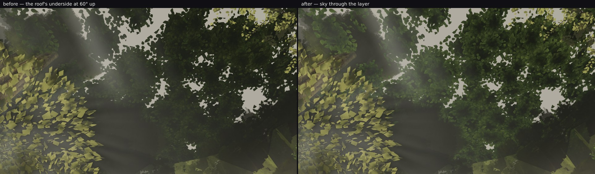
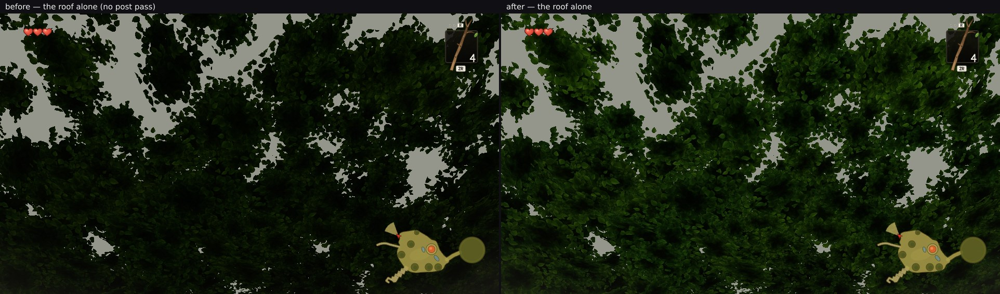

# Backlog item 4: the dark flat mass overhead is the canopy roof's underside, and it now reads as leaves

Taking **Backlog item 4** — "the distant ring's floor cards seen straight up in the open north (a dark
flat disc overhead)". Two findings: straight up is already clean, and the dark flat mass the owner saw
at a walker's upward look is **the canopy roof**, not the distant ring's floor cards. The roof is
lane 2's, so the fix is here.

## Where the dark flat mass is, and whose it is

Poses from the open north (`p = 1.5, 5.19, −40`, the squad's `u-open-up` at 60° up and a true zenith
look), head `24dc489f`:

* **straight up** (`before-u-open-zenith.png`): leaves, sky holes, lit fringes — no disc. Item 4's
  literal complaint is fixed.
* **60° up** (`before-u-open-up.png`): the lower half is a smooth dark mass. `isolateshots.mjs` renders
  the same settled frame one top-level system at a time, and in the box x 250–620, y 380–539 the roof
  covers everything: its own pixels there were **98.5 % under display level 30** (mean 12.8) while the
  frame's neighbour-to-neighbour luminance difference was **1.75** against **5.0–5.3** in the leafy
  parts of the same frame. Trees are in that box too (mean 47.7) but behind it; the distant ring's
  floor cards are not what the eye lands on.

## Why it was flat

`ROOF_UNDER_LIFT` (0.16) is one number for every texel, so under a mass the atlas' leaf detail is
multiplied by 0.16 and lands inside one or two display levels. The other light the roof had,
`ROOF_SUN_THROUGH`, is gated by `thin² · max(0, dot(−normal, sunDir))` — a mass in shade gets nothing
from it by construction. So the underside had brightness but no structure.

## The change (`src/world/canopy/index.ts`, 2 GLSL lines + 1 uniform + 1 constant)

`ROOF_SKY_THROUGH = 0.6`: the diffuse sky the layer transmits, scaled by the atlas' overlap-depth
channel **linearly** (`thin`) and not gated by the sun's direction, in the air's own colour at unit
scale (`config.fog.color`). Thin fringes lift, deep masses stay dark, and the difference between them
is the structure the flat lift cannot give. The flat lift is untouched, so nothing is paled — that is
the trap that got a paling change reverted at 05:30.

## What it did

The roof alone (`isolate`, which renders without the post pass, so this is the material's own output):

| the roof alone, `u-open-up` | before | after |
| --- | --- | --- |
| dark box mean / neighbour-diff | 12.8 / 2.90 | **23.1 / 4.66** |
| dark box under display level 30 | 98.5 % | **76.1 %** |
| whole frame mean / neighbour-diff | 34.6 / 5.11 | **43.9 / 6.26** |
| whole frame under level 30 | 81.8 % | **59.6 %** |

The finished frames (`broll --settle 6`, same pose order before and after):

| frame | before mean / neighbour-diff | after mean / neighbour-diff | pixels moved > 4 |
| --- | --- | --- | --- |
| `u-open-up` whole frame | 72.9 / 3.73 | 77.0 / 4.04 | 36.6 % |
| `u-open-up` leafy right | 51.7 / 5.06 | **60.9 / 5.75** | — |
| `u-open-up` dark box | 68.7 / 1.71 | 70.4 / 1.92 | — |
| `u-open-zenith` | 74.9 / 5.87 | 79.7 / 5.96 | 42.5 % |
| **hero A** | 95.7 / 4.82 | 95.7 / 4.82 | **0.001 %** (max 17 on ~5 px) |

Cost is unchanged by construction and measured: the canopy system draws **4 calls / 5,806 triangles**
at that pose before and after (`isolate.json` in both runs). It is a uniform and two lines of GLSL.
The capture harness agrees on the whole frame: `A_stairs` is 614 draws / 8.97 M triangles on the
branch, the same as the head.

## The owner's fixed frames: byte-identical, all of them

`sixcheck.mjs` (this directory) renders the five distinct fixed viewpoints (E repeats B's camera) on
both builds in the same order and compares them, with the luminance SSIM against `reference/frames`
that `gauntlet/scripts/compare.mjs` reports:

| frame | pixels moved > 4 | mean | local detail | SSIM vs reference |
| --- | --- | --- | --- | --- |
| A_stairs | 0 % | 95.6 → 95.6 | 4.83 → 4.83 | 0.3332 → 0.3332 |
| B_house (= E_ground) | 0 % | 92.6 → 92.6 | 4.64 → 4.64 | 0.2412 → 0.2412 |
| C_lookback | 0 % | 90.9 → 90.9 | 4.44 → 4.44 | 0.1236 → 0.1236 |
| D_log | 0 % | 90.6 → 90.6 | 4.15 → 4.15 | 0.4021 → 0.4021 |
| F_canopy | 0 % | 85.5 → 85.5 | 4.78 → 4.78 | 0.4330 → 0.4330 |

Not "small": zero pixels differ by more than 4 levels in any of the five. The roof is dropped inside
the hero frusta and its `HERO_TOP_KEEP` band sits outside every one of these pitches, so this term
cannot reach them — now measured rather than argued.

Hero A does not move: the roof is dropped inside the hero frames and its `HERO_TOP_KEEP` band is out
of A's view. Tests: 206 pass, four of them new in `src/world/canopy/roofSky.test.mjs`, which pins the
term to `thin` linear, un-gated by the sun, additive to the flat lift, and the cache key bumped.

## What is left there, for lane 1

The smooth grey wash across the bottom-left of `u-open-up` is **not** the roof. `isolate` bypasses the
post pass, and the roof's own pixels in that box are 23 levels where the finished frame reads 70: the
remaining ~47 levels are the airlight / god-ray overlay, which flattens whatever is behind it
(neighbour-diff 1.92 in the finished frame against 4.66 in the roof's own render). If the owner still
reads a flat patch overhead in the open north, that is the term to look at, and it is lane 1's.

## Measurement note

Pool residency carries over between poses inside one `broll` run, so a pose rendered first and the
same pose rendered third are not the same frame. My first hero-A pair was a fresh-run A against an
A captured third, which showed a spurious 19.5 % of pixels moved; rendered like-for-like (A alone on
both builds) it is 0.001 %. Compare only runs with the same shots order.

