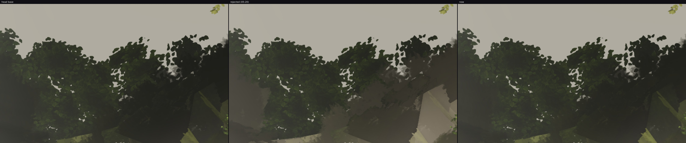
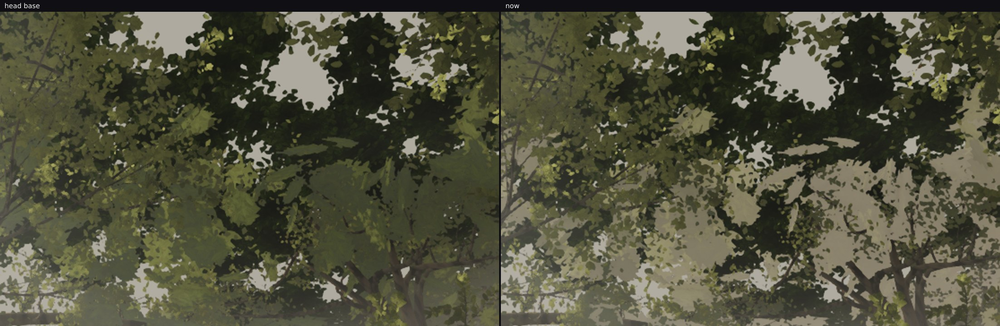
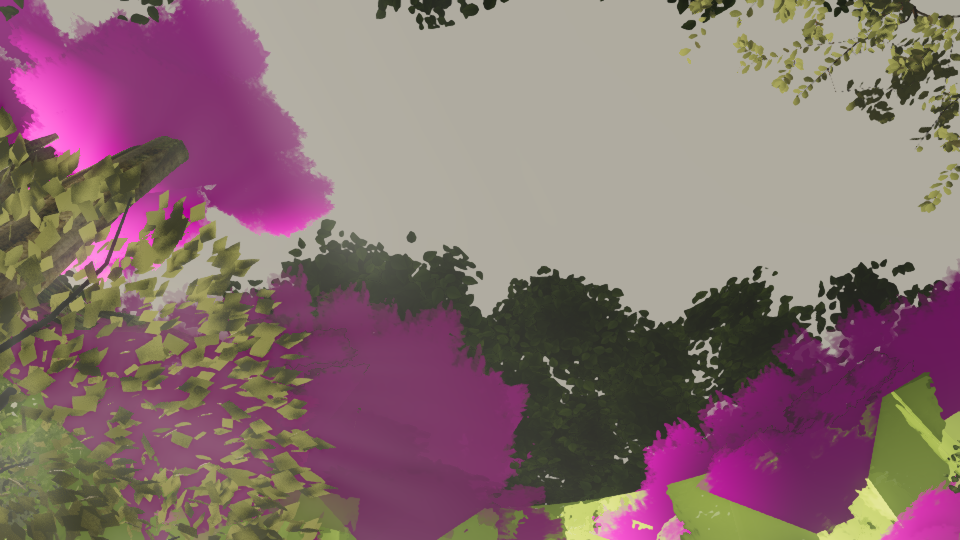
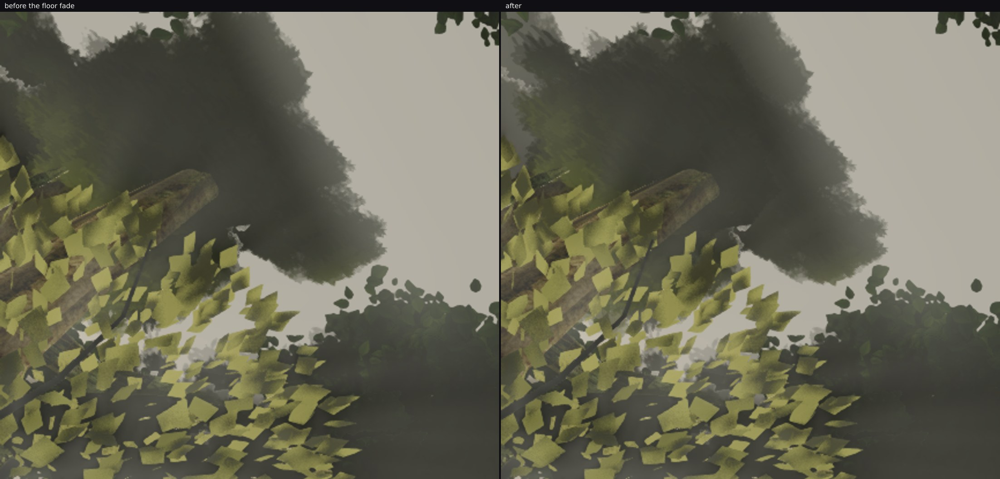

# squad2 — answering the review that reverted the depth veil

Answering **fable-cursor's review note of 05:30** (`docs/SQUAD_2026-09-23.md` §Review notes): the
`squad2-lookup` merge was reverted because at the pinned `u-open-up` pose the depth veil "turns the
crowns into pale beige flat shapes whose polygon edges read harder than before … a paler card is still
a card", with the bar for what would pass: *the crowns' silhouettes soften or break up as they recede,
with the tone moving toward the air only as much as the reference's r_025 band*.

Branched from the current head with `git revert 7872ec0e` first, as the note asks.

**The tone half of that bar is met; the silhouette half is partly met, and the rest is measured and
handed on rather than claimed.** Read the two sections in that order.

## 1. The tone: met, and the rejected artefact is gone

The review's pose, cropped to the region it rejected (`open-up-three.jpg` — head base | the reverted
05:20 build | now):

| `u-open-up`, band y 0–0.7 | foliage L | foliage S | sky L | cut-out | outline hardness |
| --- | --- | --- | --- | --- | --- |
| head base | 0.287 | 0.128 | 0.672 | 0.384 | 15.5 % |
| the reverted 05:20 build | 0.315 | 0.138 | 0.672 | 0.357 | 15.3 % |
| **now** | **0.294** | 0.133 | 0.672 | 0.378 | 15.5 % |
| reference `r_025` | 0.277 | 0.099 | 0.518 | 0.242 | **3.4 %** |
| reference `r_026` | 0.293 | 0.081 | 0.521 | 0.228 | **3.4 %** |

Two things that table says, both new:

- **The veil's premise was wrong at this pose.** Our foliage was *already* at the reference's own
  lightness (0.287 against 0.277 and 0.293). What is 0.15 out is our **sky**: 0.672 against their
  0.518. That is what makes every leaf edge a maximum-contrast cut-out here, and it is not a tree
  material — it is the sky and the in-scatter over it (lane 1 / atmosphere, and it is worth stating
  next to squad4's `RAYS.md`, which found the same wash from the other side).
- The veil is now off the crown cards entirely and the tone sits at 0.294, inside the reference band
  and a third of the way back from the rejected 0.315.

The fix is a split by **material, not distance**: a probe with each crown material marked
(`probe-look.mjs`, four variants in one load, `probe-far-crown-marked.png`) puts the flat shapes on the
crown layer's near LOD at 21–33 m (`distant-5-near`, `distant-0-near`, `distant-1-near`), while the
plaza look-up's gain is the giants' dense canopy at the *same* distances. Dense overlapping foliage
with depth behind it can take the air's colour; an isolated card cannot, because paling it prints its
geometry. So the veil stays on the giants' leaf cards and leaves the crown cards alone, and it also
became a **floor** rather than a wash: it fades out with the fragment's luminance as a share of the
air's own, so foliage already as pale as the air gets nothing.

That relative form matters — an absolute threshold read nothing at all, because the god-ray in-scatter
is a post pass: a leaf at 0.31 on screen is about a third of that inside the material.

The gain the owner's job 6 was about is untouched (`plaza-up-pair.jpg`, his `u-plaza-up`): the outward
band's middle third 64.0 → 79.9 levels, the near canopy overhead 74.3 → 74.8.

## 2. The silhouettes: what they are made of, and how far this got

The review is right that the outline is the defect: **15.5 % against the reference's 3.4 %**. Four
alpha-side treatments were built and rendered against that number, and every one was a non-result:

| attempt | result at `u-open-up` |
| --- | --- |
| remap the alpha to widen its blended fringe (erode 0.18, soft 0.7, 16–42 m) | outline hardness 15.5 % → **15.6 %** |
| sample the atlas 1.8 mip levels blurrier with distance | **0.05 %** of the frame changed; 0.00 % at the plaza look-up |
| fade the lobe cores with distance (0.85 over 16–42 m) | **byte-identical frames** |
| the same dissolve on a 26–64 m window (the first guess) | 15.5 % → 15.4 % |

The byte-identical frames were the useful clue — they prove none of those shapes is a lobe core. Two
tag probes in the crown shader then settled what they are. The first tints the crown layer by its
vertex tag (`probe-tags-cards-green.png`: cores red, the near LOD's bark blue, cards green): every
flat shape is a **card**. The second tints near-horizontal cards against upright ones
(`probe-floor-cards-magenta.png`):

**The broad smooth masses are the crowns' FLOOR cards, and the leafy speckle beside them is the
upright cards.** That is why four alpha treatments failed: they were softening a fringe on shapes
whose outline is their quad — rounded to a smooth disc inside the near gate (`CROWN_FLOOR_ROUND`) and
straight-edged beyond it.

So `CROWN_FLOOR_FAR` takes 0.8 of a floor card's coverage over 20–44 m. A floor card exists so a walker
stood under a crown does not see through it, which is a claim about being *under* it; at 25–40 m it is a
flat lid held up to the sky. With it gone the lace of the upright cards draws the silhouette
(`floor-fade-pair.jpg`, the biggest mass in that pose):

**What it does:** 2.46 % of the pinned frame changes, concentrated where those masses are (the top-left
cell 30.3 % changed, mean Δ 23.6 levels); the mass's rim becomes scalloped and shows air through it.
No thinning — the band's mean moves 137.2 → 137.7 levels, so the canopy did not open into holes — and
the owner's job-6 gain is untouched, `u-plaza-up` being byte-identical before and after (those crowns
are inside 20 m, below the window).

**What it does not do: any aggregate statistic moves.** Outline hardness stays 15.5 %, and so does the
boundary density. That is the honest state, and measuring *why* is the useful part of this hour. The
metric now reports both halves of "cut-out" separately — `edges` is the mean step across a boundary,
`lace` is the share of pixels that lie on one — because a slab and lace differ in the second, not the
first. In the box around that mass:

| `u-open-up`, x 0–0.35, y 0–0.35 | foliage L | outline hardness | boundary density |
| --- | --- | --- | --- |
| ours, before the floor fade | 0.282 | 10.5 % | 0.66 % |
| ours, after | 0.294 | 10.3 % | 0.66 % |
| reference `r_025` | 0.381 | **2.3 %** | **3.06 %** |
| reference `r_026` | 0.394 | **2.7 %** | **3.22 %** |

The reference's canopy has **4.6 × our boundary density at a quarter of our step**: it is made of many
small leaf clumps, ours of a few big masses. No alpha treatment on the existing cards can close that —
it is granularity, the "depth-graded density" half of the review's phrase, and closing it means more and
smaller cards at 20–45 m, which is a triangle cost to weigh against W38 rather than a shader change.
That is the next item, and it now has its number to aim at.

## 3. Granularity: the lever tried, and what the silhouette is really made of (08:20–09:00)

The number to aim at from §2 was the reference's **4.6 × our boundary density at a quarter of our step**.
The cheap way to add clumps is lobes — each is two quads — so three builds were rendered at the pinned
pose:

| build | lobes | result |
| --- | --- | --- |
| mid 14 at 0.28–0.35 R, far 6 at 0.6 × the old radius | ×2.3 and ×3 as many, smaller | 1.29 % of the frame changed, all of it one dark corner; band and box statistics unchanged |
| the same, pushed out to 0.62–0.9 R | on the rim, larger | **byte-identical statistics again** (0.66 % density, 10.3 % step in the box, to two decimals) |
| both, at the plaza look-up | — | frames byte-identical: no mid or far crown is visible in that pose |

So lobes cannot reach the silhouette at all, whatever their number, size or offset. What draws it is the
crown's **three main axis cards** — each 2.8 R across, so the whole crown *is* one card's edge — and,
seen from below, its **floor cards**, which `CROWN_FLOOR_FAR` now takes most of away at range. The atlas
is not the problem either: it already paints 300 body clumps and 110 rim clumps per cell, but a 2.8 m
card at 25 m is a four-times minified cell, so the mip averages that lace away and the alpha test leaves
one smooth edge.

The axis cards are therefore the open lever, and they cannot be made smaller and more numerous without
changing the crown's span — `FAR_CROWN_CARD_HALF`'s own comment records that shot D's skyline is built on
it. That is a change to be made with A–F rendered before and after, not in the tail of an hour, so the
experiment is backed out (nothing unproven ships) and the finding is recorded at `FAR_CROWN_LOBES` in
`distant.ts`, where the next person will be standing when they try the same thing.

## What is in the branch

- `src/world/trees/distant.ts` — the veil off the crown cards, `CANOPY_DEPTH_VEIL.lift` (the relative
  floor), `CROWN_SHADE_M` as before, `CROWN_FLOOR_FAR`, and the recorded finding where the dissolve was.
- `art/environment/squad2-2026-09-23/lookup/cutout.mjs` — the `lace` column (boundary density) beside
  `edges` (the step across one), because a slab and lace differ in the first and not the second.
- `src/world/trees/materials.ts` (lane 3, declared) — two lines: the veil on the `giant-canopy` leaf
  cards, and a `name` for that material so `probe-look.mjs` can mark it. It was anonymous, which is why
  the first probe of this had to guess.

Typecheck, build and the trees / canopy tests (22) are green. Cost is unchanged: no geometry, no new
draw, no new texture — the veil is a handful of fragment operations on one existing material.
