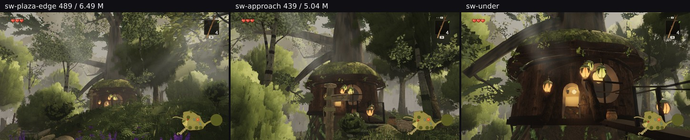
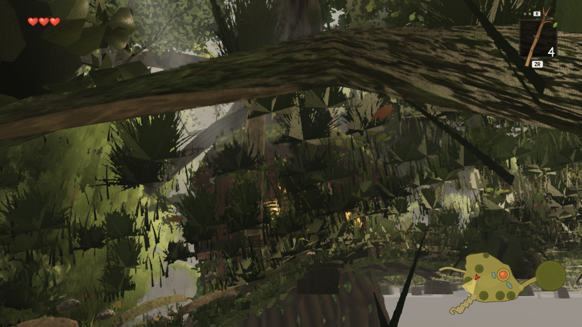

# Three poses nobody in this lane had ever looked at — one of them is bad, and not for the reason I guessed

Lane 2, 2026-09-30. Branch `cursor/squad2-treephases-682b`. **No code changed here.**

`auditgap/` §3 needed a camera aimed at the **southwest giant** at `(-23, 2.6, 9)`, because its detached
boughs are gated by a frustum test and none of the six fixed viewpoints looks that way. Three poses were
authored for that purpose and then, having them, they were rendered and **looked at** — which no round of
this lane had done for this part of the world.

| pose | camera → target | draws / triangles | the trees' own row |
| --- | --- | --- | --- |
| `sw-plaza-edge` | (−2, 1.75, 4) → (−23, 9, 9) | 489 / 6 485 687 | 82 / 3 980 797 |
| **`sw-approach`** | (−8, 1.75, 7) → (−23, 7, 9) | 458 / 5 320 061 | **83 / 4 116 658** |
| `sw-under` | (−14, 1.75, 9) → (−23, 6, 9) | 314 / 4 048 161 | 77 / 3 875 777 |

`sw-approach` carries **4.12 M tree triangles — more than any fixed viewpoint in the rubric**, hero A's
3.55 M included. So this is both an unexamined composition and the heaviest tree load in the world.



## Two of the three are good

`sw-plaza-edge` and `sw-under` show what this corner is for: the second tree-house wrapped around the
giant's bole, its pod lanterns lit, moss and climbing foliage on the trunk, god rays coming down through
layered crowns. Nothing in them reads as flat, and the middle distance has depth.

## `sw-approach` does not



The middle and lower two thirds of the frame are covered by **large, hard-edged, flat-looking foliage** —
spiky fronds a metre or two across with visible straight polygon edges, repeating across the frame at a
scale that reads as leaves an arm's length away rather than canopy at 10–20 m. It is the opposite of the
charter line this lane is measured on ("layered trees with readable crowns and trunks at 15–80 m … the far
ring never reads as flat cards from below") and it is the same *shape* of complaint as the owner's backlog
item 4, the dark flat mass overhead, which `roofsky/` fixed for the canopy roof.

**The candidate list I wrote before measuring, kept because the measurement below rejects most of it.**
Twice this week a mechanism written before the measurement turned out to be wrong (`bandwidth/LOWTIER.md` §4,
and `poolpredict/`), so it was written as a list rather than a diagnosis — and the list was still wrong at
the top:

- a mid or distant **crown card** drawn at close range, where the rung should long since have swapped to
  real geometry — that would be a LOD-gate failure and squarely this lane's;
- the **giant's own canopy laminae** seen from inside its crown, which is `giant.ts` geometry reached through
  this lane's swap distances;
- the **understory** at close range, which is the third banded family;
- or a pose a player cannot actually stand in, in which case it is not a defect at all — `(-8, 1.75, 7)`
  was chosen to frame the boughs, not by walking there, and that has to be checked before anything else.

## The attribution, and it kills the leading candidate

`outlook/familycost.mjs` crashed — it needs a temporary handle on the trees group that was added for a
measurement and taken out again (`INDEX.md` records that), so it reads `undefined.visible` and dies after
the control frame. That is a second, smaller finding: **the lane has a committed probe that cannot run on
the current `src/`**, and a reader would not know until they tried.

The submission split from `auditgap/ck-sw.json` answers the question anyway, because it is per family and per
LOD. At `sw-approach`, of the trees' 4 116 658 triangles:

| family | calls | triangles | instances |
| --- | --- | --- | --- |
| **`whitebark-lod0`** | 18 | **1 668 472** | **16** |
| `giant-far-foliage-batch` | 6 | 740 888 | 3 |
| `giant-near-canopy-batch` | 1 | 695 915 | 1 |
| `giant-wood` | 6 | 541 250 | 3 |
| `whitebark-lod1` | 7 | 127 992 | 10 |
| **`mid-near`** | 5 | **39 630** | 75 |
| `distant-*` | — | not in the top twelve | — |

**So it is not a card drawn too close, and not a LOD-gate failure.** The mid grove's near rung contributes
**39 630 of 4 116 658 triangles — under 1 %** — and the distant layer does not reach the top twelve. What
fills the frame is **sixteen white-barks at their highest rung** (104 K triangles each) plus the giant's
near-canopy and far-foliage batches: **real geometry at close range, which is the rungs doing exactly the
right thing.**

That moves the defect out of this lane's machinery. What the frame shows is the **close-range appearance of
white-bark leaf geometry and the giants' laminae** — `whitebark.ts` and `giant.ts`, lanes 3 and 4 — at a
distance the art was probably never judged at, with sixteen of them overlapping at once. My own leading
candidate above was wrong, and the measurement took ten seconds because the data was already on disk from
the previous round.

**What is still not established:** whether a player can stand at `(-8, 1.75, 7)` at all. That pose was
authored to frame the boughs, not by walking there. If the camera is inside a crown cluster no player can
enter, there is nothing to fix and the right outcome is to say so. That is the next round's first job, and
it comes before any suggestion to another lane — a defect report at an unreachable pose wastes somebody's
evening.

## Files

- `southwest-poses.json` — the three poses, in broll/`frozen.mjs` format.
- `three-poses.jpg`, `sw-approach.png` — the frames above.
- `counts.json` — `frozen.mjs`'s reads, clock frozen.

## Reproducing

```bash
npm run build
node art/environment/squad2-2026-09-23/frozen.mjs dist /tmp/sw \
     --poses art/environment/squad2-2026-09-23/southwest/southwest-poses.json --settle 8
# the attribution, per family AND per LOD, without the hook familycost.mjs needs:
node art/environment/squad2-2026-09-23/bandwidth/bucketprobe.mjs dist /tmp/sw.json \
     --views '-8,1.75,7:-23,7,9' --quality high
```

`outlook/familycost.mjs` does **not** run on the current `src/` — it needs a temporary handle on the trees
group that no longer exists.
