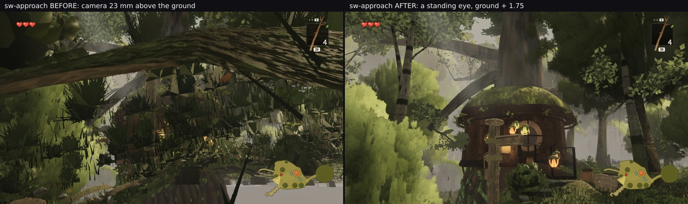

# Three poses nobody in this lane had looked at — the defect I found in one of them was my own camera

Lane 2, 2026-09-30. Branch `cursor/squad2-treephases-682b`. **No world code changed.**

`auditgap/` §3 needed a camera aimed at the **southwest giant** at `(-23, 2.6, 9)`, because its detached
boughs are gated by a frustum test and none of the six fixed viewpoints looks that way. Three poses were
authored for that, and then — having them — they were rendered and **looked at**, which no round of this lane
had done for this corner of the world.

**Verdict: the corner is good, and the frame that looked broken was a camera lying on the ground.**
Reported here in the order it happened, because the order is the point.

## 1. What the frames looked like, and the alarm

`sw-approach`'s middle and lower thirds were filled with large, hard-edged, flat-looking foliage — spiky
fronds a metre or two across with straight polygon edges, at a scale that reads as arm's length rather than
10–20 m. That is the opposite of this lane's charter line and the same shape as the owner's backlog item 4.

It also carried **4.12 M tree triangles, more than any fixed viewpoint** in the rubric, hero A's 3.55 M
included, so it looked like a genuine find in an unexamined place.

## 2. The first measurement rejected the first guess

The candidate I put at the top of the list was a **mid or distant crown card drawn at close range** — a
LOD-gate failure, squarely this lane's. The per-family, per-LOD submission (`auditgap/ck-sw.json`, already on
disk from the previous round) rejects it outright:

| family | calls | triangles | instances |
| --- | --- | --- | --- |
| **`whitebark-lod0`** | 18 | **1 668 472** | **16** |
| `giant-far-foliage-batch` | 6 | 740 888 | 3 |
| `giant-near-canopy-batch` | 1 | 695 915 | 1 |
| `giant-wood` | 6 | 541 250 | 3 |
| **`mid-near`** | 5 | **39 630** | 75 |

`mid-near` is **under 1 %** of the trees' 4 116 658 and the distant layer is not in the top twelve, while
sixteen white-barks sit at their highest rung. The rungs were doing exactly the right thing; everything near
was at rung 0. So: real geometry at close range, which pointed at `whitebark.ts` and `giant.ts` — lanes 3 and
4 — at a distance the art may never have been judged at.

**No report went to those lanes**, because one question came first.

## 3. And that question was the whole answer

Was `(-8, 1.75, 7)` somewhere a player can stand? The pose was authored to frame the boughs, not walked to.
`__ZR__.probe(x, z)` returns the heightfield's height, slope and mask, so `groundcheck.mjs` answers it with
one page load and **no rendering at all**:

| pose | ground | camera y | **above ground** | a standing eye would be | mask |
| --- | --- | --- | --- | --- | --- |
| `sw-plaza-edge` | 0.012 | 1.75 | **1.738** ok | 1.762 | path 1.00 |
| **`sw-approach`** | **1.727** | 1.75 | **0.023** | **3.477** | plateau 0.09 |
| **`sw-under`** | **1.516** | 1.75 | **0.234** | **3.266** | plateau 0.61 |
| A_stairs · B_house · C_lookback | ≈ 0 | 1.8 · 1.5 · 1.45 | 1.818 · 1.519 · 1.467 ok | — | path 1.00 |
| D_log · F_canopy | ≈ 0 | 1.45 · 1.8 | 1.436 · 1.787 ok | — | path 1.00 |
| owner north · west | 0.017 | 1.75 | 1.733 · 1.733 ok | — | path 1.00 |

**The camera at `sw-approach` was twenty-three millimetres above the ground.** The plateau rises to 1.5–1.7 m
there and I had authored `y` as an **absolute** — which is a standing eye on the flat plaza, where every other
pose in this lane sits, and ground level on a slope. A camera 2 cm off the ground looking up at 7 m sees the
underside of the understory and the white-barks' lowest foliage from a few centimetres away. "Giant hard-edged
fronds" is what leaves look like against the lens.

Checking the eight poses nobody doubted is what makes that table readable: they all land 1.44–1.82 m above
ground on `path 1.00`, which is the band the two suspects miss by two orders of magnitude.

## 4. At a standing eye it is one of the better views in the world

Same pose, same target, `y` = ground + 1.75:



The tree-house with its mossy dome roof and lit pod lanterns, white-bark trunks framing it, layered foliage
with real depth, a bough arching overhead. **439 draws / 5 039 017 triangles**, trees 82 / 3 885 873.


| pose (corrected) | draws / triangles | the trees' own row |
| --- | --- | --- |
| `sw-plaza-edge` | 489 / 6 485 687 | 82 / 3 980 797 |
| `sw-approach` | 439 / 5 039 017 | 82 / 3 885 873 |
| `sw-under` | 312 / 4 044 267 | **76 / 4 038 544** |

`sw-under` still carries the world's heaviest tree load at **4.04 M**, above hero A's 3.55 M — worth knowing,
though none of these is a rubric viewpoint.

## 5. What this round is actually worth

**The defect is withdrawn in full.** There is nothing for lanes 3 or 4 to fix, and the only reason a wasted
report did not go to them is that "is the pose reachable?" was written down as the first job before any
suggestion to anyone. That ordering is the transferable part.

The tool is the other part. **`groundcheck.mjs` would have prevented the entire episode** in the two minutes
before the first render, and any pose authored by aiming rather than by walking should go through it —
especially anywhere off the plaza, because the plaza is flat at y ≈ 0 and that is what makes an absolute
`y` of 1.75 feel safe.

A smaller finding fell out of the attempt: **`outlook/familycost.mjs` no longer runs** on the current `src/`.
It needs a temporary handle on the trees group that was added for a measurement and removed again, so it
throws `undefined.visible` after its control frame. A reader only finds out by trying it.

## Files

- `groundcheck.mjs` — §3's tool: ground height, slope and mask under a list of camera positions, no rendering.
- `groundcheck.json` — §3's table.
- `southwest-poses.json` — the three poses, **corrected** to ground + 1.75.
- `pose-fixed.jpg` — §4, the buried camera against the standing one.
- `three-poses.jpg`, `counts.json` — the corrected set.
- `sw-approach.png` — the original buried-camera frame, kept because §1 is about what it looked like.

## Reproducing

```bash
npm run build
node art/environment/squad2-2026-09-23/southwest/groundcheck.mjs dist
node art/environment/squad2-2026-09-23/frozen.mjs dist /tmp/sw \
     --poses art/environment/squad2-2026-09-23/southwest/southwest-poses.json --settle 8
```

For the per-family attribution in §2 use `bandwidth/bucketprobe.mjs --views '-8,3.48,7:-23,7,9'`;
`outlook/familycost.mjs` does **not** run on the current `src/`.
