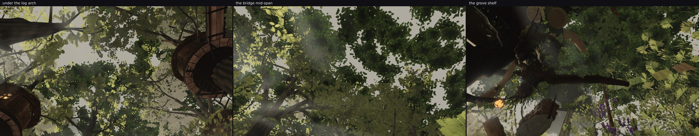

# Looking up at three places nobody had rendered

The owner's 01:12 directive lists "fix looking UP (camera range and the content overhead)". The roof's
underside was the open north's answer (`../roofsky/`). These are the other places a walker stands and
looks up, on head `905d55ea`: under the log arch, the bridge mid-span, and the grove shelf. Whole-frame
mean, neighbour-to-neighbour luminance difference (local detail — a flat slab reads under 2, leaves read
5–6), and the share of pale air:

| up-look | mean | local detail | pale > 150 |
| --- | --- | --- | --- |
| under the log arch (2.2, 1.6, −24) | 77.7 | 6.39 | 13.1 % |
| the bridge mid-span (3.9, 2.5, 37) | 78.7 | 6.36 | 15.6 % |
| the grove shelf (0, 7, −100) | 60.4 | 5.71 | 5.7 % |
| *the open north at 60° up, for scale* | 77.0 | 4.04 | — |

All three read as layered leaf mass with sky holes: local detail 5.7–6.4, which is above the open
north's 4.04 even after the roof's sky term, and no bald patch or flat disc. The grove shelf is the
darkest and the tightest (5.7 % air), which is what a closed canopy over a shelf should be.

Nothing to change in lane 2 from this; it narrows "content overhead" to the one view already fixed.

