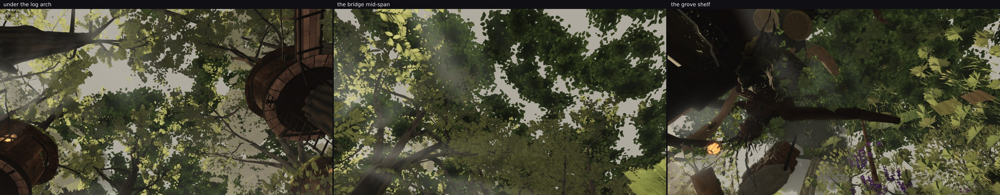

# Looking up at three places nobody had rendered (one of them from underground — see the note below)

The owner's 01:12 directive lists "fix looking UP (camera range and the content overhead)". The roof's
underside was the open north's answer (`../roofsky/`). These are the other places a walker stands and
looks up, on head `905d55ea`: under the log arch, the bridge mid-span, and the grove shelf. Whole-frame
mean, neighbour-to-neighbour luminance difference (local detail — a flat slab reads under 2, leaves read
5–6), and the share of pale air:

| up-look | mean | local detail | pale > 150 |
| --- | --- | --- | --- |
| under the log arch (2.2, 1.6, −24) | 77.7 | 6.39 | 13.1 % |
| the bridge mid-span (3.9, 2.5, 37) | 78.7 | 6.36 | 15.6 % |
| the grove shelf (0, 7, −100) | 60.4 | 5.71 | 5.7 % |
| *the open north at 60° up, for scale* | 77.0 | 4.04 | — |

All three read as layered leaf mass with sky holes: local detail 5.7–6.4, which is above the open
north's 4.04 even after the roof's sky term, and no bald patch or flat disc. ~~The grove shelf is the
darkest and the tightest (5.7 % air), which is what a closed canopy over a shelf should be.~~

> **WITHDRAWN 2026-09-30 — the grove-shelf row is from a camera three metres underground.**
> The shelf's ground is at **10.028 m** and that pose sits at **7** (`../poseaudit/`). Its 60.4 mean,
> 5.71 local detail and 5.7 % air are a view up through soil, and calling it "the darkest and the tightest …
> what a closed canopy should be" explained the artefact away as a virtue. From a standing eye at ground +
> 1.75 the same up-look reads **top third 53.0 against 41.4** — considerably more sky — and draws
> 85 / 939 570 against 160 / 1 677 983. The other two rows stand (the log arch is 1.735 m above its ground;
> the bridge is 12 m above its ravine because it is a bridge), and so does the conclusion below — it is now
> supported by two places rather than three.

Nothing to change in lane 2 from this; it narrows "content overhead" to the one view already fixed.

