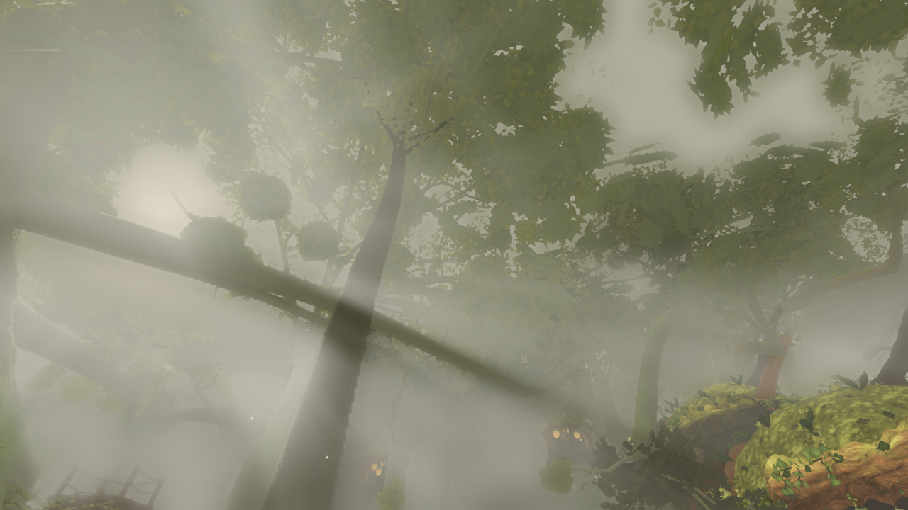
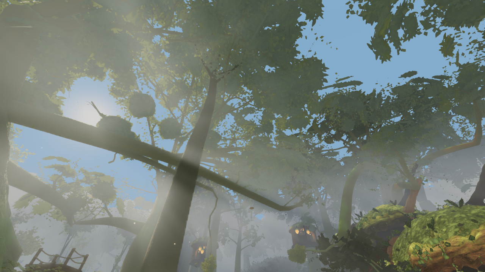
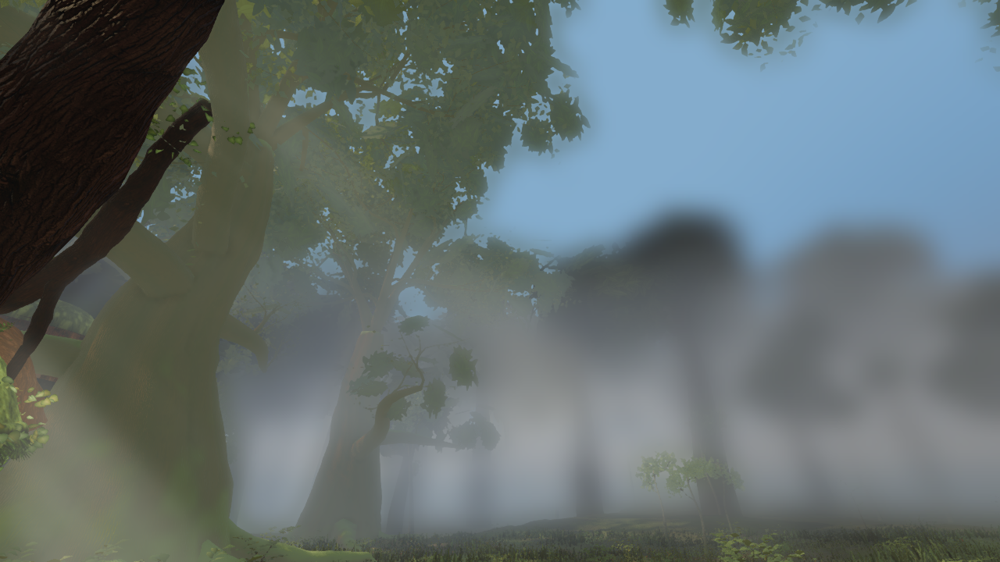
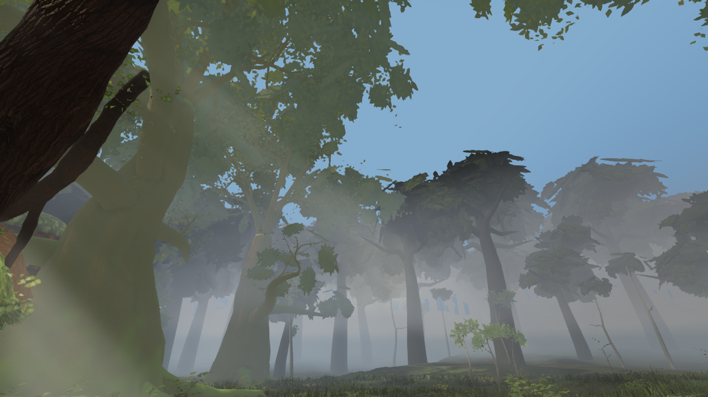
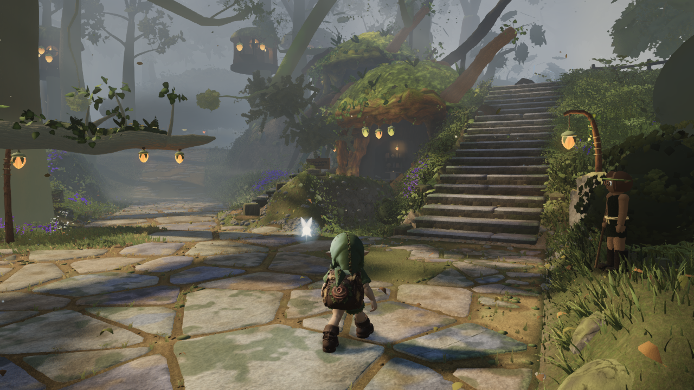
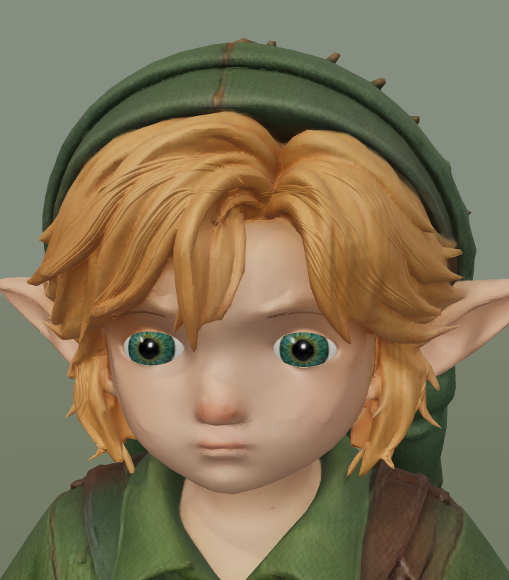

# Five before / after comparisons — 16 September 2026

Real renderer screenshots, copied without retouching. Each pair uses the same camera within that comparison. These are separate stages of the work, not five changes made today. The environment captures predate Fable's newly merged round39 geometry; they must not be presented as proof of his new trees or grass. Link remains an experimental candidate.

## 1. Plaza — complete initial daylight pass

Baseline f3314dc2 → daylight 2132882a. More visible depth and separation of sunlight/shade; the distant softening stage is disabled. Same 1280×720 camera, simulation time12.6, seed and settling settings. Tree geometry is unchanged in this pair.

| Before | After |
| --- | --- |
|  |  |

## 2. Looking up — sky visibility

Same initial/final daylight builds as pair1, matched upward camera. The sky gradient and thinner air expose the canopy. Visible tree cards are a remaining geometry problem, not finished detail.

| Before | After |
| --- | --- |
|  |  |

## 3. Stair landing — distant clarity

Matched native screenshots at the same elevated camera and simulation time, before/after disabling video-matching softening. This makes crowns clearer but also exposes their coarse layered silhouettes. It does not add leaves or improve tree topology.

| Before | After |
| --- | --- |
|  |  |

## 4. Follow-up sunlight and near haze

2132882a → 9e52630f. Sun3.7→4.4, hemisphere0.82→0.55, environment intensity0.30→0.22; haze starts farther away and nearby density is reduced. Same plaza camera/settings. This follows pair1 rather than sharing its baseline.

| Before | After |
| --- | --- |
|  |  |

The clearer daylight direction loses similarity to the trailer's golden fog. Fable measured a mean SSIM drop0.052 and hue error7–10° for the first merged daylight stage on his SwiftShader path. He requested warmer shade/air while retaining clarity. That is a documented next task, not a resolved issue. PR11 validation is green; this does not establish final art quality.

## 5. Link — finer hair, crown cleanup

Current runtime24591126 → separate Blender hair candidate, captured in actual Three.js under identical studio lighting. Today removed16 disconnected/crossing components from the previous study; the addition now has22,520 triangles and765,420 bytes. Existing runtime binary, original meshes, rig, clips and textures remain exact. The full comparison includes18 views and363 gait-clearance samples with no page errors.

| Before | After candidate |
| --- | --- |
|  |  |

The forehead remains dominated by the original broad hair locks; some surface overlaps remain. This candidate is **not the default game asset**. Head-motion attachment and in-world lighting still need visual review before promotion.

## Fable / Verdant status verified this session

Fresh remote head0820f92a includes trees merge885788d9 and vegetation merge44c21741. The source contains Verdant-derived white-bark trees, leaf geometry, veins and translucency; these ports already existed before this latest round. The new diff includes bole/base/root detail and a grass-carpet pass. This confirms published work, not that its visual quality is accepted.

[Explicit request to Fable to confirm retained Verdant elements and provide current captures](https://github.com/Leonxlnx/zeldaremake/pull/2#issuecomment-5702295642). His previous replies confirm the daylight integration and identify crown breakup/lantern corridor as remaining work. A direct answer to this new Verdant confirmation request is pending as of this report.

Image originals and SHA-256 hashes: [provenance.json](provenance.json). Environment source manifests: PR11 art/environment/clear-daylight-review and video-light-review. Character source manifests are included alongside this README.
