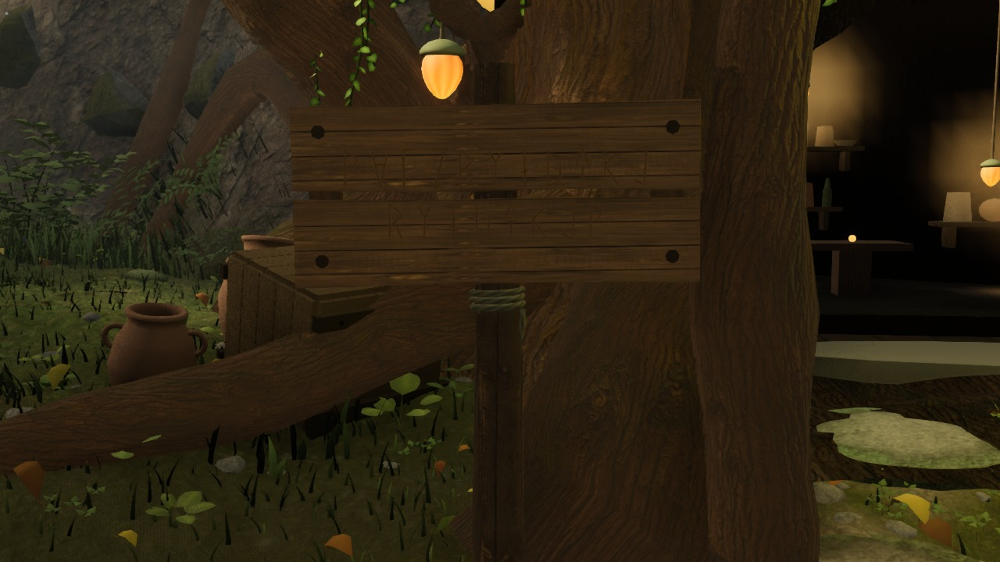
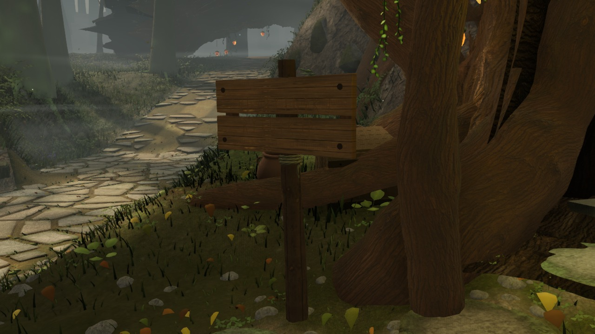
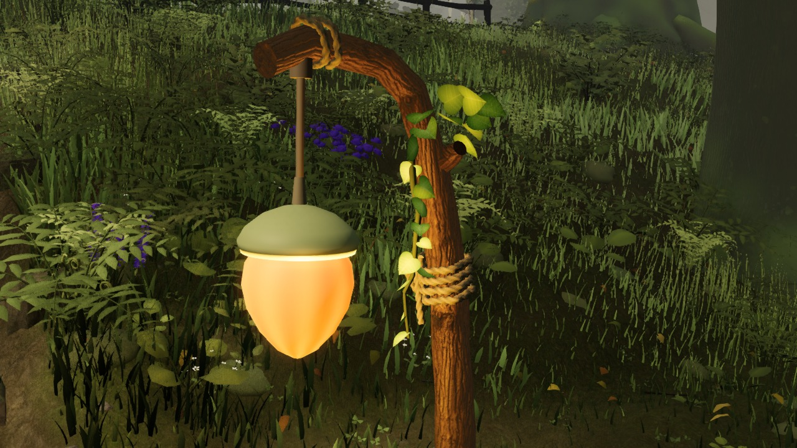
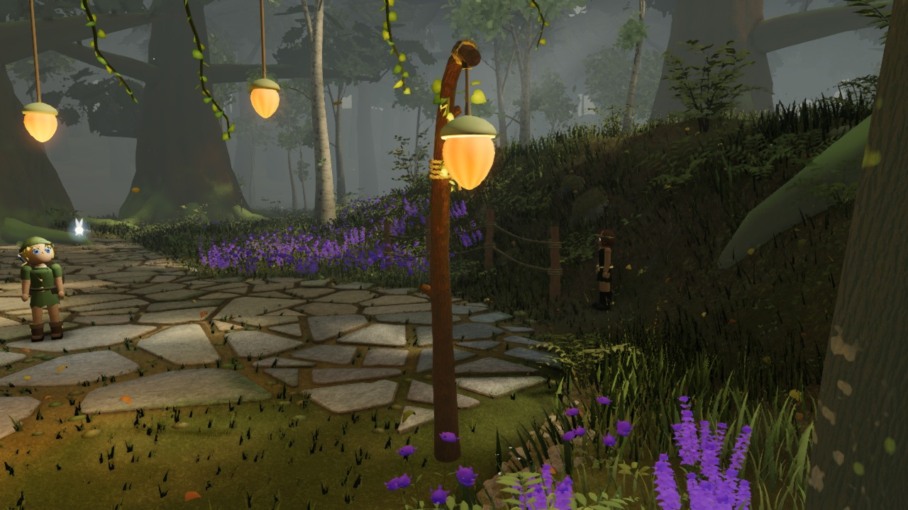

# World detail views

Four actual game renders from [ccc7e7f](https://github.com/Leonxlnx/zeldaremake/commit/ccc7e7f5eff6aa5da1e268ac1bb00bf565f19378), captured 2026-09-12T14:10:48.044Z.

The complete production scene is rendered at 1280×720, quality high, HUD hidden, scene time 12.5 s. No light/post overrides, hidden objects, alternate detail assets or generated scenery are used. Camera offsets are fixed against the authored layout and actual terrain probes; requested and rendered poses, full audits, depth and source hashes are recorded in details.json.

These closeups supplement the twelve environment comparison images. They are not saved reference cameras, gauntlet takes, scores or approval of visual quality. Image framing and occlusion still require human review.

## Sign front — boards, grain and carved marks

## Sign oblique — board edges, pegs and binding

## Stair-foot lantern — rope binding and suspension

## Fork-west lantern — whole post and ground contact

