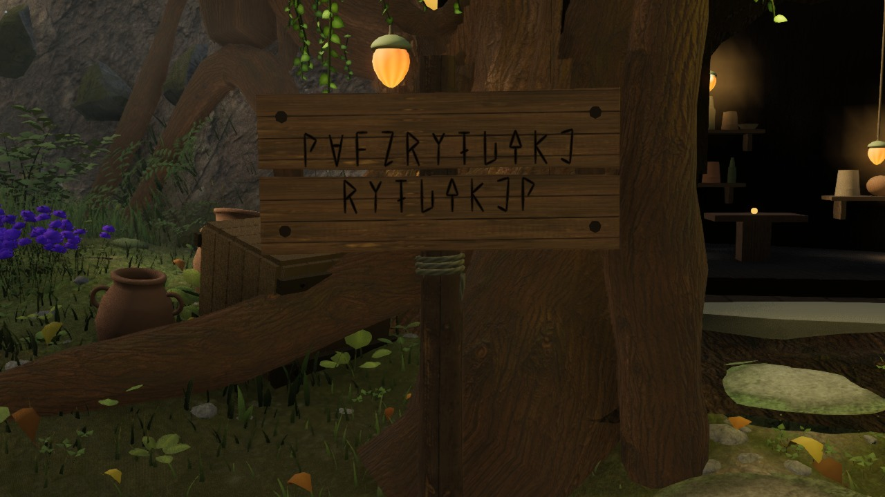
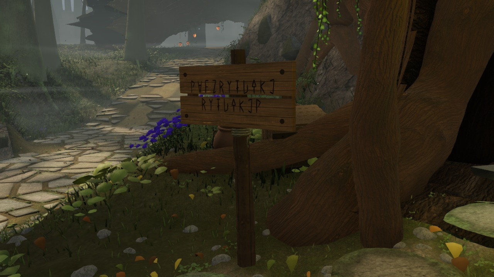
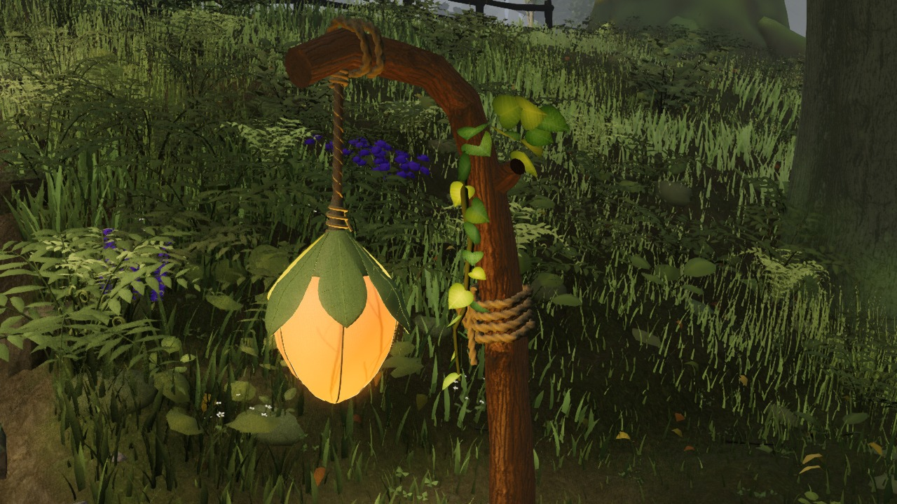
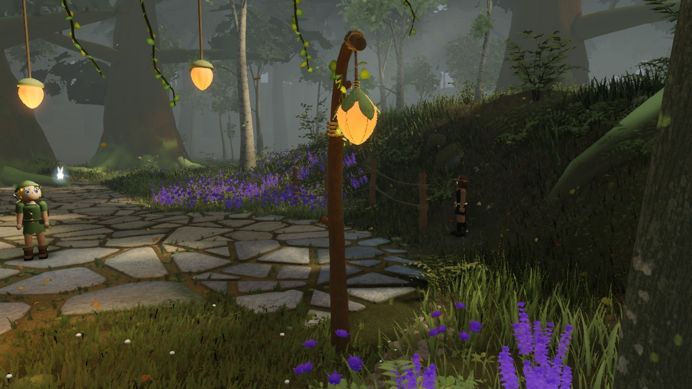

# World detail checkpoints

Four actual production closeups per checkpoint: sign front, sign oblique, stair-foot lantern binding, and fork-west lantern. Fixed layout-relative cameras, time 12.5 s, no light/post overrides, complete scene. These are supplemental evidence, not gauntlet takes or quality approvals.

[Environment comparisons](../)

## Latest rendered details — f56d0d2

Captured 2026-09-12T22:09:03.532Z. [Open the full checkpoint and source metadata](2026-09-12_220903532-f56d0d2/).

| Sign from the front | Sign from the path |
| --- | --- |
|  |  |
| Stair-foot leaf lantern | Fork-west lantern post |
|  |  |

## All checkpoints

| Captured UTC | Source | Detail views |
| --- | --- | --- |
| 2026-09-12T22:09:03.532Z | [f56d0d2](https://github.com/Leonxlnx/zeldaremake/commit/f56d0d22548a85ef776e9cc8c36644c3af8fb56f) | [4 images](2026-09-12_220903532-f56d0d2/) |
| 2026-09-12T21:56:48.877Z | [4ae74cd](https://github.com/Leonxlnx/zeldaremake/commit/4ae74cd4ae383e615ad021fe7a0ef51ce62a91d2) | [4 images](2026-09-12_215648877-4ae74cd/) |
| 2026-09-12T21:39:35.027Z | [5fa3f77](https://github.com/Leonxlnx/zeldaremake/commit/5fa3f774c121a78fe8b520540a4b9ff9d2444de9) | [4 images](2026-09-12_213935027-5fa3f77/) |
| 2026-09-12T21:11:21.078Z | [e8ccfe6](https://github.com/Leonxlnx/zeldaremake/commit/e8ccfe6779a8b89bb8fbb1362b58c247598a4b57) | [4 images](2026-09-12_211121078-e8ccfe6/) |
| 2026-09-12T20:44:25.389Z | [e2ee5f0](https://github.com/Leonxlnx/zeldaremake/commit/e2ee5f076774ab36d1e751b1f1753781795a417d) | [4 images](2026-09-12_204425389-e2ee5f0/) |
| 2026-09-12T20:09:03.738Z | [9ef903c](https://github.com/Leonxlnx/zeldaremake/commit/9ef903c58c3ee70eccaf919d565a1eb19cd1bef1) | [4 images](2026-09-12_200903738-9ef903c/) |
| 2026-09-12T19:56:28.337Z | [0d4ae52](https://github.com/Leonxlnx/zeldaremake/commit/0d4ae524bb29a64df796e7506e34761498626244) | [4 images](2026-09-12_195628337-0d4ae52/) |
| 2026-09-12T19:44:16.836Z | [7bafeb0](https://github.com/Leonxlnx/zeldaremake/commit/7bafeb0dbfadb5fd2d0830ef8fde7a690ca7b9b7) | [4 images](2026-09-12_194416836-7bafeb0/) |
| 2026-09-12T19:31:19.678Z | [ef2100e](https://github.com/Leonxlnx/zeldaremake/commit/ef2100e3d3f885692b10116f89b1a676c83dbdd0) | [4 images](2026-09-12_193119678-ef2100e/) |
| 2026-09-12T19:18:59.142Z | [e6d6ac0](https://github.com/Leonxlnx/zeldaremake/commit/e6d6ac06dc8706b8b41f13b0518077f7d8c1d242) | [4 images](2026-09-12_191859142-e6d6ac0/) |
| 2026-09-12T19:05:57.803Z | [e7069a4](https://github.com/Leonxlnx/zeldaremake/commit/e7069a456e6bb3e58f4354983446cdb10f4b35fd) | [4 images](2026-09-12_190557803-e7069a4/) |
| 2026-09-12T18:53:48.674Z | [8714d2a](https://github.com/Leonxlnx/zeldaremake/commit/8714d2af9556105fe867f9e36a1a44c4a99629f0) | [4 images](2026-09-12_185348674-8714d2a/) |
| 2026-09-12T18:40:47.388Z | [71843a2](https://github.com/Leonxlnx/zeldaremake/commit/71843a28538f00bdbbd0005a65a1b588315753b5) | [4 images](2026-09-12_184047388-71843a2/) |
| 2026-09-12T18:31:30.537Z | [660dcac](https://github.com/Leonxlnx/zeldaremake/commit/660dcac756f9095fa6b3b9c08ccd646d2bf5f499) | [4 images](2026-09-12_183130537-660dcac/) |
| 2026-09-12T18:09:10.927Z | [1e97463](https://github.com/Leonxlnx/zeldaremake/commit/1e97463582c6479e3624fa9c963b0aff2685fc85) | [4 images](2026-09-12_180910927-1e97463/) |
| 2026-09-12T17:56:13.539Z | [711758d](https://github.com/Leonxlnx/zeldaremake/commit/711758d8bda00458c0ae7339eb9ec55654a1e23b) | [4 images](2026-09-12_175613539-711758d/) |
| 2026-09-12T17:45:44.074Z | [debe215](https://github.com/Leonxlnx/zeldaremake/commit/debe21530c9085bf67ec2b25586a2d13ba61889b) | [4 images](2026-09-12_174544074-debe215/) |
| 2026-09-12T17:26:42.833Z | [09b4143](https://github.com/Leonxlnx/zeldaremake/commit/09b41437ce443cec7c50949d7c44f8ef8569f8ca) | [4 images](2026-09-12_172642833-09b4143/) |
| 2026-09-12T17:16:34.744Z | [9eb9deb](https://github.com/Leonxlnx/zeldaremake/commit/9eb9debc31c3b8dec579d75e9315ec6322c217bd) | [4 images](2026-09-12_171634744-9eb9deb/) |
| 2026-09-12T17:04:31.000Z | [2c4a8c0](https://github.com/Leonxlnx/zeldaremake/commit/2c4a8c0cc9831568236afd2c7602ef8a4d6455b5) | [4 images](2026-09-12_170431000-2c4a8c0/) |
| 2026-09-12T16:52:26.690Z | [5ea5b6d](https://github.com/Leonxlnx/zeldaremake/commit/5ea5b6d9be4c8c9e3e6f7ff7348f04961aac34ca) | [4 images](2026-09-12_165226690-5ea5b6d/) |
| 2026-09-12T16:27:23.902Z | [a350849](https://github.com/Leonxlnx/zeldaremake/commit/a350849993d05141e8d640775b2b3c6d919facd6) | [4 images](2026-09-12_162723902-a350849/) |
| 2026-09-12T16:19:18.349Z | [6686b0b](https://github.com/Leonxlnx/zeldaremake/commit/6686b0b5c4383d2202f1c57ae70290b8efbe98d6) | [4 images](2026-09-12_161918349-6686b0b/) |
| 2026-09-12T16:09:30.279Z | [ab7796e](https://github.com/Leonxlnx/zeldaremake/commit/ab7796ef928defa0e2beec5150ffcf0ba6de398c) | [4 images](2026-09-12_160930279-ab7796e/) |
| 2026-09-12T15:55:35.503Z | [84ecde9](https://github.com/Leonxlnx/zeldaremake/commit/84ecde9ccafb9057e466544340335d07b31f72c9) | [4 images](2026-09-12_155535503-84ecde9/) |
| 2026-09-12T15:43:28.053Z | [2e9c19f](https://github.com/Leonxlnx/zeldaremake/commit/2e9c19fb8ab2d3749a421ff1c5e6a030b6a8453f) | [4 images](2026-09-12_154328053-2e9c19f/) |
| 2026-09-12T15:26:23.448Z | [d41b354](https://github.com/Leonxlnx/zeldaremake/commit/d41b354bad6d12910c8881cf87e27c6f4a91c256) | [4 images](2026-09-12_152623448-d41b354/) |
| 2026-09-12T15:03:17.193Z | [d7552ee](https://github.com/Leonxlnx/zeldaremake/commit/d7552ee9ac5121fb9a5d5e0011bf128e87d0be6e) | [4 images](2026-09-12_150317193-d7552ee/) |
| 2026-09-12T14:51:21.523Z | [64028c4](https://github.com/Leonxlnx/zeldaremake/commit/64028c4ff4010aab9195d33dfa966e00e766621f) | [4 images](2026-09-12_145121523-64028c4/) |
| 2026-09-12T14:39:19.735Z | [561345b](https://github.com/Leonxlnx/zeldaremake/commit/561345b03d1e12c0552921678f63fbe14054abd4) | [4 images](2026-09-12_143919735-561345b/) |
| 2026-09-12T14:23:30.355Z | [f630ebb](https://github.com/Leonxlnx/zeldaremake/commit/f630ebbbb0e5f3465495814e1aa73df6d07a6de6) | [4 images](2026-09-12_142330355-f630ebb/) |
| 2026-09-12T14:10:48.044Z | [ccc7e7f](https://github.com/Leonxlnx/zeldaremake/commit/ccc7e7f5eff6aa5da1e268ac1bb00bf565f19378) | [4 images](2026-09-12_141048044-ccc7e7f/) |
| 2026-09-12T13:57:20.556Z | [d7ddc01](https://github.com/Leonxlnx/zeldaremake/commit/d7ddc01bc74151a0f93fa19f7a6e9b37c99fa09f) | [4 images](2026-09-12_135720556-d7ddc01/) |
| 2026-09-12T13:27:01.406Z | [18e1933](https://github.com/Leonxlnx/zeldaremake/commit/18e19331fb0571daf336b17debc9f146f9fc8cfc) | [4 images](2026-09-12_132701406-18e1933/) |
| 2026-09-12T12:48:21.285Z | [0169c3f](https://github.com/Leonxlnx/zeldaremake/commit/0169c3f72948e1638624664afe031ad1cb640ad9) | [4 images](2026-09-12_124821285-0169c3f/) |
| 2026-09-12T12:36:41.238Z | [0590dbe](https://github.com/Leonxlnx/zeldaremake/commit/0590dbe5c680787ef430ab0d88889b93b0ac15ee) | [4 images](2026-09-12_123641238-0590dbe/) |
