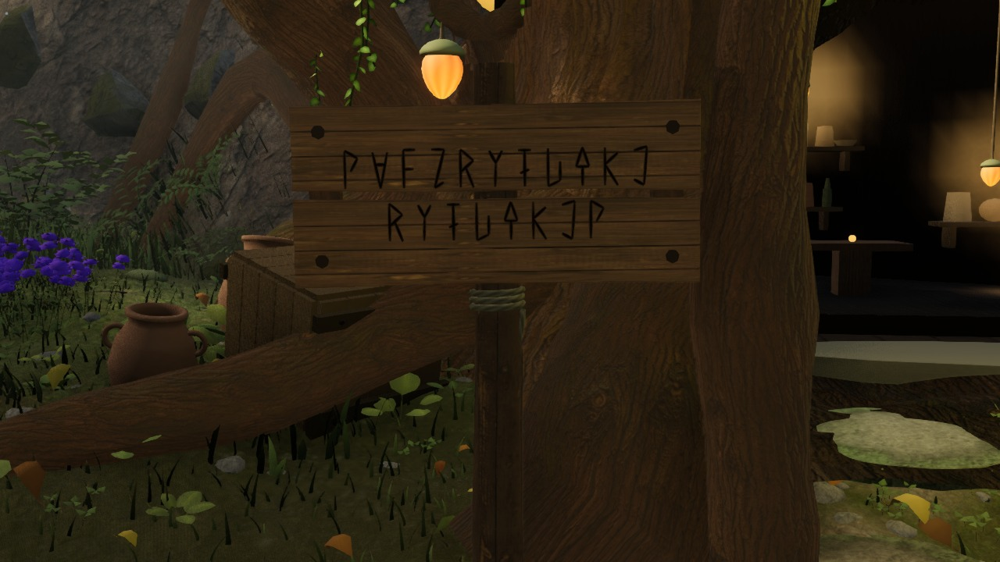
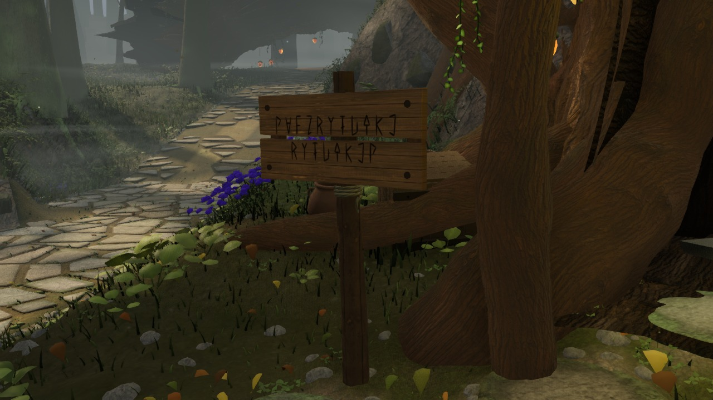
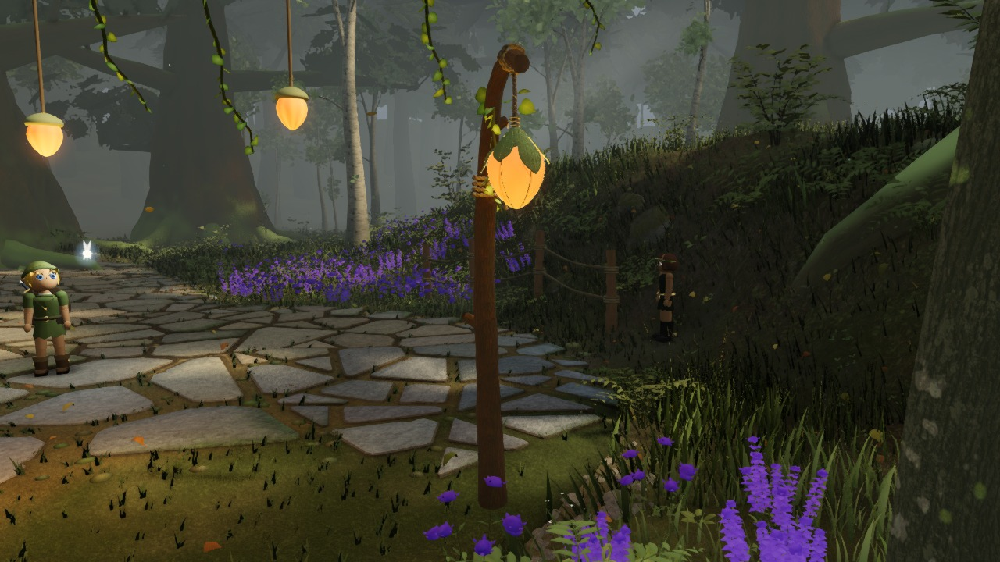

# World detail checkpoints

Four actual production closeups per checkpoint: sign front, sign oblique, stair-foot lantern binding, and fork-west lantern. Fixed layout-relative cameras, time 12.5 s, no light/post overrides, complete scene. These are supplemental evidence, not gauntlet takes or quality approvals.

[Environment comparisons](../)

## Latest rendered details — a350849

Captured 2026-09-12T16:27:23.902Z. [Open the full checkpoint and source metadata](2026-09-12_162723902-a350849/).

| Sign from the front | Sign from the path |
| --- | --- |
|  |  |
| Stair-foot leaf lantern | Fork-west lantern post |
|  |  |

## All checkpoints

| Captured UTC | Source | Detail views |
| --- | --- | --- |
| 2026-09-12T16:27:23.902Z | [a350849](https://github.com/Leonxlnx/zeldaremake/commit/a350849993d05141e8d640775b2b3c6d919facd6) | [4 images](2026-09-12_162723902-a350849/) |
| 2026-09-12T16:19:18.349Z | [6686b0b](https://github.com/Leonxlnx/zeldaremake/commit/6686b0b5c4383d2202f1c57ae70290b8efbe98d6) | [4 images](2026-09-12_161918349-6686b0b/) |
| 2026-09-12T16:09:30.279Z | [ab7796e](https://github.com/Leonxlnx/zeldaremake/commit/ab7796ef928defa0e2beec5150ffcf0ba6de398c) | [4 images](2026-09-12_160930279-ab7796e/) |
| 2026-09-12T15:55:35.503Z | [84ecde9](https://github.com/Leonxlnx/zeldaremake/commit/84ecde9ccafb9057e466544340335d07b31f72c9) | [4 images](2026-09-12_155535503-84ecde9/) |
| 2026-09-12T15:43:28.053Z | [2e9c19f](https://github.com/Leonxlnx/zeldaremake/commit/2e9c19fb8ab2d3749a421ff1c5e6a030b6a8453f) | [4 images](2026-09-12_154328053-2e9c19f/) |
| 2026-09-12T15:26:23.448Z | [d41b354](https://github.com/Leonxlnx/zeldaremake/commit/d41b354bad6d12910c8881cf87e27c6f4a91c256) | [4 images](2026-09-12_152623448-d41b354/) |
| 2026-09-12T15:03:17.193Z | [d7552ee](https://github.com/Leonxlnx/zeldaremake/commit/d7552ee9ac5121fb9a5d5e0011bf128e87d0be6e) | [4 images](2026-09-12_150317193-d7552ee/) |
| 2026-09-12T14:51:21.523Z | [64028c4](https://github.com/Leonxlnx/zeldaremake/commit/64028c4ff4010aab9195d33dfa966e00e766621f) | [4 images](2026-09-12_145121523-64028c4/) |
| 2026-09-12T14:39:19.735Z | [561345b](https://github.com/Leonxlnx/zeldaremake/commit/561345b03d1e12c0552921678f63fbe14054abd4) | [4 images](2026-09-12_143919735-561345b/) |
| 2026-09-12T14:23:30.355Z | [f630ebb](https://github.com/Leonxlnx/zeldaremake/commit/f630ebbbb0e5f3465495814e1aa73df6d07a6de6) | [4 images](2026-09-12_142330355-f630ebb/) |
| 2026-09-12T14:10:48.044Z | [ccc7e7f](https://github.com/Leonxlnx/zeldaremake/commit/ccc7e7f5eff6aa5da1e268ac1bb00bf565f19378) | [4 images](2026-09-12_141048044-ccc7e7f/) |
| 2026-09-12T13:57:20.556Z | [d7ddc01](https://github.com/Leonxlnx/zeldaremake/commit/d7ddc01bc74151a0f93fa19f7a6e9b37c99fa09f) | [4 images](2026-09-12_135720556-d7ddc01/) |
| 2026-09-12T13:27:01.406Z | [18e1933](https://github.com/Leonxlnx/zeldaremake/commit/18e19331fb0571daf336b17debc9f146f9fc8cfc) | [4 images](2026-09-12_132701406-18e1933/) |
| 2026-09-12T12:48:21.285Z | [0169c3f](https://github.com/Leonxlnx/zeldaremake/commit/0169c3f72948e1638624664afe031ad1cb640ad9) | [4 images](2026-09-12_124821285-0169c3f/) |
| 2026-09-12T12:36:41.238Z | [0590dbe](https://github.com/Leonxlnx/zeldaremake/commit/0590dbe5c680787ef430ab0d88889b93b0ac15ee) | [4 images](2026-09-12_123641238-0590dbe/) |
