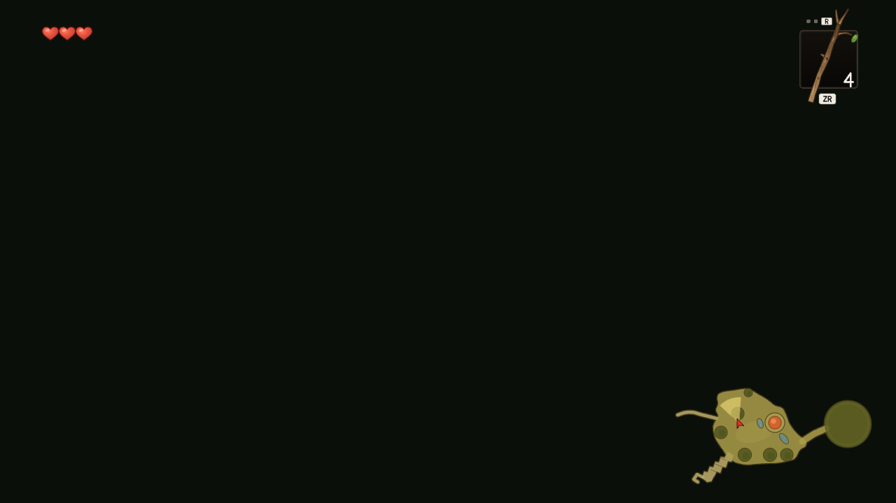
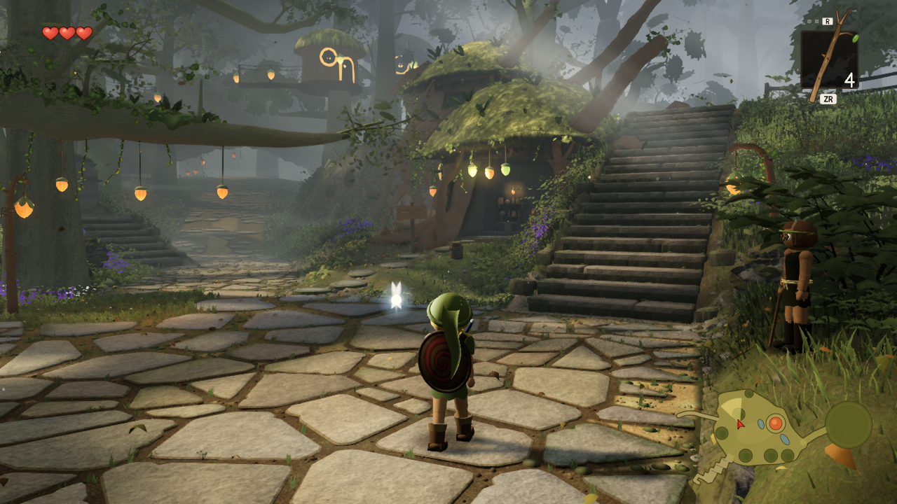

# Retry a blank world even when the HUD is visible

CI run [34790878486](https://github.com/Leonxlnx/zeldaremake/actions/runs/34790878486) failed B5 at96.13% differing pixels. Its initial A_stairs image contains only dark background and HUD; its repeat contains the rendered world. These two unedited PNGs came from artifact `gauntlet-731-6e3b71f39756ecba88ccd1563748c62c31a93987` (id10327743376), source merge6e3b71f of538c66e.

The capture retry checked whole-frame standard deviation. HUD pixels raised the blank frame to18.52, above the existing2-level threshold, so it used zero retries. `frameStdDev` now measures the middle half of the image in each dimension, clear of the HUD. Only this retry probe uses the region. The saved images, hashes, scoring and full-frame B5 comparison are unchanged, as are the threshold, retry count and deterministic re-render path.

On the original artifact, the new measurement is0 for the blank A image. It is35.14 for the correct A repeat and27.08–35.96 for the other five rendered views; exact values are in variance.json. This fixes the false acceptance by the retry guard. It does not establish why the first GPU/compositor frame was delayed, or guarantee CI determinism.

Run `node gauntlet/scripts/test-capture-variance.mjs`. Its synthetic HUD-only frame reproduces the old false acceptance, a rendered centre passes, and a fully uniform frame remains rejected. An initial test caught that Sharp stats reads its input before pending transforms: the code now materializes the crop as raw pixels before measuring it. No new dependency or production renderer change.

