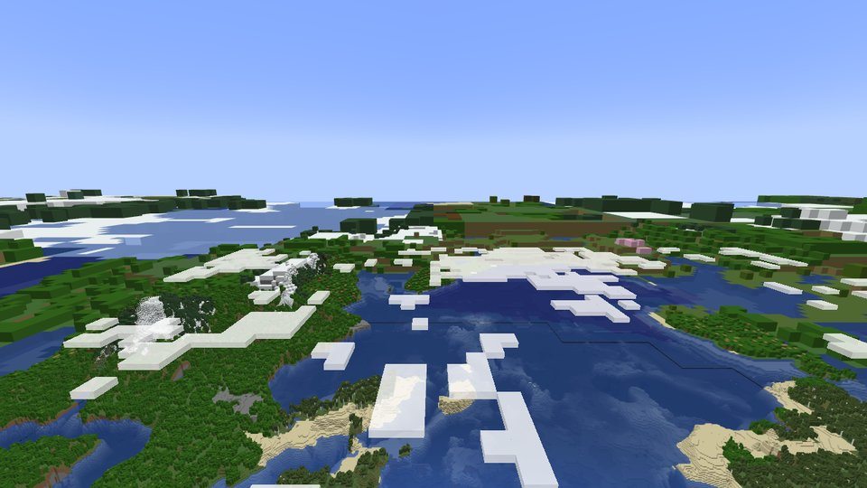
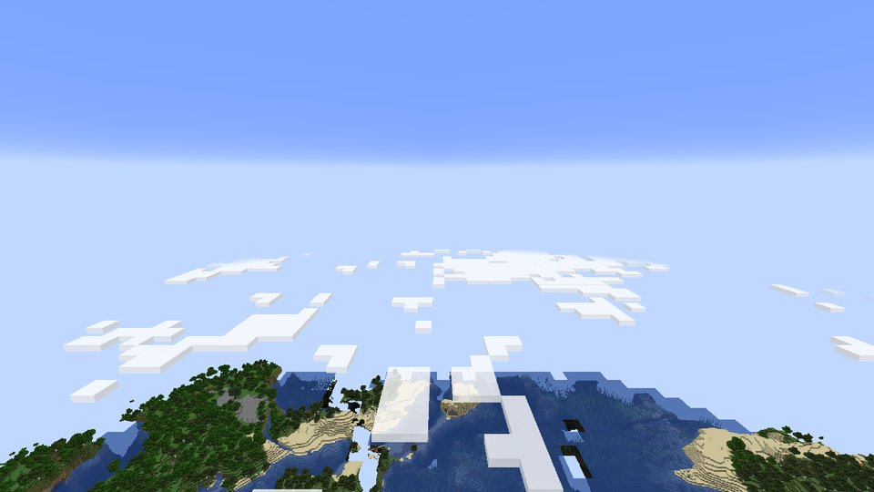
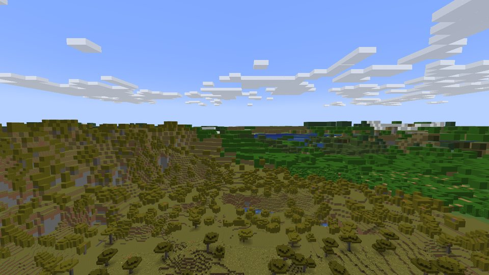
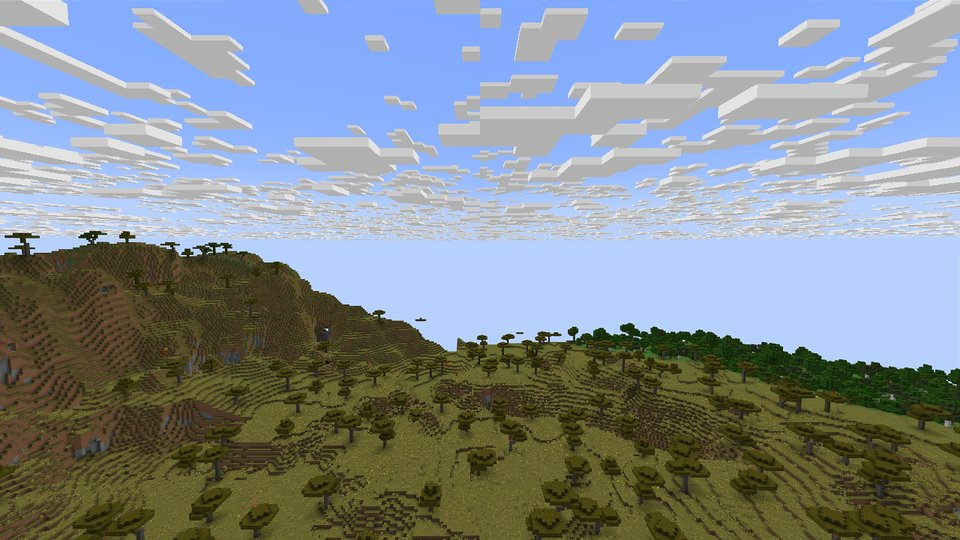
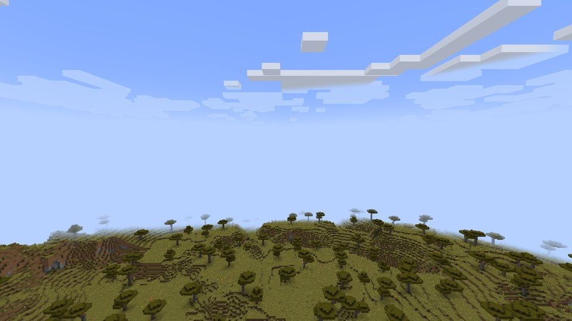
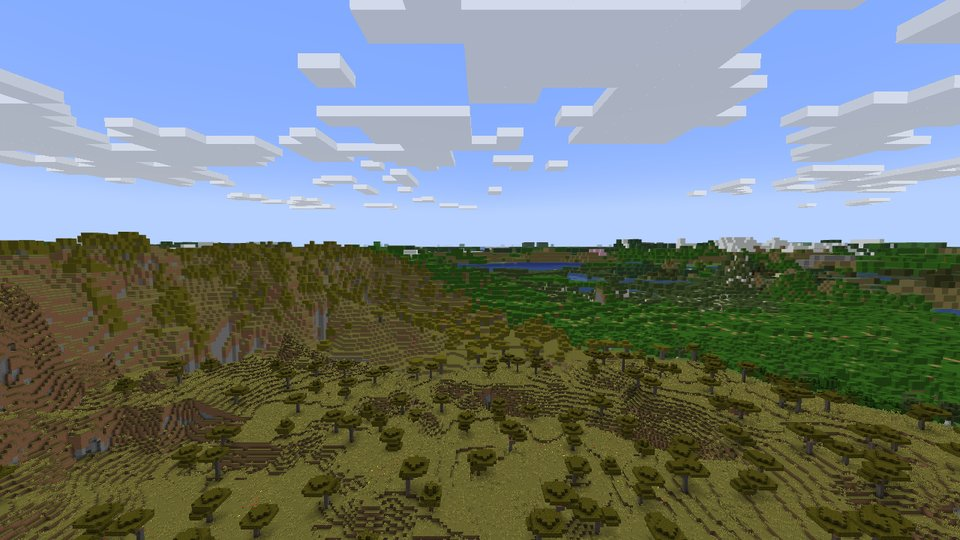
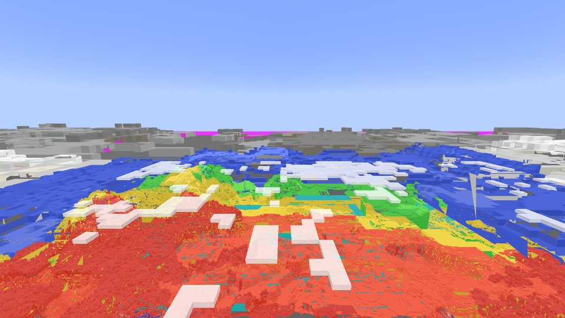

# Vista — extreme render distance for Minecraft (Fabric 1.21.1)

Vista draws the world out to 32 km (2048 chunks, configurable up to 262 144) behind vanilla's chunks, with
no visible seam at the vanilla edge, no cracks between detail levels, and a full horizon within seconds of
joining a world.

<p>


</p>

*Same seed, same camera, 20 s after arriving: Vista (left, 2048-chunk far distance, vanilla at 12 chunks)
and vanilla at its maximum of 32 chunks (right).*

## Why it is built this way

The design came out of measuring the failure modes of existing mods, then replacing whatever lost in
benchmarks (see *What was tried and replaced* below).

| Problem in existing mods | Vista's answer |
| --- | --- |
| Distant terrain appears only after full chunk generation (DH generated 4–12 chunks/s here; a 2048-chunk radius would take hundreds of hours) | **Instant horizon**: sample the world generator's own density and biome noise directly (no chunks, no features, nothing saved), about 50 ms per 32×32 column at any LOD level. Real chunks replace it as they are explored |
| Holes and pop-in while LODs stream | The LOD tree is only refined when *all* children are ready, and swaps use a complementary dithered cross-fade, so no pixel is ever covered twice or not at all |
| Cracks and walls at LOD boundaries | Meshes keep boundary "seam" faces in separate groups; the selector decides per node and direction whether the neighbouring space is drawn at another level, and only then draws them. Never toward vanilla chunks |
| Visible ring and overlap at the vanilla edge | Per-pixel mask of the chunks vanilla has actually *compiled*; far terrain fills everything else, including chunks still loading |
| Z-fighting and precision loss far away | Reversed-Z, infinite far plane, 32-bit float depth in Vista's own MSAA target |
| Shimmering at distance | Block textures on the nearest levels with analytic mip selection, fading to the sprite's gamma-correct average colour; MSAA on the far pass |
| Main-thread stutter from LOD bookkeeping | Selection runs on its own thread; the render thread only frustum-culls and fills one indirect buffer (0.3–3 ms CPU per frame measured, including uploads) |
| One quality setting for every GPU | Adaptive detail: a GPU timer on the far pass steers the detail factor to hold a frame-time budget |

## Architecture

```
client chunks ──► ChunkIngestor ─┐                     ┌─► selector thread ─► DrawList (exact cover + seam masks)
                                 ├─► LodEngine ────────┤
world-gen noise ─► NoiseTerrain ─┘   (workers)         └─► meshes ─► LodRenderer (GPU arena, MDI, fades)
                                 │
                              SectionStore (append-log regions, palette + zstd)
```

**Data model.** The world is an octree of 32³-voxel sections. A level-L section covers 32·2^L blocks, so
level 0 is block-exact and level 10 covers 32 km per section. A voxel is one int:
`state(16) | biome(8) | light(8)`, where light is the sky/block light of the space in front of a face.
Ids map to block states per world (`states.txt`, flushed before any voxel that uses the id is written).

**Sources.**
- *Real chunks* (singleplayer and multiplayer): palettes and light arrays are copied on the main thread
  (time-boxed at 1.5 ms per tick) and decoded on workers. Chunks are ingested once they have been quiet for
  750 ms, so light arrives first and bursts of block updates coalesce. Sky light takes the max of the client
  value and heightmap exposure, which fixes chunks whose light lags behind their data.
- *Instant horizon* (singleplayer): `NoiseTerrainSource` finds the surface with the noise router's
  `finalDensity`, bracketed from the neighbouring sample and bisected only to half a voxel (so coarse levels
  need 2–3 evaluations). Biomes come from the climate sampler. Samples are taken on a stride-2 or stride-4
  lattice and interpolated. `ColumnSynth` turns them into voxels with biome-specific surface, filler and
  underwater blocks, snow and ice, sea level, void outside the build limits, and forests: discrete trees
  while voxels are ≤4 blocks, a dithered canopy layer beyond that.
- *Propagation*: real data is downsampled up the tree (batched for 1.5 s) and overrides synthesised data.
  The downsampler keeps 2-of-8 solids (thin pillars and trunks survive, lone blocks don't inflate), takes
  the top-most block (grass over dirt), keeps water that covers a cell's top (seas and rivers survive coarse
  levels), and takes max light.

**Storage.** One append-log file per level and 16×16 section columns: `[key][len][bytes]` records, the index
is rebuilt on open, a torn tail is trimmed after a crash, and files are compacted when more than half is
garbage. Sections are palette + byte/short indices + Zstandard: **0.4 KiB per section on average**,
4× smaller than deflate and 3.6× faster to encode.

**Meshing.** Greedy meshing per face direction. A quad is 8 bytes (position, size, direction, and the full
voxel word as merge key, so merging never changes the image). Each mesh has 13 groups: normal and seam
faces per direction, plus translucent. The average reduction is 18.8× fewer quads than exposed faces.

**Selection.** A background thread walks the octree from the top level down. A node is split while
`distance < detail × size` *and* every non-empty child has a mesh on the GPU; otherwise the node itself is
drawn. Nodes whose chunks vanilla is drawing are skipped. The result is an exact cover, which a unit test
verifies (no node overlaps an ancestor), sorted near-to-far, with a 6-bit seam mask per node. Work
requests are de-duplicated but *re-prioritised*: if the camera approaches a queued node, a new ticket
supersedes the old job, and jobs nobody has asked for in 8 s are dropped when they reach the front of the
queue.

**Rendering (OpenGL 4.3+).**
- All quads live in one shader storage buffer managed by a best-fit allocator that grows on demand and
  evicts least-recently-drawn meshes. Vertices are pulled by `gl_VertexID`; one index pattern is shared by
  all draws.
- Per frame: frustum culling, per-direction back-face culling of whole face groups, then three
  `glMultiDrawElementsIndirect` calls: near or fading nodes with the discarding shader, everything else
  with an `early_fragment_tests` shader, and translucent groups sorted back-to-front.
- The pass renders into Vista's own MSAA target with reversed-Z float depth and is composited under
  vanilla terrain with premultiplied alpha.
- Lighting uses vanilla's lightmap (day/night, torches, gamma setting).
- Fog: vanilla's terrain fog is moved out to the far distance, so vanilla and Vista share one curve, plus
  a distance² aerial haze into the horizon colour.

## Results

Environment: 4 vCPU cloud VM with **no GPU**. OpenGL is Mesa llvmpipe, which rasterises on the same CPU
cores that run the game, the integrated server and the LOD workers. Same seed, script and window size
(1280×720) for every renderer; the harness is in `../bench`.

### Time to horizon (the architectural difference)

| | Far terrain visible at 10 s | at 60 s | at 240 s | Generation rate |
| --- | --- | --- | --- | --- |
| **Vista** (2048 chunks) | complete horizon, coarse near field | complete, refined | complete | ~50 ms per 32×32 column at any level (synthetic bench: 131 km radius converged in 8.3 s on 3 threads) |
| Distant Horizons 3.3.2 (2048 chunks, throttling disabled) | nothing past vanilla | nothing past vanilla | nothing past vanilla | 4–12 chunks/s; its own ETA for the radius: 373–1226 h |
| Vanilla, 32 chunks | 512 blocks, then fog | | | |

<p>



</p>

*Left to right: Vista after 10 s, Distant Horizons after 240 s, vanilla at 12 chunks.*

### Frame rate, memory, CPU (llvmpipe, see caveat)

Average FPS / 1 % low per phase (steady = camera still for 30 s after a 180 s load, streaming finished):

| Renderer (view distance) | steady | fly 40 b/s | spin | high (y=300) | peak RSS | peak heap |
| --- | --- | --- | --- | --- | --- | --- |
| Vanilla, 12 chunks (192 m) | 26.6 / 22.2 | 31.6 / 10.7 | 18.9 / 8.6 | 111.6 / 61.3 | 3.35 GB | 1.94 GB |
| Vanilla, 32 chunks (512 m) | 3.8 / 2.9 | 18.4 / 1.8 | 19.2 / 7.2 | 8.4 / 3.8 | 6.86 GB | 4.09 GB |
| Distant Horizons 3.3.2 (renders no far terrain here, see above) | – | 5.3 / 2.5 | 6.4 / 3.2 | 7.9 / 4.2 | 3.60 GB | 2.11 GB |
| **Vista, 2048 chunks (32 km), adaptive detail** | **8.5 / 6.9** | 3.7 / 2.6 | 3.8 / 3.0 | **10.4 / 7.0** | **3.47 GB** | **1.93 GB** |
| Vista, 2048 chunks, fixed detail 8 | 2.2 / 1.8 | 1.1 / 0.8 | 1.1 / 0.8 | 4.4 / 2.8 | 5.22 GB | 3.03 GB |

With adaptive detail (the default, 3 ms GPU budget), Vista shows **64× the distance of vanilla at 32 chunks
with 2.2× its steady frame rate and half its memory**, and beats it (and DH) from altitude. On this machine
the budget can never be met (llvmpipe's fixed full-screen cost alone is about 100 ms), so detail sits at the
floor of 2; on a real GPU it stays at the configured maximum. Vista is slower while flying: generation,
ingestion and uploads share the same four cores with the software rasteriser.

<p>


</p>

*Left: what adaptive detail at its minimum still looks like. Right: `-Dvista.debug=1`, LOD levels
(red = block-exact L0, then yellow, green, cyan, blue, white, grey), with the vanilla area at the bottom.*

In this environment every renderer's frame time is dominated by software rasterisation; Vista rasterises
64× the view distance of vanilla at 32 chunks. Vista's own render-thread CPU cost, measured separately, is
**0.3–3 ms per frame** (selection runs on its own thread). At full detail 8, a converged 32 km view is
13,442 nodes and 1.17M visible quads in three indirect calls, which a real GPU draws in about a millisecond.
Honest GPU numbers need a machine with one; the harness runs unchanged there.

### Headless pipeline benchmark (`./gradlew bench`)

| Stage | Result |
| --- | --- |
| Synthesis (synthetic noise) | 3.9 ms per 32×32 column |
| Codec palette + zstd / deflate / bit-packed | 0.4 / 1.6 / 10.8 KiB per section; encode 0.23 ms, decode 0.04 ms |
| Greedy mesh | 0.55 ms per section, 18.8× fewer quads than faces, 1.7 KiB GPU per section |
| Downsample | 0.11 ms per octant |
| Full engine, 8 km radius | first geometry 0.10 s, converged 6.1 s, 2.2M quads (16.8 MiB GPU), 4.2 MiB disk |
| Full engine, 32 km | converged 6.8 s, 3.3M quads (25.4 MiB), 5.9 MiB disk |
| Full engine, 131 km | converged 8.3 s, 4.8M quads (36.6 MiB), 8.0 MiB disk |

Each doubling of distance adds a roughly constant ~1,340 nodes and ~0.7M quads, so cost grows
logarithmically with render distance.

## What was tried and replaced

Each of these was found with the harness screenshots and logs (debug views: `-Dvista.debug=1` shows LOD
levels, `2` light, `3` tint, `4` ids):

- **Height search.** Vanilla's exact column query (4.1 ms per column) was replaced by density bisection
  (0.53 ms), and then by precision-scaled bisection (about 50 ms per 1024-sample column instead of about
  550 ms).
- **Seam walls.** Seams drawn toward "any neighbour not selected" produced stone walls around the vanilla
  area. Seam decisions moved into the selector and are vanilla-aware.
- **Priority starvation.** A de-duplicated work queue starved nodes first requested while far away: after
  flying, the near field stayed at 32-block voxels. Ticketed re-prioritisation fixed it.
- **Remesh storms.** Chunk bursts caused over 800 remeshes/s. Remeshes of on-screen nodes are now
  debounced, remeshes of off-screen nodes are lazy, and propagation is batched.
- **Shallow water.** At coarse levels shallow water turned into land. A "water covering the top" rule was
  added to both synthesis and downsampling.
- **Deep void.** Coarse sections extended below the world floor as kilometre-deep solid blocks; they are
  now void.
- **Tag-dependent classification.** Water classified through fluid tags depended on tag sync timing; it
  now compares fluid identity.
- **Reversed-Z bug.** The projection wrote `z' = near·w`, which gives every fragment the same depth. Only
  near-to-far draw order hid it; it caused sliver artifacts and made all translucent geometry fail the
  depth test. The constant `z' = near` is correct.
- **Holes at the vanilla edge.** The vanilla mask used "loaded with all neighbours", which left holes
  where vanilla had not compiled sections yet. It now checks the compiled state.
- **Fixed detail.** A fixed detail factor made the converged view (1.17M quads) cost about 390 ms per frame
  in software. Adaptive detail took it to about 78 ms.
- **Eviction collapse.** GPU eviction removed intermediate nodes that the selector still needed as split
  prerequisites, so the tree collapsed and rebuilt every ~25 s; eviction now skips recently wanted nodes.
- **Vertex cost.** Non-indexed drawing ran the vertex shader 6 times per quad; a shared index pattern with
  base-vertex offsets brought that down to 4.

## Using it

- Requires Fabric Loader ≥ 0.16, Fabric API, Minecraft 1.21.1, OpenGL 4.3 (so not macOS). It works with
  Sodium's terrain renderer; Iris shader packs are not supported.
- `config/vista.json`: `renderDistanceChunks` (2048), `detail` (8, the maximum; 16 for ultra), `gpuBudgetMs`
  (3.0; 0 fixes detail), `generateTerrain`, `threads` (0 = cores − 2), `msaa` (4), `uploadBudgetMiB`,
  `gpuMemoryMiB` / `maxGpuMemoryMiB`, `fadeSeconds`, `fogStart`, `cacheSections`, `textures`.
- `/vista` prints stats; `/vista toggle`, `/vista distance <chunks>`, `/vista detail <factor>`. The F3
  screen shows the same stats.
- The cache lives in `.minecraft/vista/<world>/<dimension>/`.

## Limitations and next steps

- Synthesised terrain has no structures and approximates trees and surface rules; it is replaced as real
  chunks are explored. An optional background real-chunk generation pass for the mid-field would close the
  gap further.
- No occlusion culling yet. A Hi-Z pass over the previous frame's depth would cut overdraw in mountains.
- Voxy has no 1.21.1 build, so it could not be compared under equal conditions. Vista would need a port to
  1.21.6+ for that comparison.
- The numbers above are from a CPU-rendered VM; GPU frame-time numbers still need to be measured on real
  hardware.

## Building

```bash
./gradlew build        # mod jar in build/libs, runs the unit tests
./gradlew bench        # headless pipeline benchmark
./gradlew inspect -PinspectDir=<.minecraft/vista/world/dimension>   # cache statistics
```
