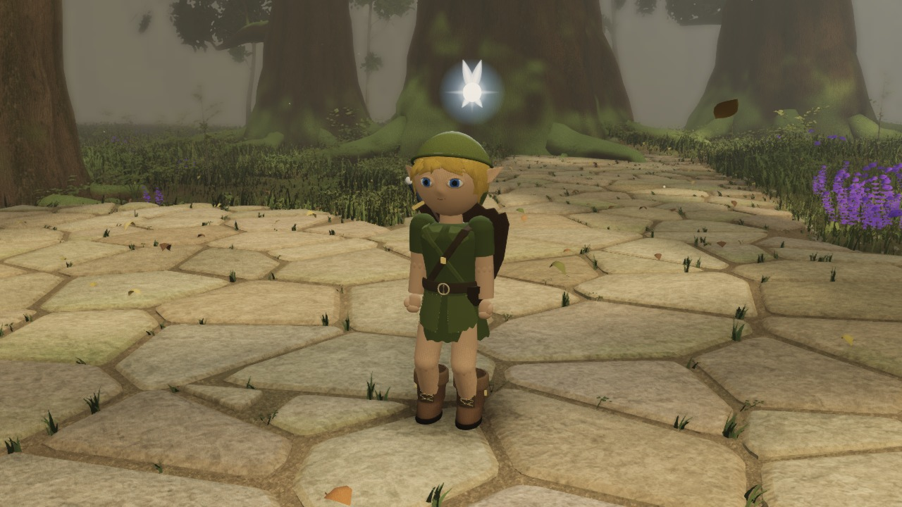
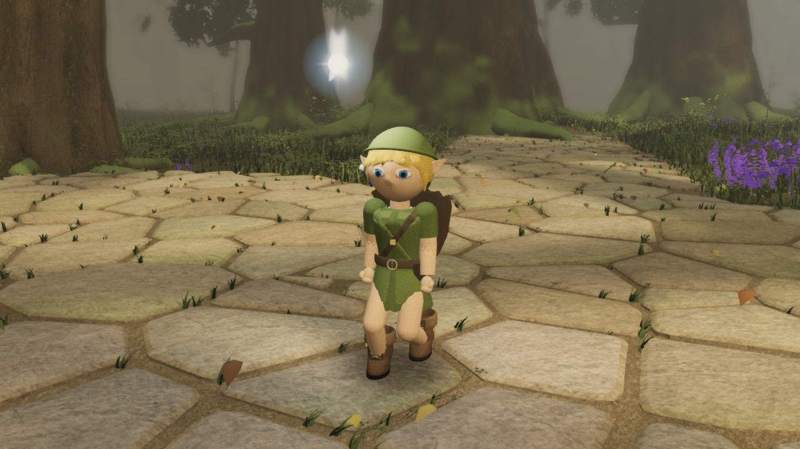
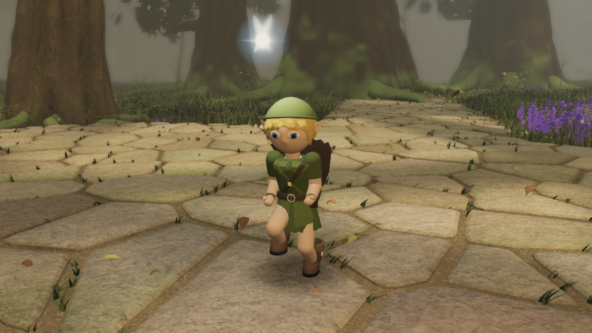
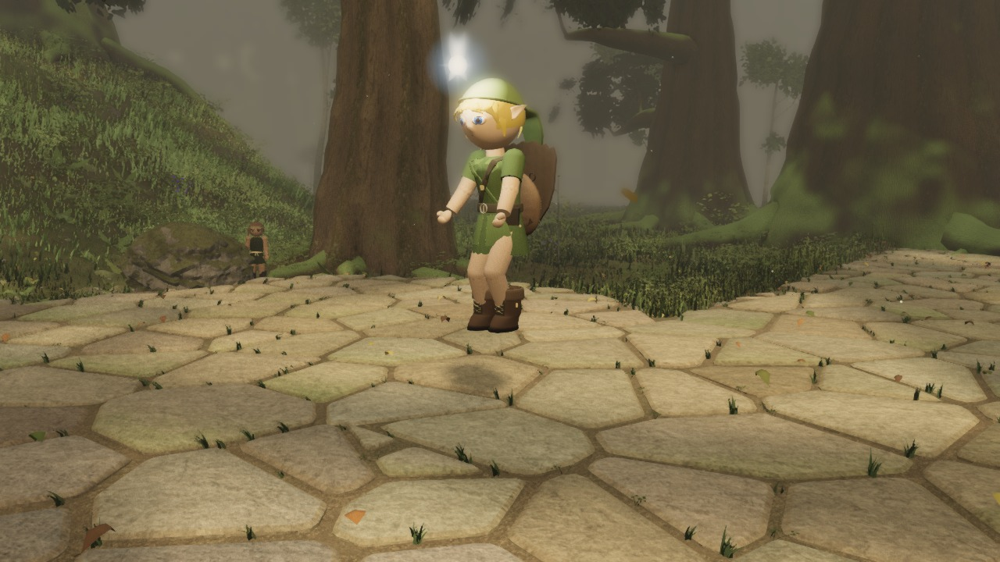
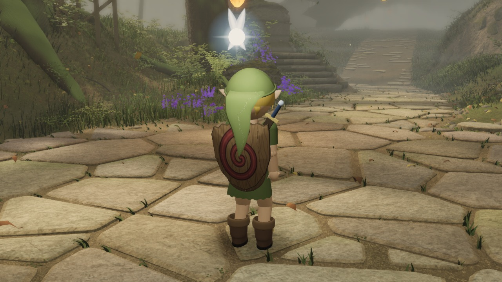
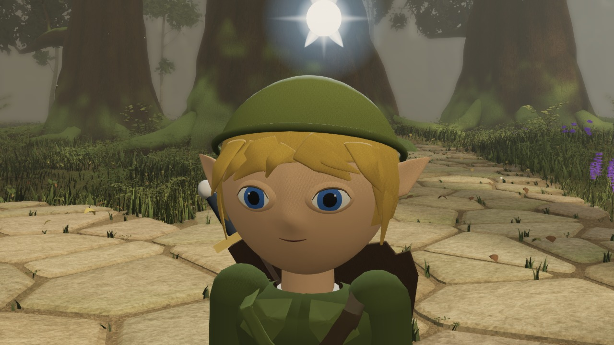
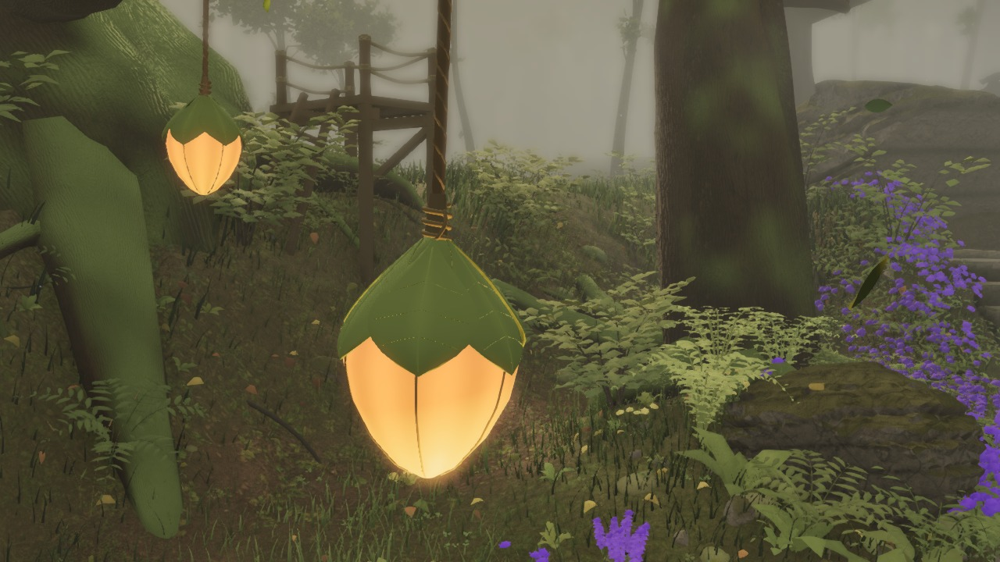
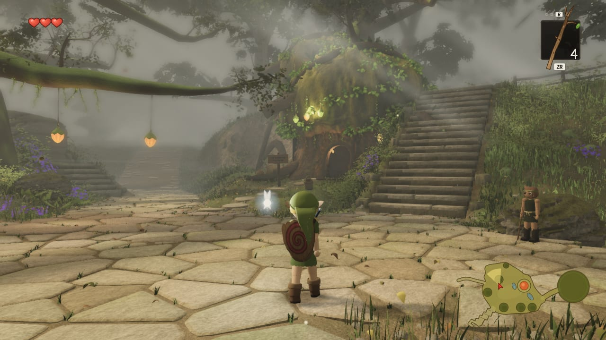
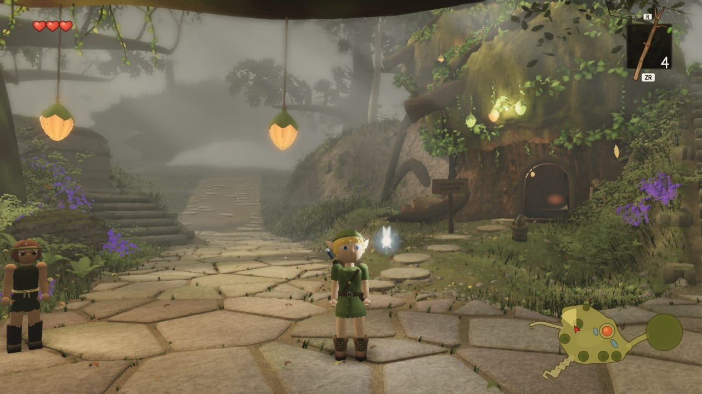
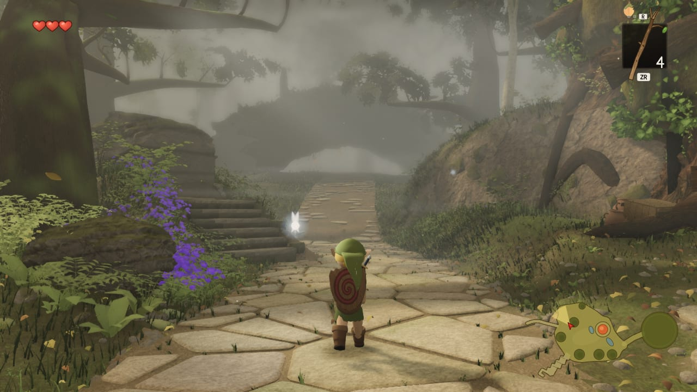

# Zelda remake — first 12 progress screenshots

Actual game renders from Astra and Fable’s shared project.

Images 01–09: source `b84bedc`, captured 11 September 2026 at 08:09 UTC. Images 10–12: wider world views from source `a35c949`, take-0038 at 06:55 UTC; these precede the latest small face/hair and lantern updates.

This remains a work in progress. Unrendered sleeve, nose, gear and stair experiments are excluded. The wider take has a known chronology validation failure, so these images do not imply a passed quality gate.

## Idle

## Walk

## Run

## Jump

## Outfit back

## Face detail

## Leaf lantern

## Carved sign

## Boot detail

## Forest stairway

## Tree house

## Forest path

