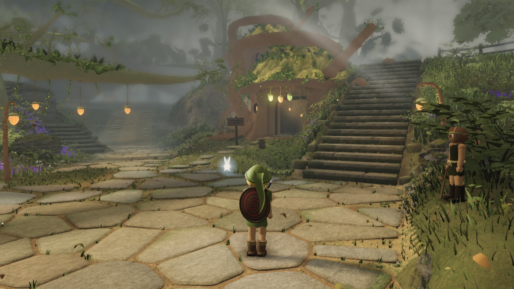
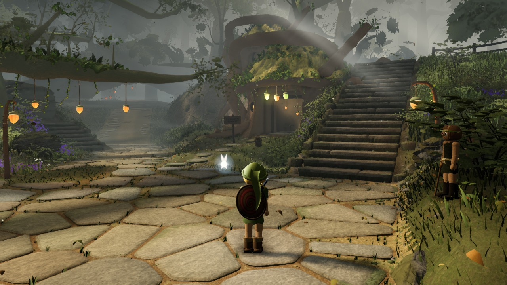
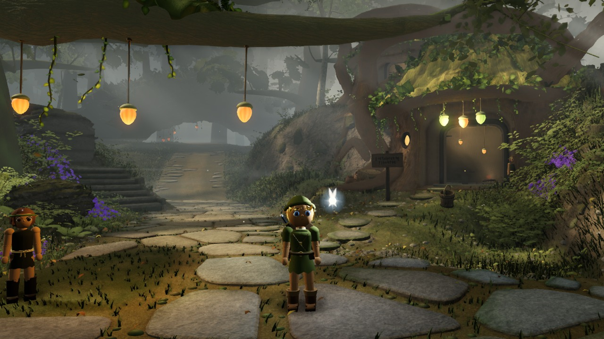
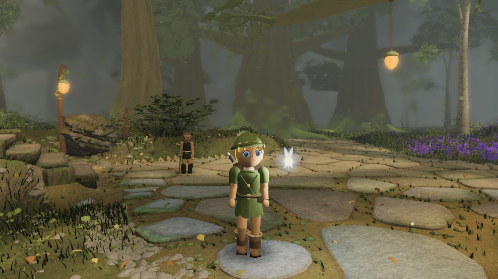
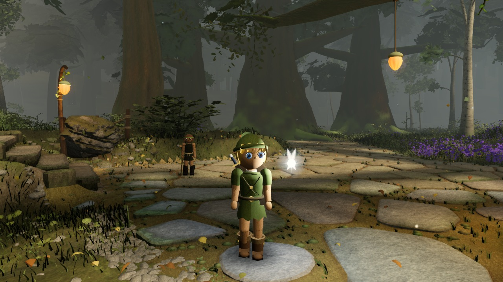
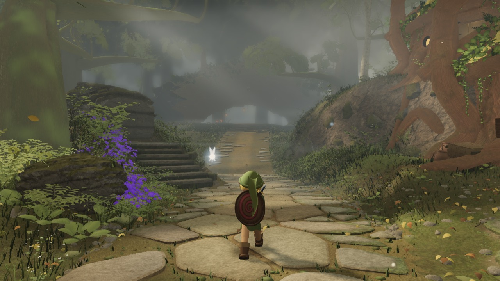
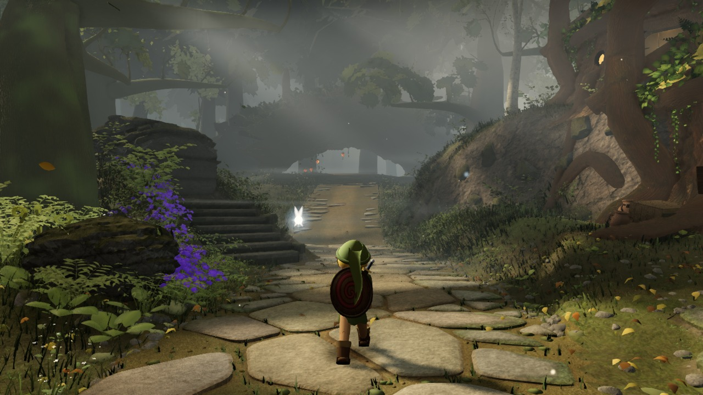
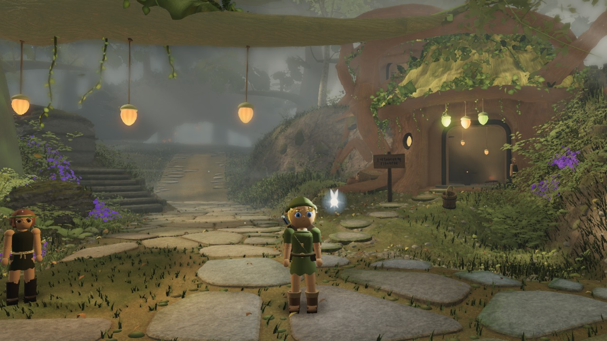
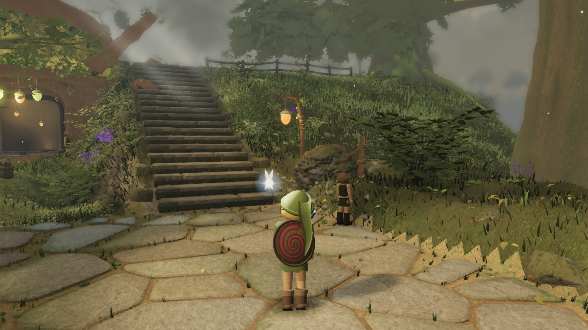
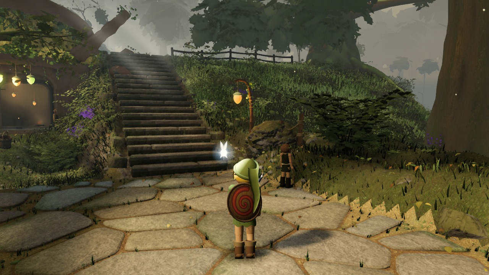

# Environment lighting comparison

Actual game renders from [23ea37a](https://github.com/Leonxlnx/zeldaremake/commit/23ea37a7d9ffaf6462362b1d15b1198707c89408), captured 2026-09-12T08:22:25.685Z.

Both columns use this same built source, saved camera, scene time (12.5 s), geometry and fog. The baseline is a set of historical light/post controls, not a render of a separate historical build. Candidate controls are listed in environment.json. This supplemental study does not score or replace the locked gauntlet.

Baseline controls attributed to source: e17f310d5e05b8879b9dfdcb89b453a5e4597b26.

Baseline: Production defaults, no runtime overrides. Candidate: Concept light hypothesis: golden key, cooler shade, stronger form and less video softness.

Raw audits and requested controls are retained. Requested overrides are checked against the actual light objects and composer settings used by the last render; this is not an independent GPU measurement of irradiance or color.

## A_stairs

| Baseline | Candidate |
| --- | --- |
|  |  |

## B_house

| Baseline | Candidate |
| --- | --- |
|  |  |

## C_lookback

| Baseline | Candidate |
| --- | --- |
|  |  |

## D_log

| Baseline | Candidate |
| --- | --- |
|  |  |

## E_ground

| Baseline | Candidate |
| --- | --- |
|  |  |

## F_canopy

| Baseline | Candidate |
| --- | --- |
|  |  |
